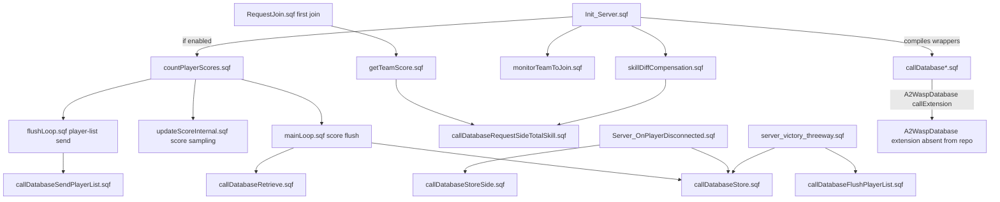

# AntiStack Database Extension Audit

This page is the canonical source-backed map for AntiStack skill balancing and its out-of-repo `A2WaspDatabase` extension dependency. Use [Integration trust boundary audit](Integration-Trust-Boundary-Audit) for the cross-integration security overview; use this page before changing AntiStack loops, join checks, score persistence or database wrappers.

## Why This Matters

AntiStack is both gameplay logic and server operations glue:

- It can deny a first side join when a player tries to join the stronger side.
- It periodically stores player score deltas.
- It periodically sends active player/team lists to the database.
- It can grant side-supply compensation when total team skill diverges.
- It persists score diffs on disconnect and at match end.

The current source has an operational ON/OFF switch, which is good. But when AntiStack is enabled, all DB wrapper paths still trust strings returned by a separate `A2WaspDatabase` extension that is not shipped in this repo.

## Current Runtime Shape

| Part | Source evidence | Meaning |
| --- | --- | --- |
| Compile registry | `Server/Init/Init_Server.sqf:72-80,85-87` | AntiStack wrappers, scoring helpers and the launch PVEH are compiled during server init. |
| Mission parameter | `Rsc/Parameters.hpp:546-552`, fallback `Common/Init/Init_CommonConstants.sqf:170-171` | `WFBE_C_ANTISTACK_ENABLED` defaults to enabled, with a constants fallback for older parameter sets. |
| Loop start gate | `Server/Init/Init_Server.sqf:597-608` | Server logs enabled/disabled state, records `antistack_state` if performance audit exists, and starts scheduled AntiStack loops only when enabled. |
| Disabled-mode join behavior | `Server/PVFunctions/RequestJoin.sqf:49-53` | Team-swap protection remains active, but first-join skill DB checks are skipped when AntiStack is disabled. |
| Disabled-mode persistence behavior | `Server/Functions/Server_OnPlayerDisconnected.sqf:151-153`, `Server/FSM/server_victory_threeway.sqf:51-53` | Disconnect and final-score DB persistence are skipped when AntiStack is disabled, avoiding false missing-score errors. |
| Enabled-mode DB dependency | `Server/Module/AntiStack/callDatabase*.sqf` | All database work relies on `"A2WaspDatabase" callExtension` return strings. The DLL is not in the repo. |

## Identity And Session Keys

AntiStack and join persistence mostly use durable UIDs, but several lifecycle helpers also depend on object, group and owner identity. Keep these distinctions visible when hardening reconnect, launch-join or skill-balance behavior.

| Key | Source evidence | Meaning / risk |
| --- | --- | --- |
| UID | `Server_OnPlayerConnected.sqf:9,27,42,65,70,79,93,101`; `Server_OnPlayerDisconnected.sqf:39,48,125,128,129,133,157,164,170,174,175`; `AntiStack/mainLoop.sqf:28,32,36,40`; `AntiStack/flushLoop.sqf:32,34,36,39` | Primary durable identity for JIP records, disconnect persistence and database score/list work. |
| Player name | `Server_OnPlayerConnected.sqf:10,16`; `Server_OnPlayerDisconnected.sqf:10,20` | Used for logs only in the audited server paths; do not promote names into authority keys. |
| Group / player object | `Server_OnPlayerConnected.sqf:23,27,45,56,64-66`; `Server_OnPlayerDisconnected.sqf:32,34,45,48,57,68,79,93,102,117,125,128,129`; `Server_HandleSpecial.sqf:11,29,138,141,144` | Owns team state and cleanup side effects. Fast reconnects can overlap stale disconnect cleanup unless UID/object checks are repeated before clearing state. |
| Network owner | `clientHasConnectedAtLaunch.sqf:4,15`; `Server_PV_RequestSupplyValue.sqf:4,8`; `Server_SetLocalityOwner.sqf:10,13`; `Server_HandleSpecial.sqf:120,123,127,130` | Used for targeted responses and locality changes. Validate payload object ownership where the engine exposes enough context. |
| Profile name | Source search found no `profileName` use in the scoped server lifecycle paths. | Good: profile names are mutable and should stay out of authority decisions. |

## Data Flow

## Procedure Register

| Wrapper | Procedure code(s) | Return use | Current guard | Remaining risk |
| --- | ---: | --- | --- | --- |
| `callDatabaseRetrieve.sqf` | `101`, poll `505` | Compiles request id, selects index `1`, polls up to `120` attempts, then expects `[code,totalScore,ticks]`. | Disabled mode returns `[0,1]`; timeout fallback returns `[1,1]`. | Enabled mode compiles untrusted strings twice and assumes array shape at `:30,39-51,62-63`. With default `_sleep = 0.10`, retrieve can poll for about 12 seconds per player. |
| `callDatabaseRequestSideTotalSkill.sqf` | `606`, poll `707` | Compiles request id, polls up to `9` attempts with `_sleep = 3`, then selects total skill. | Disabled mode returns `0`; timeout fallback returns `[1,1]` even though callers expect scalar skill. | Enabled mode compiles untrusted strings twice and can block about 27 seconds per side-skill request. Timeout return-shape mismatch can leak an array into skill math. |
| `callDatabaseStore.sqf` | `202` | Compiles response and selects response code. | Disabled mode returns `1`. | Enabled mode compiles returned string and assumes index `0` exists. |
| `callDatabaseStoreSide.sqf` | `404` | Converts side to `0/1/2`, compiles response, selects response code. | Disabled mode returns `1`. | Enabled mode compiles returned string and assumes index `0` exists. |
| `callDatabaseSendPlayerList.sqf` | `303` | Formats GUID/side list, compiles response, selects response code. | Disabled mode returns `1`. | Enabled mode compiles returned string and assumes index `0` exists; parameter string grows with players. |
| `callDatabaseFlushPlayerList.sqf` | `808` | Compiles response and selects response code. | Disabled mode returns `1`. | Enabled mode compiles returned string and assumes index `0` exists. |
| `callDatabaseSetMap.sqf` | `909` | Compiles response and selects response code. | Disabled mode returns `1`. | Enabled mode compiles returned string and assumes index `0` exists. |

## What Is Already Guarded

| Guard | Source evidence | Keep it? |
| --- | --- | --- |
| ON/OFF parameter and fallback | `Rsc/Parameters.hpp:546-552`, `Common/Init/Init_CommonConstants.sqf:170-171` | Yes. It gives admins a controlled performance/reliability switch. |
| Loop start disabled gate | `Server/Init/Init_Server.sqf:597-608` | Yes. Scheduled loops should stay dormant when disabled. |
| Direct loop guards | `countPlayerScores.sqf:3-5`, `mainLoop.sqf:8-10`, `flushLoop.sqf:10-12`, `updateScoreInternal.sqf:8-10`, `skillDiffCompensation.sqf:3-5` | Yes. These protect against direct `execVM` or stale calls. |
| Wrapper disabled no-ops | Seven `callDatabase*.sqf` files each check `WFBE_C_ANTISTACK_ENABLED` near the top. | Yes, but keep return shapes aligned with caller expectations. |
| Team-swap remains active when AntiStack disabled | `RequestJoin.sqf:49-53` | Yes. Do not accidentally turn off team-swap protection while disabling skill balancing. |
| Final/disconnect DB skip when disabled | `Server_OnPlayerDisconnected.sqf:151-153`, `server_victory_threeway.sqf:51-53` | Yes. Score sampling is not running when disabled, so DB persistence would be misleading. |

## Remaining Hardening Work

| Priority | Work | Patch shape |
| --- | --- | --- |
| P1 | Replace raw `call compile` return handling with a small parser/validator wrapper. | Centralize DB response handling in one SQF helper that checks non-empty string, expected array form, expected count, scalar response code and scalar/string payload types before returning a safe fallback. Do not use Arma 3-only `parseSimpleArray`. |
| P1 | Add missing/slow extension circuit breaker. | After repeated malformed or timeout responses, set a missionNamespace degraded flag, log once per interval and fall back to disabled-mode behavior for join skill checks and compensation while keeping team-swap protection. |
| P1 | Fix timeout return-shape mismatch in `callDatabaseRequestSideTotalSkill.sqf`. | If callers expect scalar skill, timeout fallback should be scalar `0` or the caller should explicitly handle array fallback. Do not feed `[1,1]` into skill-difference math. |
| P2 | Bound player-list payload size and validate GUID/side entries. | Keep only known player UIDs and west/east side codes; log skipped malformed entries. |
| P2 | Validate launch-connect raw PV payloads. | `clientHasConnectedAtLaunch.sqf` records a client-pushed player object and owner-targets an ACK. Confirm the object/UID/side match the sender before storing `WFBE_PLAYER_%UID_CONNECTED_AT_LAUNCH`. |
| P2 | Check and retry disconnect database persistence. | `Server_OnPlayerDisconnected.sqf:151-176` calls store-side and store-score paths but does not act on return codes. Log failures and consider one bounded retry before clearing durable state. |
| P2 | Replace stale all-units snapshots in skill balancing. | `flushLoop.sqf` and score-monitor helpers can operate on stale `allUnits`/fallback snapshots. Prefer confirmed session records keyed by UID where practical. |
| P2 | Add performance audit fields for DB degraded state. | Existing `antistack_main`, `antistack_flush`, `antistack_update_score` and `antistack_state` records are good anchors; add malformed/timeout counters if hardening is implemented. |

## Implementation Guardrails

- Keep gameplay edits in `Missions/[55-2hc]warfarev2_073v48co.chernarus` first.
- Do not hand-edit `Missions_Vanilla` until LoadoutManager propagation runs from a correctly named `a2waspwarfare` checkout.
- Do not assume the in-repo `Extension` project implements AntiStack. It implements `a2waspwarfare_Extension` / `GLOBALGAMESTATS`; AntiStack uses separate `A2WaspDatabase`.
- Do not replace `call compile` with Arma 3 APIs. This mission targets Arma 2 OA 1.64.
- Treat disabled AntiStack as a supported operating mode, not a failed state.
- Preserve team-swap protection when disabling or degrading only the skill-balancing database path.

## Validation Pack

| Scenario | Expected result |
| --- | --- |
| AntiStack disabled at mission parameter | Server logs disabled state, scheduled loops do not start, first join skips skill DB checks, team-swap protection still works, disconnect/victory DB persistence is skipped cleanly. |
| AntiStack enabled with valid DB extension | First join retrieves side skill, allowed/denied logic still works, score sampling/storage and player-list flush produce no RPT errors. |
| DB extension missing or returns empty/malformed string | No raw compile crash, one clear degraded-state log, join skill check falls back safely, team-swap protection remains active. |
| DB response delayed beyond poll attempts | Retrieve/side-skill paths time out to documented safe scalar/array shapes and do not poison compensation math. |
| Skill compensation active | `SUPPLY_COMPENSATION_AMOUNT_WEST/EAST` updates, side supply changes are bounded by the economy authority rules, and RHUD shows compensation without client-side authority assumptions. |
| Match end with AntiStack enabled | Final score store and player-list flush run or degrade gracefully before `failMission "END1"`. |
| Launch-side spoof attempt | A client-pushed launch-connect player object that does not match sender/UID/side is ignored and logged compactly. |
| Disconnect DB write failure | Store-side and score-diff failures are visible in RPT/performance state and do not silently masquerade as successful persistence. |

## Continue Reading

Previous: [Integration trust boundary audit](Integration-Trust-Boundary-Audit) | Next: [Feature status](Feature-Status-Register)

Main map: [Home](Home) | Runtime: [Server gameplay runtime atlas](Server-Gameplay-Runtime-Atlas) | Agent file: [`agent-hardening-backlog.jsonl`](agent-hardening-backlog.jsonl)
