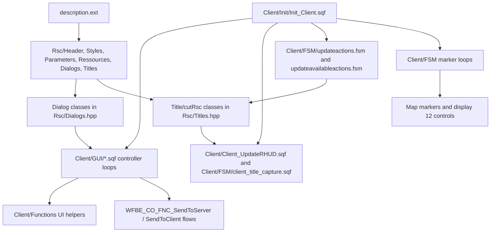

# Client UI Systems Atlas

This page maps the client-facing UI layer from source: `description.ext`, `Rsc/*.hpp`, `Client/GUI`, client FSM loops, map marker scripts, HUD/title resources and WASP overlays. It complements [Client UI, HUD and menus](Client-UI-HUD-And-Menus) with implementation-level ownership and risk notes.

All paths are relative to `Missions/[55-2hc]warfarev2_073v48co.chernarus/`.

## UI Stack

## Resource Include Graph

`description.ext` includes the UI stack in this order:

| Include | Role | Evidence |
| --- | --- | --- |
| `Rsc/Header.hpp` | Mission metadata and loading labels. | `description.ext:46`, `Header.hpp:9-10` |
| `Rsc/Styles.hpp` | UI constants such as `ST_*`, `CT_*` and style values. | `description.ext:49` |
| `Rsc/Parameters.hpp` | Mission parameter definitions. Several parameters directly gate UI loops such as map icon blinking, artillery UI, AFK time and EASA. | `description.ext:52`, `Parameters.hpp:86`, `:333`, `:375`, `:547` |
| `Rsc/Ressources.hpp` | Base control classes: buttons, listboxes, structured text, maps, controls groups, sliders and combos. | `description.ext:54`, `Ressources.hpp:46-563` |
| `Rsc/Dialogs.hpp` | Interactive dialog classes and `onLoad` hooks into `Client/GUI`. | `description.ext:56` |
| `Rsc/Titles.hpp` | `cutRsc` / title resources: overlay icons, RHUD/FPS HUD, capture bar, end stats and CoIn construction interface. | `description.ext:58`, `Titles.hpp:23-25` |
| `Rsc/Identities.hpp` | Non-vanilla identities. | `description.ext:62` |

## Dialog Class Map

`Rsc/Dialogs.hpp` defines the mission's modal UI classes. Most large menus are polling loops driven by global action variables (`MenuAction` or `WFBE_MenuAction`) set by control actions in the resource file.

| Class | IDD | Controller | Primary purpose |
| --- | ---: | --- | --- |
| `WFBE_UpgradeMenu` | 504000 | `Client/GUI/GUI_UpgradeMenu.sqf` | Newer upgrade list/detail view; sends `RequestUpgrade`. |
| `WFBE_VoteMenu` | 500000 | `Client/GUI/GUI_VoteMenu.sqf` | Commander vote UI. |
| `WFBE_Commander_VoteMenu` | 500999 | `Client/GUI/GUI_Commander_VoteMenu.sqf` | Commander-side vote handling. |
| `WFBE_RespawnMenu` | 511000 | `Client/GUI/GUI_RespawnMenu.sqf` | Death/respawn map and spawn selector. |
| `WFBE_TransferMenu` | 505000 | `Client/GUI/GUI_TransferMenu.sqf` | Funds transfer from team menu. |
| `WFBE_BuyGearMenu` | 503000 | `Client/GUI/GUI_BuyGearMenu.sqf` | Gear, vehicle cargo, backpacks and profile templates. |
| `WF_Menu` | 11000 | `Client/GUI/GUI_Menu.sqf` | Main Warfare menu/router. |
| `RscMenu_Team` | 13000 | `Client/GUI/GUI_Menu_Team.sqf` | Team management and transfer entry. |
| `RscMenu_BuyUnits` | 12000 | `Client/GUI/GUI_Menu_BuyUnits.sqf` | Unit/vehicle purchase from structures, depots and hangars. |
| `RscMenu_Command` | 14000 | `Client/GUI/GUI_Menu_Command.sqf` | Commander/team orders, task assignment and squad behavior. |
| `RscMenu_Tactical` | 17000 | `Client/GUI/GUI_Menu_Tactical.sqf` | Fast travel, artillery, support requests, UAV and unit camera entry. |
| `RscMenu_Upgrade` | 18000 | `Client/GUI/GUI_Menu_Upgrade.sqf` | Legacy/alternate upgrade menu class. |
| `RscMenu_Service` | 20000 | `Client/GUI/GUI_Menu_Service.sqf` | Rearm/repair/refuel/heal and EASA entry. |
| `RscMenu_UnitCamera` | 21000 | `Client/GUI/GUI_Menu_UnitCamera.sqf` | Unit camera selection. |
| `RscDisplay_Parameters` | 22000 | `Client/GUI/GUI_Display_Parameters.sqf` | Runtime mission parameter display. |
| `RscMenu_EASA` | 23000 | `Client/GUI/GUI_Menu_EASA.sqf` | Aircraft loadout selection. |
| `RscMenu_Economy` | 23000 | `Client/GUI/GUI_Menu_Economy.sqf` | Commander income/sell/respawn-supply-truck controls. |
| `RscMenu_Help` | 508000 | `Client/GUI/GUI_Menu_Help.sqf` | Online/help text panel and WASP branding. |

### Dialog Risks

- `RscMenu_EASA` and `RscMenu_Economy` both use `idd = 23000` (`Dialogs.hpp:3209-3212`, `:3287-3290`). They are not opened together in normal flow, but IDD reuse is a maintenance trap for `findDisplay`, debugging and future scripted interactions.
- The main menu and most submenus are not event-driven state machines. They are `while {alive player && dialog}` polling loops with `sleep` delays. Keep new work small inside those loops and reuse existing update flags.
- Several menu files return to `WF_Menu` by `closeDialog 0; createDialog "WF_Menu"` rather than maintaining a stack. Adding nested dialogs must preserve those return paths.

## Title And HUD Resource Map

`Rsc/Titles.hpp` defines long-lived non-modal resources.

| Resource | IDD/channel | Runtime owner | Purpose |
| --- | --- | --- | --- |
| `RscOverlay` | `idd=10200`, channel 1365 | Spawned from `Init_Client.sqf:147-150` | Older GPS/option overlay; sets `uiNamespace['GUI']`. |
| `CaptureBar` | `idd=600100`, channel 600200 | `Client/FSM/client_title_capture.sqf` | Town/camp capture progress bar using controls `601000-601002`. |
| `OptionsAvailable` | `idd=10200`, channel 12450 and default `CutRsc` | `Client/Client_UpdateRHUD.sqf`, `updateavailableactions.fsm` | Shared action icons plus RHUD/FPS HUD controls. |
| `EndOfGameStats` | `idd=90000` | `Client/GUI/GUI_EndOfGameStats.sqf` | End-of-game stat bars and faction imagery. |
| `WFBE_ConstructionInterface` | `idd=112200`, channel 112200 | `Client/Module/CoIn/coin_interface.sqf` | CoIn building placement cursor, hints, controls and cash panel. |

### HUD Display Ownership

`OptionsAvailable` uses `onLoad = "_this ExecVM ""Client\GUI\GUI_SetCurrentCutDisplay.sqf"""` and `onUnload = "_this ExecVM ""Client\GUI\GUI_ClearCurrentCutDisplay.sqf"""` (`Titles.hpp:170-171`). Those one-line scripts maintain `uiNamespace["currentCutDisplay"]`, which is then used by:

- `Client/Client_UpdateRHUD.sqf:87-95` to recover/recreate the display.
- `Client/FSM/updateavailableactions.fsm:225-233` to write action icons into controls `3500 + index`.

`RscOverlay` and `OptionsAvailable` both use `idd=10200` (`Titles.hpp:44-51`, `:164-176`). Treat them as separate cutRsc resources with overlapping IDD values; code should key off the stored display (`currentCutDisplay` or `GUI`) rather than assume IDD lookup is unique.

## Client Init UI Boot

`Client/Init/Init_Client.sqf` wires the UI layer in several waves:

| Lines | Behavior |
| --- | --- |
| `49-80` | Compiles old-style UI helpers (`BuildUnit`, `UIChangeComboBuyUnits`, `UIFillListBuyUnits`, `UIFillListTeamOrders`, `UIFindLBValue`). |
| `83-85` | Defines `BIS_FNC_GUIset` / `BIS_FNC_GUIget` wrappers over `uiNamespace`. |
| `116-127` | Compiles gear UI helper functions and respawn selector. |
| `147-150` | Keeps `RscOverlay` alive while no map/camera display is active. |
| `161-162` | Clears stale title displays before waiting for common init. |
| `330-339` | Initializes `RUBHUD`, `RUBFPSHUD`, `RUBGPS`, `RUBOSD`, then starts `Client/Client_UpdateRHUD.sqf`. |
| `356-387` | Starts client marker/action/resource/update loops after init. |
| `570-575` | Applies skill module, starts WASP base repair and WASP action overlay. |
| `592-593` | Loads keybind initialization. |
| `730-736` | Re-runs `Client/Init/Init_Markers.sqf` after a short JIP delay. |
| `779-782` | Starts blinking marker bookkeeping only when `WFBE_C_MAP_ICON_BLINKING_ENABLED` is enabled. |
| `785` | Plays `Videos/intro720p.ogv`. |
| `790` | Opens `WFBE_VoteMenu` if a vote is already running. |
| `959` | Shows the long new-player hint with Discord and map guidance. |

## Main Menu Router

The player opens the main menu through the scroll action wired by `Client/Functions/Client_AddWFMenuAction.sqf:17` and `Client/Action/Action_Menu.sqf:1`.

`Client/GUI/GUI_Menu.sqf` polls `MenuAction` every 0.1 seconds and routes to submenus:

| `MenuAction` | Result |
| ---: | --- |
| 1 | `RscMenu_BuyUnits` |
| 2 | `WFBE_BuyGearMenu` |
| 3 | `RscMenu_Team` |
| 4 | Vote menu or commander vote flow |
| 5 | `RscMenu_Command` |
| 6 | `RscMenu_Tactical` |
| 7 | `WFBE_UpgradeMenu` |
| 8 | `RscMenu_Economy` |
| 9 | `RscMenu_Service` |
| 10 | Unflip nearby/current vehicle |
| 11 | Headbug fix via temporary vehicle move |
| 12 | `RscDisplay_Parameters` |
| 13 | `RscMenu_Help` |
| 16 | Toggle full `RUBHUD` |
| 17/18 | GPS zoom out/in |
| 19 | Toggle FPS-only HUD |

Range booleans such as `barracksInRange`, `gearInRange`, `commandInRange` and `serviceInRange` are maintained by `Client/FSM/updateavailableactions.fsm`, not by the main menu itself.

## Major Controller Flows

### Buy Units

`GUI_Menu_BuyUnits.sqf`:

- Selects nearest active factory/depot/hangar context (`:48`, `:214-237`).
- Refreshes unit lists through `UIChangeComboBuyUnits` and `UIFillListBuyUnits` (`:197-198`).
- Enforces AI capacity based on `WFBE_C_PLAYERS_AI_MAX`, barracks upgrade level and commander bonus (`:117-124`).
- Sends the final purchase to `BuildUnit` (`:155`), which later handles spawn details and salvage FSM entry.
- Displays ambulance and supply-truck hints for important support vehicles (`:443-449`).

### Buy Gear

`GUI_BuyGearMenu.sqf` uses `WFBE_MenuAction`, not `MenuAction`, and works across three views:

- `gear`: player/AI equipment.
- `backpack`: OA backpack content where available.
- `vehicle`: cargo inventory.

The helper functions compiled in `Init_Client.sqf:116-126` own list filling, template parsing, sanitizing, inventory display, price calculation and target selection. Profile template saving is compiled only when the OA version gate passes (`Init_Client.sqf:169-172`).

### Commander And Tactical Menus

`GUI_Menu_Command.sqf` owns team selection, AI team templates, behavior/combat/formation/speed combos, move/task orders and respawn factory choice. It calls team/order helpers such as `SetTeamMoveMode`, `UIFillListTeamOrders` and command PVF paths.

`GUI_Menu_Tactical.sqf` is the support hub. It builds the support list from fast travel, ICBM, paratroopers, ammo/vehicle paradrops, UAV actions and unit camera (`:56-64`). Availability is recomputed from current upgrades, funds, cooldowns and selected support (`:144-290`), then requests are sent through `RequestSpecial` where needed (`:373` and later request branches).

### Upgrade And Economy Menus

`GUI_UpgradeMenu.sqf` reads side upgrade arrays, costs, descriptions, images, labels, levels, links and times from missionNamespace (`:9-18`). Commander-only purchase sends `RequestUpgrade` (`:158-161`) and starts local progress feedback for pure clients (`:168-174`).

`GUI_Menu_Economy.sqf` handles commander income percentage, structure selling and supply-truck respawn. The respawn supply-truck action sends `["RequestSpecial", ["RespawnST", sideJoined]]` (`:90-96`), which ties this UI directly to the partially broken AI/supply-truck feature described in [Feature status register](Feature-Status-Register).

### Respawn Menu

Respawn flow starts in `Client/Functions/Client_OnKilled.sqf:156` with `createDialog "WFBE_RespawnMenu"`.

`GUI_RespawnMenu.sqf`:

- Stores the display in `uiNamespace["wfbe_display_respawn"]`.
- Centers the map on `WFBE_DeathLocation`.
- Starts a countdown from `WFBE_C_RESPAWN_DELAY`, shortened in debug.
- Spawns `WFBE_CL_FNC_UI_Respawn_Selector`, which animates marker `wfbe_respawn_selector` every 0.03 seconds while `WFBE_MarkerTracking` exists.
- Rebuilds local respawn markers and calls `OnRespawnHandler` after selection/time expiry.

## RHUD And FPS HUD

`Client/Client_UpdateRHUD.sqf` is the optimized HUD loop:

- Starts hidden by default: `RUBHUD = false`, `RUBFPSHUD = false` (`:3-7`).
- Uses `OptionsAvailable` as the shared display and repairs it if missing (`:87-95`).
- Caches controls, last texts, last colors and last visibility state (`:22-56`).
- Has three modes: hidden, FPS-only and full RHUD (`:205-239`).
- Refreshes expensive town/economy aggregates every 3 seconds instead of every loop (`:338-350`).
- Records local performance audit samples under `client_rhud` (`:366-370`).

Full RHUD displays health, uptime, commander, AI count, money, income, side supply, supply income/minimum, towns held and client/server FPS. FPS-only mode repositions four controls into a small upper-right overlay.

## Map And Marker UI

Map UI is split across one-shot initialization, long-running refresh loops and event handlers:

| Script | Role | Performance posture |
| --- | --- | --- |
| `Client/Init/Init_Markers.sqf` | Creates local town/camp markers. Re-run after JIP delay. | One-shot plus JIP refresh. |
| `Client/FSM/updatetownmarkers.sqf` | Updates town marker text/status while map is visible. | Sleeps longer when map is closed; records `updatetownmarkers`. |
| `Client/FSM/updateteamsmarkers.sqf` | Tracks team/player/AI markers, AFK suffix and alpha/color changes. | Skips most work when no map/GPS/Warfare dialog consumer is visible; records `updateteamsmarkers`. |
| `Client/FSM/updateavailableactions.fsm` | Computes range booleans and writes action availability icons. | Tracks `nearEntities` count and records `updateavailableactions`. |
| `Client/Functions/Client_BookkeepBlinkingIcons.sqf` | Optional combat marker blinking bookkeeping. | Fully gated by `WFBE_C_MAP_ICON_BLINKING_ENABLED`. |
| `WASP/global_marking_monitor.sqf` | Adds a display-12 map double-click handler that prefixes marker text with the player's name. | Waits for map display then attaches `mouseButtonDblClick`. |

## Action Menus And Scroll Actions

The scroll-action surface is part UI, part gameplay:

- `Client_AddWFMenuAction.sqf` stores/removes the WF menu action ID on the current player object so respawn does not leave stale actions.
- `updateactions.fsm` attaches the blue `STR_WF_Options` action to the player's current vehicle and removes it from the previous vehicle.
- `Client_AddPlayerAIActions.sqf` attaches AI diagnose/recover actions and removes stale IDs first.
- `Client_PreRespawnHandler.sqf` reapplies WF menu and player AI actions after respawn, then also runs WASP `OnKilled`/RPG-drop hooks.
- `WASP/baserep/viem.sqf` attaches a commander-only base-repair action near damaged base structures and removes it when conditions change.

## UI Assets

`Client/Images` contains 45 `.paa` files plus `fps_hud.jpg`. Resource users include:

- Gear tabs: `gearicontemplate`, `geariconall`, `geariconprimary`, `geariconsecondary`, `geariconsidearm`, `geariconmisc`.
- Buy-unit controls: factory/category images and crew toggles (`i_driver`, `i_gunner`, `i_commander`, `i_extra`, `i_lock`).
- Action availability icons: `icon_wf_building_*` and `icon_wf_support_*`.
- Upgrade category icons: `wf_b`, `wf_lvf`, `wf_hvf`, `wf_air`, `wf_par`, `wf_uav`, `wf_sup`, `wf_*`.
- Help branding: `Textures/logo1.paa`.

The intro video is `Videos/intro720p.ogv`, started from `Init_Client.sqf:785`.

## Known UI Risks And Partial Work

| Area | Evidence | Risk |
| --- | --- | --- |
| Duplicate dialog IDD | `RscMenu_EASA` and `RscMenu_Economy` both use `idd = 23000`. | Avoid `findDisplay 23000` assumptions; assign a new IDD before adding scripted cross-dialog control work. |
| Shared title IDD | `RscOverlay` and `OptionsAvailable` both use `10200`. | Use `uiNamespace` display variables rather than IDD uniqueness. |
| Polling loops | `GUI_Menu.sqf`, buy/command/tactical/service/upgrade/respawn menus all run scheduled loops. | Keep work incremental and cache expensive state. |
| Map marker loops | Marker loops are live-server sensitive and now include performance-audit records. | Preserve map-closed skip behavior and `WFBE_C_MAP_ICON_BLINKING_ENABLED` gates. |
| Respawn selector loop | `Client_UI_Respawn_Selector.sqf` sleeps `0.03`. | Do not add expensive marker or object scans inside it. |
| Economy supply-truck UI | `GUI_Menu_Economy.sqf` can send `RespawnST`. | This touches the config-gated broken autonomous supply-truck path. |
| CoIn title registration | `WFBE_ConstructionInterface` is cut from `coin_interface.sqf` and stores `wfbe_title_coin`, but it is not listed in `RscTitles.titles[]`. | Construction appears intentionally wired; verify in-game before refactoring title registration. |
| Disabled task UI | `TaskSystem` compile and town task spawn are commented in `Init_Client.sqf:75` and `:744-745`. | Task UI behavior is partial/disabled; revive only with JIP and spam review. |

## Safe Extension Points

- For a new modal workflow, add a distinct class in `Rsc/Dialogs.hpp`, a controller under `Client/GUI`, and a main-menu or action entry. Use a unique IDD.
- For status HUD data, extend `OptionsAvailable` controls and update `Client/Client_UpdateRHUD.sqf` with cached text/color/show writes.
- For range/action indicators, extend `_icons` and `_usable` together in `updateavailableactions.fsm`, then verify the matching `OptionsIcon` exists in `Rsc/Titles.hpp`.
- For map marker behavior, prefer local markers and preserve map-closed sleep/backoff logic.
- For respawn UI, keep marker selection and actual respawn execution separated: marker loop in `Client_UI_Respawn_Selector.sqf`, action in `GUI_RespawnMenu.sqf`, post-respawn state in `Client_OnRespawnHandler.sqf`.
- For WASP UI additions, check [WASP overlay](WASP-Overlay) first because some old action chains are commented or missing.

## Continue Reading

Previous: [Client UI/HUD/menus](Client-UI-HUD-And-Menus) | Next: [Tools/build](Tools-And-Build-Workflow)

Main map: [Home](Home) | Fast path: [Quickstart](Quickstart-For-Humans-And-Agents) | Agent file: [`agent-context.json`](agent-context.json)
