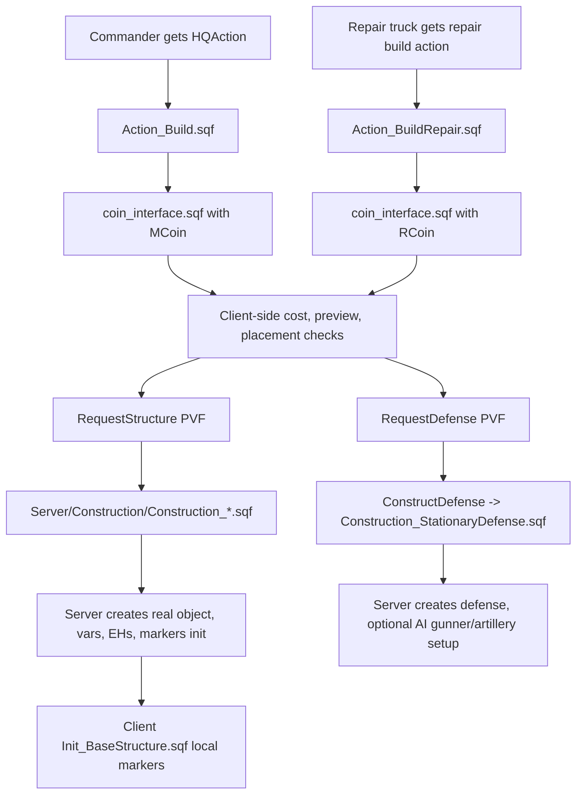

# Construction And CoIn Systems Atlas

Page ownership: this page owns the construction/CoIn runtime map, source anchors, request-handler map and safe extension checklist. [Commander/HQ lifecycle](Commander-HQ-Lifecycle-Atlas) owns commander selection, HQ deploy/mobilize, HQ destruction, wreck markers and MHQ repair. [Deep-review findings](Deep-Review-Findings) DR-6 owns the exact per-handler construction-authority proof, and DR-20 owns the HQ-killed non-idempotency / score-duplication proof; [Server authority migration map](Server-Authority-Migration-Map) owns the broader migration design table.

This page maps the build system that turns commander/repair-truck actions into HQ state changes, factories, base defenses, static weapons and repair flows.

All source paths below are relative to `Missions/[55-2hc]warfarev2_073v48co.chernarus/` unless a row explicitly names maintained Vanilla Takistan or another branch.

## How To Use This Page

| Need | Start here | Then follow |
| --- | --- | --- |
| Build/HQ/CoIn orientation | [High-level flow](#high-level-flow), [Server request handlers](#server-request-handlers), [Server construction workers](#server-construction-workers) | [Commander/HQ lifecycle](Commander-HQ-Lifecycle-Atlas), [Factory and purchase systems](Factory-And-Purchase-Systems-Atlas) |
| Construction authority proof | [Authority boundary](#authority-boundary) | [Deep-review findings](Deep-Review-Findings) DR-6, [Server authority migration map](Server-Authority-Migration-Map) |
| Base-area and CoIn guard-order work | [Construction state ownership synthesis](#construction-state-ownership-synthesis) | [Server authority migration map](Server-Authority-Migration-Map), [Testing workflow](Testing-Debugging-And-Release-Workflow) |
| Small/Medium structure cleanup | [SmallSite / MediumSite](#smallsite--mediumsite) | [Construction logic list cleanup](Construction-Logic-List-Cleanup) |
| Commander-built artillery defenses | [StationaryDefense](#stationarydefense) | [Support specials and tactical modules](Support-Specials-And-Tactical-Modules-Atlas), [Source fix propagation queue](Source-Fix-Propagation-Queue) |
| Salvage payout/authority | [Salvage](#salvage), [Salvage branch matrix](#salvage-branch-matrix) | [Feature status](Feature-Status-Register), [Source fix propagation queue](Source-Fix-Propagation-Queue) |

## Source Map

| Role | Files |
| --- | --- |
| Client entry actions | `Client/Action/Action_Build.sqf`, `Client/Action/Action_BuildRepair.sqf`, `Client/Action/Action_RepairMHQ.sqf` |
| CoIn data setup | `Client/Init/Init_Coin.sqf` |
| CoIn runtime UI | `Client/Module/CoIn/coin_interface.sqf` |
| Client action lifecycle | `Client/FSM/updateclient.sqf`, `Client/Functions/Client_PreRespawnHandler.sqf`, `Client/Functions/Client_OnKilled.sqf` |
| Server PVF entrypoints | `Server/PVFunctions/RequestStructure.sqf`, `Server/PVFunctions/RequestDefense.sqf`, `Server/PVFunctions/RequestMHQRepair.sqf` |
| Server construction workers | `Server/Construction/Construction_HQSite.sqf`, `Construction_SmallSite.sqf`, `Construction_MediumSite.sqf`, `Construction_StationaryDefense.sqf`; patch-ready SmallSite cleanup lives in [Construction logic list cleanup](Construction-Logic-List-Cleanup). |
| Structure config | `Common/Config/Core_Structures/Structures_*.sqf` |
| Server support functions | `Server_HandleBuildingRepair.sqf`, `Server_MHQRepair.sqf`, `Server_OnHQKilled.sqf`, `Server_HandleDefense.sqf`, `Server_CreateDefenseTemplate.sqf` |
| Client structure markers | `Client/Init/Init_BaseStructure.sqf` |

## Current Branch Scope

Checked 2026-06-14 against docs head `docs/developer-wiki-index` `7d248610`, stable `origin/master` `cf2a6d6a`, Miksuu `b8389e74`, `origin/perf/quick-wins` `0076040f` and release `origin/release/2026-06-feature-bundle` `a96fdda2` in Chernarus plus maintained Vanilla Takistan where present. Targeted diffs from both the earlier construction docs checkpoint `4bd37b98` and the source-line anchor snapshot `1aa178f8` to `HEAD` over checked construction/CoIn, base-area, structure-config, commander ARTY and salvage paths returned no source changes. Older hashes remain line-anchor provenance; `7d248610` is the visible docs-head source-continuity checkpoint. Salvage was refreshed again on 2026-06-21 in [Salvage branch matrix](#salvage-branch-matrix) after stable advanced to `origin/master@0139a346`.

| Branch/root | Construction shape | Development meaning |
| --- | --- | --- |
| Docs head `7d248610` | Source-unchanged from `4bd37b98`: Chernarus and maintained Vanilla carry the `Construction_StationaryDefense.sqf:12-15` `_availweapons` null guard and commander-team ARTY gunner handoff at `:91-93`; `Common_GetTeamArtillery.sqf:10-30` scans the player's group vehicles. | This is the current docs/source shape for patch carry-forward, but it still needs Arma smoke for grouped-base and Tactical fire-mission behavior. |
| Stable `origin/master` `cf2a6d6a` and release `a96fdda2` | Chernarus and maintained Vanilla use marker-based commander ARTY discovery: non-repair-truck artillery defenses set `WFBE_CommanderArtillery*` at `Construction_StationaryDefense.sqf:133-135`, and `Common_GetTeamArtillery.sqf:46-78` scans same-side marked guns near HQ/base areas. They still read `_area getVariable "weapons"` before a null guard at `Construction_StationaryDefense.sqf:15`. | Treat stable/release ARTY as a different implementation, not proof that the docs-checkout gunner handoff has landed there. The base-area null-guard lane remains open on those branches. |
| Miksuu `b8389e74` and `perf/quick-wins` `0076040f` | Chernarus and maintained Vanilla keep the older `DefenseTeam` manning shape, no `WFBE_CommanderArtillery*` marker discovery, and the pre-guard `_area getVariable "weapons"` read at `Construction_StationaryDefense.sqf:13`. | No ARTY or null-guard rescue candidate was found in these heads. |
| All checked refs | Auto-wall remains one global `isAutoWallConstructingEnabled`; SmallSite still appends `_nearLogic` after construction while MediumSite removes it; salvage still calls lowercase `ChangePlayerfunds`, keeps the `updatesalvage.sqf:10` `||` loop and deletes/rewards locally. | Keep these as patch-ready construction/salvage findings until source Chernarus plus maintained Vanilla are changed and smoked. |

## High-Level Flow

## Structure Configuration

Each side/faction structure file builds the same parallel arrays. `Structures_CO_US.sqf` is a representative example:

| Array | Meaning | Example source |
| --- | --- | --- |
| `WFBE_<side>STRUCTURES` | Logical structure labels such as `Headquarters`, `Barracks`, `Light`, `CommandCenter`, `Heavy`, `Aircraft`, `ServicePoint`, `AARadar`. | Lines 23, 32, 41, 50, 59, 68, 77, 86. |
| `WFBE_<side>STRUCTURENAMES` | Actual classnames used by CoIn and server creation. | Lines 24, 33, 42, 51, 60, 69, 78, 88. |
| `WFBE_<side>STRUCTURECOSTS` | Build/deploy costs. | Lines 26, 35, 44, 53, 62, 71, 80, 90. |
| `WFBE_<side>STRUCTURETIMES` | Build time, `1` in debug, otherwise mostly `30`/`60`. | Lines 27, 36, 45, 54, 63, 72, 81, 91. |
| `WFBE_<side>STRUCTURESCRIPTS` | Server construction worker: `HQSite`, `SmallSite`, `MediumSite`. | Lines 28, 37, 46, 55, 64, 73, 82, 92. |
| `WFBE_<side>STRUCTUREDISTANCES` / `DIRECTIONS` | Placement offsets used by nearby-building logic and defense auto-manning. | Lines 29-30, 38-39, 47-48. |
| `WFBE_<side>DEFENSENAMES` | Defense, fortification, MASH, spawn marker, ammo and service objects. | Lines 115-166. |

After the arrays are built, the script stores them into `missionNamespace` at lines 105-113. In money-only mode, `Common/Init/Init_Common.sqf:350-356` multiplies all structure costs by five.

## Client CoIn Initialization

`Client/Init/Init_Coin.sqf` is the adapter between Warfare data and the BIS CoIn UI.

| Behavior | Evidence |
| --- | --- |
| Sets build area and funds labels on the CoIn logic. | Lines 8-12. |
| Shows only HQ deploy/mobilize when HQ is not deployed. | Lines 20-31. |
| Shows all structures and defenses once HQ is deployed. | Lines 30-40. |
| Repair-truck mode uses only defenses and player cash. | Line 31 and lines 51-55. |
| Builds CoIn categories and item arrays from structure/defense config. | Lines 57-81. |
| Assigns a `BIS_coin_<id>` vehicle variable and stores params. | Lines 83-91. |

CoIn is reinitialized from several lifecycle points:

| Trigger | Source |
| --- | --- |
| Initial client boot waits for `wfbe_hq_deployed`, then initializes `MCoin` based on deployed/undeployed HQ state. | `Client/Init/Init_Client.sqf:489-497`. |
| Repair-truck CoIn initializes `RCoin` with `"REPAIR"` mode. | `Client/Init/Init_Client.sqf:738-739`. |
| Becoming commander refreshes `MCoin` and adds `HQAction`. | `Client/FSM/updateclient.sqf:214-220`. |
| Server/client special message `hq-setstatus` refreshes `MCoin`. | `Client/Functions/Client_FNC_Special.sqf:70-75`. |

## Player Entry Points

| Entry | Behavior |
| --- | --- |
| `Client/Action/Action_Build.sqf` | Runs CoIn from player/HQ context: `[player, player, 2, MCoin, getpos player, (sideJoined) Call WFBE_CO_FNC_GetSideHQ] ExecVM "Client\Module\CoIn\coin_interface.sqf"`. |
| `Client/Action/Action_BuildRepair.sqf` | Runs CoIn from a repair truck using `RCoin`. |
| `Common/Init/Init_Unit.sqf:56-68` | Adds repair-truck build and MHQ repair actions to repair trucks. |
| `Client/FSM/updateclient.sqf:220` | Adds commander build menu action only for the commander, gated by `hqInRange`, `canBuildWHQ` and target player. |
| `Client/Functions/Client_PreRespawnHandler.sqf:36` | Re-adds commander HQAction after respawn. |
| `Client/Functions/Client_OnKilled.sqf:27-28` | Removes `HQAction` from the dead body. |

`Client/Functions/Client_HandleHQAction.sqf` is a small lag guard: it keeps `canBuildWHQ = false` while an HQ object still exists and flips it back once the object is gone.

## CoIn Runtime Behavior

`Client/Module/CoIn/coin_interface.sqf` is a large customized BIS CoIn controller.

| Area | Evidence |
| --- | --- |
| Aborts if the source object is dead. | Line 5. |
| Distinguishes HQ vs repair root and resets `lastBuilt` when switching roots. | Lines 8-24. |
| Enforces base-area limit client-side before opening the UI. | Lines 13-26. |
| Opens custom construction title resources and camera controls. | Lines 29-56. |
| Maintains command-menu reopen loop. | Lines 98-112 and 920-937. |
| Border is temporary and only auto-refreshes on area-size changes. | `coin_interface.sqf:114-158` creates a local transparent-wall border from the initial logic/start position; `:419-425` recreates it when `BIS_COIN_areasize` changes and refreshes camera limits. The TODO is specifically about logic-position movement, not a proven generic border break. Branch continuity is summarized in [Current Branch Scope](#current-branch-scope); stable/release line drift moves the refresh to `:420-426`. |
| Allows quick-repeat of last built defense with User15. | Lines 220-228. |
| Allows toggling defense manning with User16. | Lines 231-236. |
| Lets commander sell/delete a pointed defense and refund player cash. | Lines 238-265. |
| Handles HQ mobilize/deploy specially for item index 0. | Lines 485-503. |
| Deducts structure/defense cost client-side before sending the server request. | Lines 658-695. |
| Sends `RequestStructure` / `RequestDefense` to the server. | Lines 718-723. |
| Decrements local base-area availability when placing defenses. | Lines 724-730. |
| Clears the custom title layer when closing. | Line 938. |

## Placement Rules

`Client/Init/Init_Client.sqf:599-728` defines `WFBE_C_STRUCTURES_PLACEMENT_METHOD` when `WFBE_C_STRUCTURES_COLLIDING == 1`.

Important checks:

| Check | Source |
| --- | --- |
| Base-area availability can force red preview. | Lines 611-613. |
| Water placement is rejected. | Line 614. |
| Structures avoid nearby houses/factories by bounding-box distance. | Lines 616-662. |
| Defenses avoid duplicate nearby defenses and enemy entities. | Lines 631-642. |
| Non-HQ structures avoid enemy base structures. | Lines 664-670. |
| Minefields are blocked inside base areas. | Lines 684-687. |
| Structures cannot be placed within 600m of hostile towns or inside enemy base areas. | Lines 694-703. |
| Enemy units near base block non-base placement. | Lines 705-722. |

These are preview/client rules. The server creation handlers do not repeat most of them.

## Server Request Handlers

`Common/Init/Init_PublicVariables.sqf:14-17` registers `RequestStructure`, `RequestDefense` and `RequestMHQRepair` as server PVF commands.

| Request | Server behavior |
| --- | --- |
| `RequestStructure` | Reads side, classname, position and direction from the client payload; maps classname to logical structure and construction script; sends `building-started` messages for major structures; executes `Server\Construction\Construction_<script>.sqf` if the classname exists. See `Server/PVFunctions/RequestStructure.sqf:3-21`. |
| `RequestDefense` | Looks up the classname in `WFBE_<side>DEFENSENAMES`; for WDDM composition anchors (classnames in `WFBE_POSITION_ANCHOR_NAMES`) calls `Server_ConstructPosition`; for single defenses calls `ConstructDefense`. A defense-budget gate (`WFBE_C_DEFENSE_BUDGET`) may reject and refund before either call. See `Server/PVFunctions/RequestDefense.sqf`. |
| `RequestMHQRepair` | Spawns `MHQRepair` with the received side. See `Server/PVFunctions/RequestMHQRepair.sqf:1`. |

### Authority Boundary

DR-6 confirms the authority boundary: the client pays cost and enforces most placement/role checks before sending the request, while server-side request handlers mainly check that the requested class exists in the side arrays. They do not re-check commander ownership, funds, build radius, base-area restrictions, hostile-town distance or most collision checks.

This atlas keeps the system map and checklist. For exact forged payload examples and the validation sketch, use [Deep-review findings](Deep-Review-Findings) DR-6; for migration sequencing across other economy authority paths, use [Economy authority first cut](Economy-Authority-First-Cut) and [Server authority migration map](Server-Authority-Migration-Map).

## Server Construction Workers

### HQSite

`Server/Construction/Construction_HQSite.sqf` toggles between deployed HQ structure and mobile HQ vehicle.

When deploying:

- Sets `wfbe_hqinuse` true.
- Creates the deployed HQ structure, sets `wfbe_side` and `wfbe_structure_type = "Headquarters"`.
- Sets `wfbe_hq_deployed = true` and `wfbe_hq` to the new site.
- Initializes client-side base marker via `Client\Init\Init_BaseStructure.sqf`.
- Adds killed, hit and damage handlers.
- Sends side message/logging.
- Deletes the old mobile HQ.

When mobilizing:

- Creates the side-specific MHQ vehicle from `WFBE_<side>MHQNAME`.
- Sets taxi/trash/side/type vars.
- Sets `wfbe_hq_deployed = false` and `wfbe_hq` to the vehicle.
- Sends a client `HandleSpecial` message so clients add killed EH to the mobile HQ.
- Locks/unlocks commander interaction and logs the change.
- Deletes the deployed HQ structure.

Base-area support is present but partly broken. `Server/Init/Init_Server.sqf:380` initializes each side logic `wfbe_basearea` to `[]` when grouped base areas are enabled. During HQ deploy, the server creates a `LocationLogicStart`, sets `DefenseTeam` and `weapons`, then sends `RequestBaseArea` to clients (`Construction_HQSite.sqf:50-54`). The older direct server-side `avail`, `side` and `wfbe_basearea` updates are inside a commented block at `Construction_HQSite.sqf:55-58`, while `Client/PVFunctions/RequestBaseArea.sqf:1-4` performs the append on the receiving client. `Server/FSM/basearea.sqf:55-77` only prunes an existing server list; no source path in this pass was found that appends the new base-area logic back into the server-side list. Treat server-side base-area consumers as operating from an empty or stale list until the server seeding path is restored and smoked.

The CoIn defense path mirrors the same fragility on the client side. `Client/Module/CoIn/coin_interface.sqf:721-730` reads base-area availability from the nearest `_area` before proving the base-area object is valid. The commander defense-sale path has the same guard-order shape: `coin_interface.sqf:256-263` finds the closest base-area logic, reads `_area getVariable "avail"` first, and only checks `!isNull _area` afterwards. Pair any server-side `Construction_StationaryDefense` null-guard fix with a CoIn UI smoke pass for stale/empty base-area lists, grouped-base placement and commander defense selling.

### SmallSite / MediumSite

`Construction_SmallSite.sqf` and `Construction_MediumSite.sqf` are near twins. They:

- Resolve side logic, side ID, build time, construction-site classname and logical structure type.
- Optionally create construction-site objects and a logic with `WFBE_B_*` completion variables.
- Wait through construction steps, with different completion ratios and timing.
- Delete temporary construction objects.
- Create the real structure object.
- Set `wfbe_side` and `wfbe_structure_type`.
- Create wall/defense templates with `CreateDefenseTemplate`.
- Send `Constructed` side message.
- Add the site to `wfbe_structures`.
- Run `Client\Init\Init_BaseStructure.sqf` on clients via `setVehicleInit`.
- Add hit, damage and killed event handlers.

Medium sites use a lower completion ratio (`0.6`) and more staged waiting than small sites.

Auto-wall state is global, not per-player or per-side. The source anchors are the `User14` client toggle at `coin_interface.sqf:180,207-217`, the thin server write at `Server/PVFunctions/RequestAutoWallConstructinChange.sqf:3-7`, and SmallSite/MediumSite consumers at `Construction_SmallSite.sqf:110` / `Construction_MediumSite.sqf:125`. [Current Branch Scope](#current-branch-scope) owns the branch comparison: all checked refs keep one global value; stable/release initialize it to `true` and add an `AARadar` exclusion, but no checked branch keys the state by player, side or requester. One user's toggle can therefore affect later small/medium construction globally.

Future code work should decide whether this is an intentional match-wide switch or a player/side preference, then either label the UI behavior or key the state by side/requester and smoke two players/sides toggling before small and medium construction. The branch matrix above owns current refs for this path.

Focused construction review found a source asymmetry worth treating as a bug candidate rather than a vague TODO:

- `Construction_SmallSite.sqf:70` adds `_nearLogic` to `wfbe_structures_logic`, and `:98-99` says "Remove the logic from the list since it's built" but adds `_nearLogic` again.
- `Construction_MediumSite.sqf:70` adds `_nearLogic`, then `:113-114` removes it after construction.
- Mini-scout follow-up 2026-06-04 rechecked the same lines directly against source Chernarus: SmallSite remains add/add, MediumSite remains add/remove. Current source continuity is summarized in [Current Branch Scope](#current-branch-scope), and the exact patch route lives in [Construction logic list cleanup](Construction-Logic-List-Cleanup). Treat this as a real patch candidate, not merely an old comment mismatch.
- No source initializer for `wfbe_structures_logic` was found in the server init path; `Init_Server.sqf` initializes `wfbe_structures` and `wfbe_structures_live`, while `wfbe_structures_logic` appears only in SmallSite/MediumSite/repair-handler code.
- Wave P confirmed the same SmallSite add/add and MediumSite add/remove shape in maintained Vanilla Takistan and the main modded Eden/Napf copies. `Server_HandleBuildingRepair.sqf:81,99` removes repair logic entries, but no active source caller for `HandleBuildingRepair` was found beyond compile/init text, so repair cleanup does not prove SmallSite stale entries are cleared in live play.

Patch shape is now captured in [Construction logic list cleanup](Construction-Logic-List-Cleanup): source Chernarus should change only the post-completion SmallSite line from append to remove, then propagate maintained Vanilla with `Tools/LoadoutManager` and smoke small/medium construction before claiming runtime impact.

### StationaryDefense

`Construction_StationaryDefense.sqf` creates defenses, fortifications, minefields and static weapons.

Notable paths:

- Creates the defense and sets `side` plus `wfbe_defense`.
- Special-cases `Sign_Danger` into a minefield and deletes the sign.
- Adds killed/damage handlers.
- If manning is requested and defense AI is enabled, finds a nearby barracks and spawns `HandleDefense`.
- `Server_HandleDefense.sqf` either delegates static defense crew creation to headless clients or creates a side soldier locally and moves it into the gunner seat.
- Artillery defenses can receive BIS ARTY interface initialization and `EquipArtillery`.
Docs head `7d248610` commander-built artillery-class defenses inside a valid base area use the current commander team as their gunner group when a commander team exists (`Construction_StationaryDefense.sqf:91-93`). That matches the docs-head Tactical discovery shape, which scans `units group player` for occupied non-player artillery (`Common_GetTeamArtillery.sqf:10-30`). Non-artillery defenses still use the base area's `DefenseTeam`; unmanned artillery remains unmanned if the CoIn manning toggle is off. Stable/release use marker-based ARTY discovery instead, while Miksuu/perf keep the older `DefenseTeam` path; keep those branch differences in [Current Branch Scope](#current-branch-scope) and the [Source fix propagation queue](Source-Fix-Propagation-Queue#current-propagated-fix-queue) instead of repeating the full matrix here.

Focused construction scout 2026-06-04 found a small guard-order bug here. Docs head `7d248610` source Chernarus and maintained Vanilla Takistan now default `_availweapons` to `0` and read `_area getVariable "weapons"` only after `!isNull _area` (`Construction_StationaryDefense.sqf:12-15`). Stable/release and Miksuu/perf still carry the pre-guard read as noted in [Current Branch Scope](#current-branch-scope). Arma smoke is still needed for defense placement with grouped-base mode on and off, and this does not close broader DR-6 construction authority hardening.

Client-side CoIn placement and sale have the companion risks noted above (`coin_interface.sqf:721-730` and `:256-263`). Do not call the guard fixed until the server construction worker, server base-area seeding, client placement availability/decrement and commander sale/refund path all handle missing/stale base-area logics.

### Construction State Ownership Synthesis

The 2026-06-04 fallback construction scout confirmed that several separate-looking issues share the same owner: base/construction state is split across client-visible logic objects, server-side side logic arrays and dormant repair helpers.

| Symptom | Evidence | Development meaning |
| --- | --- | --- |
| Base areas are client-seeded but not clearly server-reseeded after HQ deploy. | `Server/Init/Init_Server.sqf:380`, `Construction_HQSite.sqf:50-58`, `Client/PVFunctions/RequestBaseArea.sqf:1-4`, `Server/FSM/basearea.sqf:55-77`. | Treat `wfbe_basearea` as a partial feature until server ownership is explicit. Patch grouped-base placement, cleanup and JIP as one lane. |
| Base-area `avail` / `weapons` reads can happen before null guards. | `coin_interface.sqf:256-263`, `:721-730`; docs head `7d248610` server-side `Construction_StationaryDefense.sqf:12-15` is patched in source Chernarus and maintained Vanilla Takistan, while branch drift remains summarized in [Current Branch Scope](#current-branch-scope). | Client CoIn placement/sale still need guard-order cleanup; smoke empty, stale and race-pruned base-area lists before closing the whole base-area availability lane. |
| Small and medium construction disagree on repair logic cleanup. | `Construction_SmallSite.sqf:69-70,98-99`; `Construction_MediumSite.sqf:69-70,113-114`. | Keep [Construction logic list cleanup](Construction-Logic-List-Cleanup) separate from authority hardening; it is a one-line correctness patch with propagation/smoke gates. |
| Damage/killed handlers are live, while progressive building repair is compiled but not reached by static search. | EH attachment in `Construction_SmallSite.sqf:123-129`, `Construction_MediumSite.sqf:138-144`, `Construction_HQSite.sqf:36-38,78-93`; repair compile at `Init_Server.sqf:26`; latent helper in `Server_HandleBuildingRepair.sqf`. | Do not call progressive building repair working until a live caller, parameter path and smoke evidence exist. Keep WASP base repair separate. |

## Repair Flows

### MHQ Repair

Client side:

- `Action_RepairMHQ.sqf` requires a dead HQ within 30m of the repair vehicle.
- It checks `wfbe_hq_repairing`, repair count/price, and currency.
- It deducts side supply or player funds on the client, sends `RequestMHQRepair`, sets repair flags and increments the local count.

Server side:

- `Server_MHQRepair.sqf` creates a new MHQ at the wreck position, sets `wfbe_side`, `wfbe_structure_type`, trash/taxi vars and killed/hit handlers.
- It sets `wfbe_hq`, `wfbe_hq_deployed = false`, `wfbe_hq_repairing = false` and increments server `wfbe_hq_repair_count`.
- It sends `SetMHQLock` to the commander and broadcasts HQ-alive marker variables (`IS_WEST_HQ_ALIVE`, `HQ_WEST_MARKER_INFOS`, equivalent east values).
- It deletes the wreck and logs repair.

### Building Repair

`Server_HandleBuildingRepair.sqf` uses a repair logic with `WFBE_B_Completion`. It creates ruins, waits for completion, recreates the site if structure live limits allow it, re-adds init/event handlers and subtracts half the building cost from side supply in currency system 0. If completion stalls, it degrades over time and eventually deletes the repair logic.

Current status is latent/uncalled by static search: `Server_HandleBuildingRepair.sqf` is compiled, but no active caller was found in the source mission. Do not confuse this with the WASP base-repair flow, which is live and separate in `WASP/baserep/viem.sqf` and `WASP/baserep/repair.sqf`.

### Salvage

The engineer salvage flow is client-led. In the docs checkout `docs/developer-wiki-index@10097961`, `Client/Module/Skill/Skill_Salvage.sqf:20-38` and `Client/FSM/updatesalvage.sqf:46-50` own wreck deletion and cash payout locally. Both payout paths call `ChangePlayerfunds` with a lowercase `f` (`Skill_Salvage.sqf:38`, `updatesalvage.sqf:50`), while the compiled client function is `ChangePlayerFunds` in `Client/Init/Init_Client.sqf:53,91`. Current stable `origin/master@0139a346` keeps the same behavior with line drift: `updatesalvage.sqf:46,51`, `Init_Client.sqf:72,110` and salvage-truck launch at `Client_BuildUnit.sqf:343`. The update loop condition in `updatesalvage.sqf:10-18` uses `while {!gameOver || !(alive _vehicle)}`, which keeps the loop alive while the game is running even if the vehicle state changes in surprising ways. Treat salvage as a small correctness + authority lane before increasing rewards or adding new salvage targets.

#### Salvage Branch Matrix

| Root / branch | Payout casing | Loop / authority shape | Status |
| --- | --- | --- | --- |
| Docs checkout `docs/developer-wiki-index@10097961` Chernarus and maintained Vanilla | `Skill_Salvage.sqf:38` and `updatesalvage.sqf:50` call lowercase `ChangePlayerfunds`; `Init_Client.sqf:53,91` compiles `ChangePlayerFunds`; `Client_BuildUnit.sqf:267` starts `Client\FSM\updatesalvage.sqf` for salvage trucks. | `updatesalvage.sqf:10` uses `while {!gameOver || !(alive _vehicle)}`; both salvage paths delete wrecks locally at `Skill_Salvage.sqf:34` / `updatesalvage.sqf:46`. | Patch-ready, docs-source-unpatched. |
| Stable `origin/master@0139a346` Chernarus and maintained Vanilla | Same casing mismatch with current line drift: `Skill_Salvage.sqf:38`, `updatesalvage.sqf:51`, `Init_Client.sqf:72,110`; `Client_BuildUnit.sqf:343` starts the salvage-truck FSM. | Same `updatesalvage.sqf:10` `||` loop and client-local delete/reward shape at `updatesalvage.sqf:46,51`; manual salvage still deletes locally at `Skill_Salvage.sqf:34`. | Patch-ready, current-stable-unpatched. |
| Miksuu `b8389e74`, `origin/perf/quick-wins` `0076040f` and historical release commit `a96fdda2` | Same lowercase payout calls and uppercase compile name in both maintained roots. Miksuu was fetched into `FETCH_HEAD` from `https://github.com/Miksuu/a2waspwarfare.git`; current origin exposes no `release/*` heads on 2026-06-21, so `a96fdda2` is historical branch-scoped evidence. | Same `||` loop and client-local deletion/reward shape in both maintained roots. | No branch rescue candidate found in these upstream/perf/historical-release refs. |
| Historical Miksuu salvage branches (`EngineerSalvageAbility` `99bfaeb8`, `SalvageRuTranslationFix` `291c6cb4`) | Same lowercase payout call existed when the feature landed / translation changed. | Same `||` loop and client-local deletion/reward shape. | Treat as inherited salvage-feature debt, not a local regression. |

Practical patch rule: fix the casing first in source Chernarus and maintained Vanilla, then smoke manual engineer salvage and salvage-truck salvage for one valid wreck. Review the update loop and move final payout/deletion server-side as the larger authority pass; do not bundle that authority rewrite into a tiny casing-only fix unless a code owner explicitly claims it.

## Sale And Deletion Flows

There are two sale paths:

| Path | Behavior |
| --- | --- |
| Economy menu structure sale | `Client/GUI/GUI_Menu_Economy.sqf:105-151` lets commanders pick a nearby structure on the map, marks `WFBE_SOLD`, waits `WFBE_C_STRUCTURES_SALE_DELAY`, refunds `WFBE_C_STRUCTURES_SALE_PERCENT`, sends localized messages and damages the structure to 1. |
| CoIn defense sale | `coin_interface.sqf:238-265` lets commanders point at a nearby defense, checks side and prior `sold` state, refunds roughly `price / 2.5` to player funds, increments base-area `avail` and deletes the defense. |

Both are client-initiated. Future server hardening should be careful not to break the current UX but should move final authority for sale/refund/delete to the server.

## Client Markers

`Client/Init/Init_BaseStructure.sqf` waits for common/client init, ignores enemy structures, creates local markers for allied structures and deletes them when the structure dies. Command centers also create a local range ellipse.

The server reaches this script by `setVehicleInit` in construction scripts (`Construction_HQSite.sqf`, `SmallSite`, `MediumSite`) and repair flows.

## Current Risks And Safe Extension Points

| Area | Risk | Safer path |
| --- | --- | --- |
| Server request validation | `RequestStructure` / `RequestDefense` trust client-side payment and placement checks; see [Deep-review findings](Deep-Review-Findings) DR-6. | Add server-side validation of side, commander/repair-truck authority, class membership, funds, radius, base-area availability and collision restrictions before creating objects. Start in request handlers, not in CoIn UI. |
| PVF dispatch | Construction uses generic PVF channels; DR-1 already shows dispatch hardening is needed. | Validate PVF function strings and then validate construction payloads. |
| Base-area availability | `avail`/`weapons` are updated through client-visible logic and direct client CoIn mutations. | Before changing limits, trace `RequestBaseArea`, `coin_interface`, `Construction_StationaryDefense` and JIP behavior together. |
| Stationary defense base-area null guard | Docs head `7d248610` `Construction_StationaryDefense.sqf:12-15` reads base-area `weapons` only after a non-null area check; [Current Branch Scope](#current-branch-scope) owns stable/release/Miksuu/perf drift. | Source Chernarus and maintained Vanilla Takistan are patched only in the docs head; smoke grouped-base defense placement and non-base defense placement before carrying forward. |
| Auto-wall toggle is global | `RequestAutoWallConstructinChange.sqf:3-7` writes global `isAutoWallConstructingEnabled`; SmallSite/MediumSite consume it at `:110` / `:125`. [Current Branch Scope](#current-branch-scope) owns branch refs and the stable/release `AARadar` nuance. | If auto-wall should be a player/commander preference, key it by side or requester and validate the sender. If global behavior is intentional, label it in UI/docs and smoke two players toggling it from opposite sides. |
| SmallSite/MediumSite repair logic asymmetry | SmallSite adds `_nearLogic` where its comment says remove; MediumSite removes it. `wfbe_structures_logic` has no obvious source initializer. | Use [Construction logic list cleanup](Construction-Logic-List-Cleanup) for the exact one-line patch, Vanilla propagation and smoke checklist; keep this separate from construction authority hardening. |
| Progressive repair/construction path appears dormant | Progressive mode code remains in construction scripts and economy UI, but `Rsc/Parameters.hpp` exposes only construction-time mode `0`. | Do not expand progressive repair UI until the mission parameter and live caller model are restored intentionally. |
| Cost deduction | Normal build/MHQ repair/sale costs are deducted client-side. | Server should become the final authority for final debits/refunds; client can keep previews and immediate feedback. |
| Salvage payout and deletion | [Salvage Branch Matrix](#salvage-branch-matrix) owns the casing, loop and client-local deletion/reward branch proof. | Fix the `ChangePlayerFunds` casing first, propagate Vanilla, and smoke manual/truck salvage; handle server-owned salvage payout/deletion as a separate authority hardening lane. |
| HQ killed EH locality | Mobile HQ killed EH fires locally, so server sends clients `set-hq-killed-eh`. | Preserve dedicated/JIP handling when touching HQ mobilize/repair/deploy. |
| HQ killed idempotency | [Deep-review findings](Deep-Review-Findings) DR-20 confirms multiple client-held HQ killed EHs can all send `process-killed-hq`; `Server_OnHQKilled.sqf:46-50` and `:74-81` award score without a done guard. | Keep redundant detection for locality/JIP, but make the server consumer idempotent before changing HQ destruction or score handling. |
| `setVehicleInit` usage | Construction relies on legacy Arma 2 init broadcast patterns for client markers and artillery UI. | Avoid replacing without testing dedicated, hosted and JIP cases. |
| CoIn performance | CoIn uses camera/menu loops with `sleep 0.01` and rich nearest-object checks. | Keep new checks cached or server-side; avoid adding expensive per-frame scans to `coin_interface.sqf`. |

## Implementation Checklist

When changing construction:

1. Edit the Chernarus source mission first.
2. Identify whether the change is client preview, server authority, common config or generated tooling.
3. If adding a structure, update every relevant `Common/Config/Core_Structures/Structures_*.sqf` array in lockstep: logical label, classname, description, cost, time, script, distance and direction.
4. If adding a defense, update side defense configs and check repair-truck CoIn categories.
5. If adding a new server request, register it in `Common/Init/Init_PublicVariables.sqf` and document the PVF payload.
6. For authority changes, keep the existing client CoIn UX but make the server reject invalid payloads and send a clear message.
7. Run `Tools/LoadoutManager` after gameplay edits; remember the skip-list trap in [Tools and build workflow](Tools-And-Build-Workflow).
8. Update this page, [Feature status](Feature-Status-Register) and [`agent-context.json`](agent-context.json) when changing ownership or authority.

## Continue Reading

Previous: [Gameplay atlas](Gameplay-Systems-Atlas) | Next: [Factory and purchase systems](Factory-And-Purchase-Systems-Atlas)

Main map: [Home](Home) | Fast path: [Quickstart](Quickstart-For-Humans-And-Agents) | Agent file: [`agent-context.json`](agent-context.json)
