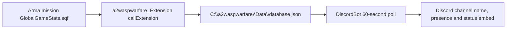

# External Integrations

## Discord Bot

`DiscordBot` is a .NET 9 executable using:

- `Discord.Net` 3.10.0
- `Newtonsoft.Json` 13.0.2
- `Pastel` 4.0.2

The bot registers `/setup` and `/cleanup`, tracks a configured game-status channel/message, updates channel name and bot presence every 60 seconds, and reads `database.json` from a data source path. `GameData` maps exported mission stats to terrain/player-count display strings.

Required local files are intentionally absent from the repo:

- `DiscordBot/preferences.json`
- `DiscordBot/token.txt`

`preferences_sample.json` points `DataSourcePath` at `C:\a2waspwarfare\Data`. Runtime refuses to continue if `token.txt` is missing or empty, so do not treat a local bot run failure as a mission-code failure until those files are supplied.

## Arma Extension: `a2waspwarfare_Extension`

`Extension` is a .NET Framework 4.8 library using `RGiesecke.DllExport` and Newtonsoft.Json. It exports `_RVExtension@12`, parses comma-separated arguments, resolves an extension class by enum name, and currently includes `GLOBALGAMESTATS`.

Mission bridge:

- `Server/CallExtensions/GlobalGameStats.sqf`
- calls `"a2waspwarfare_Extension" callExtension format ["%1,%2,%3,%4,%5,%6", ...]`
- sends class name, west score, east score, map, uptime and player count every 60 seconds.

The handoff is file-based, not an HTTP API:

The extension writes `GameData.Instance` to `C:\a2waspwarfare\Data\database.json`; DiscordBot reads the configured data-source path and updates Discord every 60 seconds.

## AntiStack Database Extension

Server AntiStack scripts call `"A2WaspDatabase" callExtension` for player/team score storage and map selection. Key scripts:

- `callDatabaseRetrieve.sqf`
- `callDatabaseStore.sqf`
- `callDatabaseStoreSide.sqf`
- `callDatabaseSendPlayerList.sqf`
- `callDatabaseRequestSideTotalSkill.sqf`
- `callDatabaseFlushPlayerList.sqf`
- `callDatabaseSetMap.sqf`

This is live-server sensitive because extension/database latency can affect monitoring loops and team-balance decisions.

## BattlEye Filter

`BattlEyeFilter/publicvariable.txt` contains the public-variable rule used for AFK kick behavior. Client `updateclient.sqf` intentionally broadcasts `kickAFK`; BattlEye detects it and kicks because direct serverCommand paths are unavailable/disabled.

This file is feature-specific, not a comprehensive publicVariable hardening layer. The current filter contains only the `kickAFK` rule, so PVF spoofing and direct mission PV channels must not be considered protected by BattlEye until a restrictive whitelist is designed and tested.

## Public Server Metadata

The repo README lists:

- IP: `144.76.185.231`
- Port: `2302`
- Server name: `Miksuu's Warfare | CTI TvT PvE | discord.me/warfare`
- BattleMetrics and GameTracker links
- Trello board link

## Continue Reading

Previous: [Tools/build](Tools-And-Build-Workflow) | Next: [Feature status](Feature-Status-Register)

Main map: [Home](Home) | Fast path: [Quickstart](Quickstart-For-Humans-And-Agents) | Agent file: [`agent-context.json`](agent-context.json)
