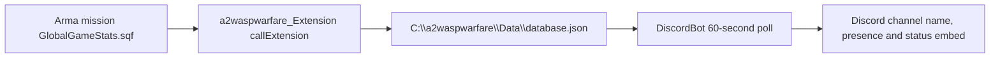

# External Integrations

This page maps the Discord bot, C# extension, AntiStack database extension, BattlEye filter and public server metadata. For the security-first view across these boundaries, use [Integration trust boundary audit](Integration-Trust-Boundary-Audit); it separates the DiscordBot JSON reader risk from the in-repo extension writer and the out-of-repo AntiStack DLL.

## Discord Bot

`DiscordBot` is a .NET 9 executable using:

- `Discord.Net` 3.10.0
- `Newtonsoft.Json` 13.0.2
- `Pastel` 4.0.2

The bot registers `/setup` and `/cleanup`, tracks a configured game-status channel/message, updates channel name and bot presence every 60 seconds, and reads `database.json` from a data source path. `GameData` maps exported mission stats to terrain/player-count display strings.

Required local files are intentionally absent from the repo:

- `DiscordBot/preferences.json`
- `DiscordBot/token.txt`

`preferences_sample.json` points `DataSourcePath` at `C:\a2waspwarfare\Data`. Runtime refuses to continue if `token.txt` is missing or empty, so do not treat a local bot run failure as a mission-code failure until those files are supplied.

### Discord Config Hygiene

Claude Round 16 verified that `DiscordBot/preferences_sample.json` currently includes concrete sample IDs (`GuildID`, `AuthorizedUserIDs`) plus the production-style `DataSourcePath`. `DiscordBot/FileConfiguration.cs` also has `DataSourcePath`/`botconfig.json` support, but the active status-data reader bypasses it: `DiscordBot/src/ExtensionData/GameData/GameData.cs` resolves `Preferences.Instance.DataSourcePath ?? C:\a2waspwarfare\Data`. Static usage review found only `FileConfiguration.LogsPath` used by the live logging path, not by the live game-status JSON reader.

No token is committed, which is good. Still, treat the sample identifiers and hardcoded path as governance cleanup:

- replace real-looking sample IDs with obvious placeholders;
- prefer one config-loading path instead of multiple fallbacks;
- document whether `botconfig.json`, `preferences.json` or environment variables are the intended deployment source, then remove or clearly demote the unused path;
- keep `token.txt` and any live Discord IDs out of committed files.

### Discord Data Path Risk

Claude DR-31 completed the consumer-side review of the extension data path. The bot polls `database.json` on a 60-second timer, at startup and from a command path. Secret hygiene is good (`token.txt` and `preferences.json` are ignored, and commands are auth-gated), but `DiscordBot/src/ExtensionData/GameData/GameData.cs` deserializes that JSON with Newtonsoft `TypeNameHandling.All`.

That setting is unnecessary for the flat `GameData` DTO and creates a local-write-gated RCE sink in the token-holding bot process if anything can write to `C:\a2waspwarfare\Data\database.json`. Fix direction: use `TypeNameHandling.None` for the active reader and remove or make private/safe the still-callable `.Auto` helper in `DiscordBot/src/ExtensionData/GameData/GameDataDeSerialization.cs:31-36`.

Do not conflate this with the in-repo extension writer: `Extension/src/SerializationManager.cs` writes the live database JSON with `TypeNameHandling.None`. The active `TypeNameHandling.All` sink is the DiscordBot reader, while the in-repo extension's `Auto` deserialization path is dead/commented scaffolding unless a future persistence load path revives it.

## Arma Extension: `a2waspwarfare_Extension`

`Extension` is a legacy .NET Framework 4.8 x86 Arma 2 OA extension using `RGiesecke.DllExport`/`UnmanagedExports` and Newtonsoft.Json. It is not an SDK-style `dotnet build` target. Build it with Visual Studio/MSBuild after restoring the old `../packages` NuGet layout, and preserve x86 for Arma 2 OA extension loading. It exports `_RVExtension@12`, parses comma-separated arguments, resolves an extension class by enum name, and currently includes `GLOBALGAMESTATS`.

Mission bridge:

- `Server/CallExtensions/GlobalGameStats.sqf`
- calls `"a2waspwarfare_Extension" callExtension format ["%1,%2,%3,%4,%5,%6", ...]`
- sends class name, west score, east score, map, uptime and player count every 60 seconds.

The handoff is file-based, not an HTTP API:

The extension writes `GameData.Instance` to `C:\a2waspwarfare\Data\database.json`; DiscordBot reads the configured data-source path and updates Discord every 60 seconds.

Implementation notes from the source:

- `Extension/src/ExtensionMethods.cs` exports `_RVExtension@12` through `RGiesecke.DllExport`.
- `Extension/src/BaseExtensionClass/ExtensionName.cs` only enumerates `GLOBALGAMESTATS` in the in-repo extension.
- `Extension/src/SerializationManager.cs` writes `database.json` through a temp file and `File.Replace`.
- `SerializeDB()` is `async void`, so extension write failures can become log-only/asynchronous failures rather than mission-visible errors.

Claude DR-29 sharpened this boundary: the in-repo `GLOBALGAMESTATS` extension is not an SQF RCE path today because `GlobalGameStats.sqf` discards the `callExtension` return, the extension does not write `_output`, and the active writer serializes with `TypeNameHandling.None`. It still has code-owner risks: a commented/load-path deserialization landmine using Newtonsoft `TypeNameHandling.Auto`, an `async void` create/write race around `File.Replace`, stale write-only persistence scaffolding, and a player-count heuristic in `GlobalGameStats.sqf` that uses `abs(_playerCount - 1)` to exclude one assumed headless client. That can misreport 0-HC, multi-HC or unusual bot/player states.

## AntiStack Database Extension

Deep page: [AntiStack database extension audit](AntiStack-Database-Extension-Audit) owns the current runtime map, ON/OFF guards, wrapper procedure table, remaining `call compile` return-shape risks and validation pack.

Server AntiStack scripts call `"A2WaspDatabase" callExtension` for player/team score storage and map selection. Key scripts:

- `callDatabaseRetrieve.sqf`
- `callDatabaseStore.sqf`
- `callDatabaseStoreSide.sqf`
- `callDatabaseSendPlayerList.sqf`
- `callDatabaseRequestSideTotalSkill.sqf`
- `callDatabaseFlushPlayerList.sqf`
- `callDatabaseSetMap.sqf`

This is live-server sensitive because extension/database latency can affect monitoring loops and team-balance decisions.

Claude DR-7 through DR-10 found that all seven AntiStack DB wrappers `call compile` the `A2WaspDatabase` extension return. The `A2WaspDatabase` DLL is not in this repo, and `WFBE_C_ANTISTACK_ENABLED` defaults on in mission constants. In Arma 2 OA there is no `parseSimpleArray`, so hardening has to guard and shape-check the compiled value before reading it, plus add a circuit breaker for missing/slow extension responses.

Important distinction: the in-repo `Extension` project implements `a2waspwarfare_Extension` / `GLOBALGAMESTATS`; AntiStack uses a separate out-of-repo `A2WaspDatabase` extension. Current source also has a controlled AntiStack ON/OFF parameter and disabled-mode loop guards, but enabled mode still needs extension return-shape hardening; see [AntiStack database extension audit](AntiStack-Database-Extension-Audit).

## BattlEye Filter

Page ownership: this section is the canonical shipped BattlEye/server-filter posture. Other pages should link here instead of restating the `kickAFK`/missing-filter evidence.

`BattlEyeFilter/publicvariable.txt` contains the public-variable rule used for AFK kick behavior. Client `updateclient.sqf` intentionally broadcasts `kickAFK`; BattlEye detects it and kicks because direct serverCommand paths are unavailable/disabled.

| Shipped evidence | Developer meaning |
| --- | --- |
| `BattlEyeFilter/publicvariable.txt` contains only `//new` and `5 "kickAFK"`. | This is feature plumbing for AFK kick, not a comprehensive publicVariable hardening layer. |
| No in-tree `scripts.txt`, `server.cfg`, `basic.cfg` or broader BattlEye filter bundle is present. | The repo cannot claim shipped public-server BattlEye hardening; production `BEpath` files remain an owner/deployment question. |
| `updateclient.sqf:153-162` explicitly tells hosts to place `publicVariable.txt` beside `server.cfg` and broadcasts `kickAFK`. | BattlEye filtering is a contingent local-server filter layer: if production loads BE filters, they can act as defense in depth; if it does not, server-side authority remains the durable fix. |
| PVF registered commands and direct mission PV channels both exist. | Filter design must include `WFBE_PVF_*` plus direct channels, and still does not replace server-side authority checks. |

Claude DR-30 closed the remediation loop: as shipped in this repo, the "rely on BattlEye" option is not implemented. No `scripts.txt`, `server.cfg`, `basic.cfg` or broader BattlEye filter bundle is present in the tree. Production servers may have external `BEpath` files, but that is an owner/deployment question, not documented source truth.

Arma 2 OA filter guidance should name the OA-era files that matter here: `publicvariable.txt` for PV/PVEH channels, `scripts.txt` for script-command injection/client locality abuse, and command-specific filters such as `createvehicle.txt`, `setvariable.txt`, `setpos.txt`, `setdamage.txt`, `deletevehicle.txt`, `mpeventhandler.txt`, cargo filters, `teamswitch.txt`, `waypointcondition.txt`, `selectplayer.txt` and `attachto.txt`. Do not list `remoteexec.txt` as a missing Arma 2 OA filter; `remoteExec` / `remoteExecCall` are Arma 3 commands.

Filter design should be driven by [Networking and public variables](Networking-And-Public-Variables), [Public variable channel index](Public-Variable-Channel-Index) and [Server authority migration map](Server-Authority-Migration-Map). A PV filter alone still will not solve client-side `createVehicle`/`createUnit` authority; that class needs BattlEye `scripts.txt` or a server-authoritative redesign.

## License And CI Posture

Claude Round 16 resolved the external reports' license uncertainty: `LICENSE.md` is a custom/proprietary/source-available license, not an OSI open-source license. Treat redistribution/reuse as restricted unless the repo owner explicitly grants it.

The docs branch now has docs-only CI in `.github/workflows/docs.yml`: Windows wiki validation plus an Ubuntu MkDocs strict build. Treat that as documentation validation, not release CI. Useful additional checks for this project would be:

- .NET builds for `Tools/LoadoutManager`, `DiscordBot` and `Extension` where the platform/toolchain is available;
- generated-mission drift checks after LoadoutManager runs;
- SQF/string reference checks for `preprocessFileLineNumbers`, `execVM`, `ExecFSM` and dialog `onLoad` paths;
- wiki machine-file validation for `agent-context.json`, `agent-status.json`, `agent-collaboration.json` and `agent-events.jsonl`.

## Public Server Metadata

The repo README lists:

- IP: `144.76.185.231`
- Port: `2302`
- Server name: `Miksuu's Warfare | CTI TvT PvE | discord.me/warfare`
- BattleMetrics and GameTracker links
- Trello board link

## Continue Reading

Previous: [Tools/build](Tools-And-Build-Workflow) | Next: [Integration trust boundary audit](Integration-Trust-Boundary-Audit)

Main map: [Home](Home) | Fast path: [Quickstart](Quickstart-For-Humans-And-Agents) | Agent file: [`agent-context.json`](agent-context.json)
