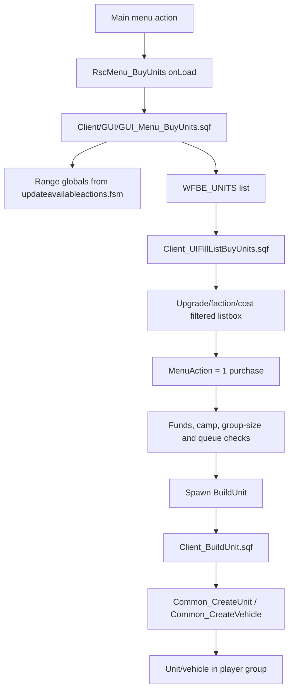
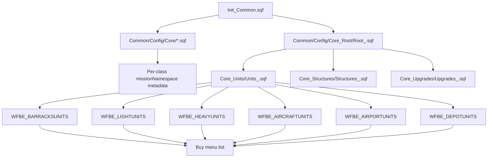

# Factory And Purchase Systems Atlas

This page maps how units and vehicles become purchasable, how the buy menu gates and queues player purchases, how spawned units enter the mission, and where the older server-side AI buy path currently sits.

Primary source scope:

- `Rsc/Dialogs.hpp`
- `Client/GUI/GUI_Menu.sqf`
- `Client/GUI/GUI_Menu_BuyUnits.sqf`
- `Client/Functions/Client_BuildUnit.sqf`
- `Client/Functions/Client_UIFillListBuyUnits.sqf`
- `Client/Functions/Client_UIChangeComboBuyUnits.sqf`
- `Client/FSM/updateavailableactions.fsm`
- `Client/Init/Init_Client.sqf`
- `Common/Init/Init_Common.sqf`
- `Common/Init/Init_CommonConstants.sqf`
- `Common/Init/Init_PublicVariables.sqf`
- `Common/Config/Core/*.sqf`
- `Common/Config/Core_Root/*.sqf`
- `Common/Config/Core_Units/*.sqf`
- `Common/Config/Core_Squads/*.sqf`
- `Common/Functions/Common_CreateUnit.sqf`
- `Common/Functions/Common_CreateVehicle.sqf`
- `Server/Functions/Server_BuyUnit.sqf`
- `Server/Init/Init_Server.sqf`

## Executive Summary

| Area | Source-backed finding |
| --- | --- |
| Player buy path | The player buy menu does not send a `RequestBuyUnit` PVF. `GUI_Menu_BuyUnits.sqf` calls local `BuildUnit`, compiled from `Client_BuildUnit.sqf`, then deducts client funds. |
| Server buy path | `Init_Server.sqf` compiles `AIBuyUnit = Server_BuyUnit.sqf`, but source search finds no current caller besides the compile. Treat it as latent/unused until a dynamic call is proven. |
| Config model | `Common/Config/Core/*.sqf` creates per-class metadata arrays; `Core_Units/*.sqf` groups class names into factory lists such as `WFBE_WESTLIGHTUNITS`; `Core_Root/*.sqf` selects which side root calls which unit/structure/upgrade files. |
| Availability | `updateavailableactions.fsm` sets `barracksInRange`, `lightInRange`, `heavyInRange`, `aircraftInRange`, `depotInRange` and `hangarInRange`. Command center range can replace normal purchase range through `commandInRange`. |
| Queueing | Player queue caps are client missionNamespace counters initialized in `Init_Client.sqf`; factory FIFO order is stored on the building variable `queu`. |
| Unit creation | Both client and server paths call common primitives: `WFBE_CO_FNC_CreateUnit` and `WFBE_CO_FNC_CreateVehicle`, which attach global init, killed/hit handlers, tracking and performance-audit hooks. |
| Risk | Purchase authority is largely client-side for player buys. That is consistent with legacy Warfare locality, but high-value additions should not assume there is a server-side purchase validator. |

## Player Purchase Flow



Entry points:

- `GUI_Menu.sqf` creates `RscMenu_BuyUnits`.
- `Dialogs.hpp` defines `RscMenu_BuyUnits` with `idd = 12000` and `onLoad = "_this ExecVM ""Client\GUI\GUI_Menu_BuyUnits.sqf"""`.
- `Init_Client.sqf` compiles `BuildUnit`, `UIChangeComboBuyUnits` and `UIFillListBuyUnits`.

The menu starts by choosing the closest available purchase category from the range globals:

- `Barracks`
- `Light`
- `Heavy`
- `Aircraft`
- `Depot`
- `Airport`

If no purchase type is in range, the dialog closes.

## Range And Availability

`Client/FSM/updateavailableactions.fsm` runs after client init and updates the globals used by the UI. It loads these important constants:

| Constant | Default | Role |
| --- | ---: | --- |
| `WFBE_C_UNITS_PURCHASE_RANGE` | `150` | Normal factory purchase range. |
| `WFBE_C_STRUCTURES_COMMANDCENTER_RANGE` | `5500` | Command center remote interaction range. |
| `WFBE_C_TOWNS_PURCHASE_RANGE` | `60` | Depot purchase range. |
| `WFBE_C_UNITS_PURCHASE_HANGAR_RANGE` | `50` | Airport/hangar purchase range. |

The FSM sets `_purchaseRange = if (commandInRange) then {_ccr} else {_pur}`. That means the command center can effectively turn normal barracks/light/heavy/aircraft purchase into a much larger remote-purchase radius. Depot and hangar logic use their own closest-depot/airport checks.

The active buy menu then reads:

- `barracksInRange`
- `lightInRange`
- `heavyInRange`
- `aircraftInRange`
- `depotInRange`
- `hangarInRange`

## Config Chain



`Init_Common.sqf` first loads the broad `Common/Config/Core/*.sqf` files, including `Core_US.sqf`, `Core_USMC.sqf`, `Core_RU.sqf`, `Core_TKA.sqf` and other content cores. These core files define per-class metadata arrays and store them under the class name in `missionNamespace`.

The metadata layout is defined by `Init_CommonConstants.sqf`:

| Index | Constant | Meaning |
| ---: | --- | --- |
| `0` | `QUERYUNITLABEL` | Display label. |
| `1` | `QUERYUNITPICTURE` | UI picture or portrait. |
| `2` | `QUERYUNITPRICE` | Base price. |
| `3` | `QUERYUNITTIME` | Build time. |
| `4` | `QUERYUNITCREW` | Crew slot metadata or scalar sentinel. |
| `5` | `QUERYUNITUPGRADE` | Required upgrade level. |
| `6` | `QUERYUNITFACTORY` | Factory category index/type. |
| `7` | `QUERYUNITSKILL` | AI skill. |
| `8` | `QUERYUNITFACTION` | Faction filter label. |
| `9` | `QUERYUNITTURRETS` | Extra turret paths. |

Representative metadata example from `Core_US.sqf`: `US_Soldier_EP1` has price `150`, build time `4`, infantry upgrade requirement `0`, factory category `0`, skill `1` and faction `US`.

After core metadata is loaded, `Core_Root/Root_<side>.sqf` chooses side-specific root data and calls the matching `Core_Units`, `Core_Squads`, `Core_Structures` and `Core_Upgrades` files. For example, `Root_US.sqf` sets West crew/pilot/soldier/support vehicle arrays and then calls `Units_CO_US.sqf`, `Structures_CO_US.sqf` and `Upgrades_CO_US.sqf`.

## Factory Lists

`Core_Units/*.sqf` files put class names into six purchase pools:

| Pool | Example variable | Menu tab |
| --- | --- | --- |
| Barracks | `WFBE_WESTBARRACKSUNITS` | Infantry. |
| Light | `WFBE_WESTLIGHTUNITS` | Cars, trucks, light armor, support vehicles. |
| Heavy | `WFBE_WESTHEAVYUNITS` | APCs, tanks, heavy artillery/AA. |
| Aircraft | `WFBE_WESTAIRCRAFTUNITS` | Helicopters and some fixed-wing classes. |
| Airport | `WFBE_WESTAIRPORTUNITS` | Fixed-wing/hangar purchases. |
| Depot | `WFBE_WESTDEPOTUNITS` | Civilian/simple vehicles and optionally town infantry. |

`Units_CO_US.sqf` shows the complete pattern:

- Sets `WFBE_WESTBARRACKSUNITS`, then calls `Client/Init/Init_Faction.sqf` locally to build faction-filter labels.
- Sets `WFBE_WESTLIGHTUNITS`, `WFBE_WESTHEAVYUNITS`, `WFBE_WESTAIRCRAFTUNITS`, `WFBE_WESTAIRPORTUNITS` and `WFBE_WESTDEPOTUNITS`.
- Adds depot infantry only if `WFBE_C_UNITS_TOWN_PURCHASE > 0`.
- Adds boats only when `IS_naval_map` is true.
- Handles Chernarus vs non-Chernarus class variants through `IS_chernarus_map_dependent`.

## Buy Menu Filtering

`Client_UIFillListBuyUnits.sqf` fills the listbox from the selected factory pool. It applies:

- Unit-cost upgrade modifier: `WFBE_UP_UNITCOST` sets `UNIT_COST_MODIFIER` to `0.75` or `0.5`.
- Current side upgrades: a unit is shown if `QUERYUNITUPGRADE <= currentUpgrades select tabValue`.
- Faction dropdown filter: values come from `WFBE_<side><factory>FACTIONS`, built by `Init_Faction.sqf`.
- Depot exceptions: some infantry are manually allowed when barracks upgrade thresholds are met.
- Visual coloring for repair trucks, ammo trucks, airlift vehicles, ambulances, salvage trucks, artillery vehicles and supply trucks.

Cost shown in the list is:

```sqf
round (((_c select QUERYUNITPRICE) * ATTACK_WAVE_PRICE_MODIFIER) * UNIT_COST_MODIFIER)
```

The visible list is therefore a combined result of core metadata, side upgrade state, faction filter state, unit-cost upgrades and attack-wave discount state.

## Purchase Checks

When `MenuAction == 1`, `GUI_Menu_BuyUnits.sqf` performs these checks before spawning:

| Check | Source behavior |
| --- | --- |
| Funds | Uses `Call GetPlayerFunds`; missing funds blocks and hints. |
| Depot infantry camps | Depot infantry purchase requires all camps on that town to belong to the player's side. |
| Group size | Uses live units plus local `unitQueu`, scaled by barracks upgrade and with a commander bonus. |
| Crew count | Vehicle purchases can include driver, gunner, commander and extra turret crew. |
| Queue cap | Checks `WFBE_C_QUEUE_<type>` against `WFBE_C_QUEUE_<type>_MAX`. |
| Factory queue text | Reads the selected building's `queu` variable to show immediate or queued purchase hint. |

If accepted:

1. `WFBE_C_QUEUE_<type>` increments locally.
2. `_params Spawn BuildUnit`.
3. Funds are deducted with `ChangePlayerFunds`.

Important authority note: no server PVF request is sent for this player purchase. There is also no `Server/PVFunctions/RequestBuyUnit.sqf` in the current source and `RequestBuyUnit` is not registered in `Init_PublicVariables.sqf`.

## Queue Model

There are two queue concepts:

| Queue | Scope | Source |
| --- | --- | --- |
| Client queue cap | Client missionNamespace counters such as `WFBE_C_QUEUE_LIGHT`, max values initialized in `Init_Client.sqf`. | Prevents a player from starting too many concurrent local builds by category. |
| Factory FIFO | Building variable `queu`, public on the building. | Orders builds at the same selected factory. |

`Client_BuildUnit.sqf` appends a random `_unique` ID to `_building getVariable "queu"` and waits until that ID reaches the front. If the queue appears stuck longer than `WFBE_LONGEST<factory>BUILDTIME`, it removes the head entry. Longest build times are calculated in `Init_Common.sqf` by scanning the purchasable units for each structure and side.

Queue cleanup is fragile by design: changing factory type labels, longest-build variables or queue mutation rules can strand entries or let concurrent purchases overlap.

Claude DR-33 adds two concrete implementation hazards:

| Hazard | Evidence | Fix direction |
| --- | --- | --- |
| Empty-vehicle buys leak the client queue counter. | Current source still has an empty-vehicle `exitWith` before the normal `unitQueu` / `WFBE_C_QUEUE_*` decrement in `Client_BuildUnit.sqf`. | Patch-ready, not patched. Smoke repeated crewless vehicle buys and normal crewed/infantry buys after the fix. See [Factory queue counter token cleanup](Factory-Queue-Counter-Token-Cleanup). |
| Factory FIFO token identity is collision-prone; `queu` broadcast churn remains. | Current source still uses a low-entropy random `varQueu` token, and the building `queu` array is still broadcast with `setVariable [..., true]` on enqueue/progress/completion. | Patch the local token and counter first; broadcast reduction remains a separate UI-aware follow-up. See [Factory queue counter token cleanup](Factory-Queue-Counter-Token-Cleanup). |

## Spawn Position Model

`Client_BuildUnit.sqf` chooses spawn positions from either structure distance/direction arrays or nearby helper pads:

| Factory type | Preferred helper object | Fallback |
| --- | --- | --- |
| Light | `HeliH`, excluding `HeliHCivil` and `HeliHRescue` | Structure modelToWorld distance/direction. |
| Heavy | `HeliHRescue` | Structure modelToWorld distance/direction. |
| Aircraft | `HeliHCivil` | Structure modelToWorld distance/direction. |
| Barracks | `Sr_border` | Structure modelToWorld distance/direction. |
| Depot | `WFBE_C_DEPOT_BUY_DISTANCE` / `WFBE_C_DEPOT_BUY_DIR` | Position from town depot logic. |
| Airport | `WFBE_C_HANGAR_BUY_DISTANCE` / `WFBE_C_HANGAR_BUY_DIR` | Position from airfield logic. |

This means map object placement can alter purchase spawn behavior without touching scripts.

## Creation And Initialization

Player build path:

- Infantry: `Client_BuildUnit.sqf` calls `WFBE_CO_FNC_CreateUnit`.
- Vehicles: `Client_BuildUnit.sqf` calls `WFBE_CO_FNC_CreateVehicle`, then adds local vehicle actions, balance, artillery, missile, countermeasure, IRS, engine and reload handlers.
- Optional crew are created through `WFBE_CO_FNC_CreateUnit` and moved into driver/gunner/commander/turret positions.
- Created units are sent to the leader waypoint helper through `WFBE_CL_FNC_SendSpawnedUnitsToLeaderWaypoint`.

Common creation behavior:

- `Common_CreateUnit.sqf` sets unit skill from `QUERYUNITSKILL`, applies selected special-case loadout fixes, attaches killed handler and runs `Init_Unit.sqf` depending on infantry tracking/global-init rules.
- `Common_CreateVehicle.sqf` creates the vehicle, applies tank/APC modification, textures, direction/velocity, lock state, killed/hit bounty handlers, optional global `setVehicleInit`, map combat marker fired handler and performance audit.

## Server AI Buy Path

`Server/Init/Init_Server.sqf` compiles:

```sqf
AIBuyUnit = Compile preprocessFile "Server\Functions\Server_BuyUnit.sqf";
```

`Server_BuyUnit.sqf` is a full server-side purchase worker:

- expects `_id`, `_building`, `_unitType`, `_side`, `_team` and vehicle crew flags;
- appends to the building `queu`;
- waits for the factory FIFO;
- exits if the factory dies or a player takes over the AI team;
- creates units/vehicles server-side through the common primitives;
- applies vehicle handlers and crew logic;
- clears the team's `wfbe_queue` entry when done.

Current status: a source search finds `AIBuyUnit` only in the compile line and `Server_BuyUnit.sqf` itself. No active caller was found in the source mission. Treat the server buy worker as latent or abandoned until a dynamic call path is proven.

## Attack Wave And Unit Cost Modifiers

The buy menu cost path includes two global modifiers:

| Modifier | Source |
| --- | --- |
| `ATTACK_WAVE_PRICE_MODIFIER` | Initialized in `Init_CommonConstants.sqf`; changed by attack-wave client special messages. |
| `UNIT_COST_MODIFIER` | Initialized to `1`; updated by `Client_UIFillListBuyUnits.sqf` from `WFBE_UP_UNITCOST`. |

Attack wave itself is handled through direct public variable channels:

- `Common_AttackWaveActivate.sqf` sends `ATTACK_WAVE_INIT` to the server.
- `Server_AttackWave.sqf` publishes `ATTACK_WAVE_DETAILS`.
- `Server/PVFunctions/AttackWave.sqf` listens for `ATTACK_WAVE_DETAILS` and sends `HandleSpecial` / `LocalizeMessage` updates to clients.
- `Client/PVFunctions/HandleSpecial.sqf` updates `ATTACK_WAVE_PRICE_MODIFIER`.

Because player purchase cost is calculated client-side, any attack-wave or unit-cost work must keep UI display, local affordability and actual deduction aligned.

## Relationship To AI Squads

`Core_Squads/Squads_GetFactionGroups.sqf` reads `QUERYUNITFACTORY` and `QUERYUNITUPGRADE` from the same per-class metadata arrays to infer what factories and upgrade levels a group template requires.

This means class metadata mistakes can break more than the visible buy menu:

- buy list gating;
- AI squad requirement derivation;
- bounties and score;
- build time;
- factory categorization;
- crew/turret generation;
- skill applied by `Common_CreateUnit`.

## Current Risks And Partial Features

| Risk / status | Evidence | Development guidance |
| --- | --- | --- |
| No player `RequestBuyUnit` server authority | `Init_PublicVariables.sqf` has no `RequestBuyUnit`; `GUI_Menu_BuyUnits.sqf` calls local `BuildUnit` and deducts funds client-side. | For high-value or exploit-sensitive purchases, add a server-validated request path or at least document why client-local creation is acceptable for the target server model. |
| `Server_BuyUnit.sqf` appears unused | `AIBuyUnit` is compiled in `Init_Server.sqf`, but source search finds no caller. | Before reviving AI purchases, find intended caller history or design a new explicit AI commander production loop. |
| Player/server build drift | `Client_BuildUnit.sqf` and `Server_BuyUnit.sqf` duplicate vehicle handler, missile, IRS, countermeasure and crew setup logic. | Any new vehicle behavior may need both paths unless server path is formally retired or refactored. |
| Queue state is fragile | Building `queu` and client `WFBE_C_QUEUE_*` counters are manually incremented/decremented; DR-33 counter/token fixes are patch-ready but still absent from current source, while public queue broadcast churn also remains. | Always test cancellation, factory destruction, menu close, empty-vehicle buys, repeated purchases and queue hints when touching queues. |
| Cost authority is local | Menu checks funds and calls `ChangePlayerFunds` locally after spawning build thread. | Do not add new economy side effects to purchase without tracing client funds, commander income, side supply and PV hardening. |
| Spawn pads are object-class conventions | Light/heavy/air/barracks pads depend on nearby helper object classes. | Document required map editor objects when adding or moving bases. |
| Attack-wave cost is client-visible state | `ATTACK_WAVE_PRICE_MODIFIER` affects list display and purchase cost. | Keep JIP sync and local modifier state aligned before adding temporary discounts. |

## Implementation Checklist

When adding or changing purchasable units:

1. Define or update the class metadata in the relevant `Common/Config/Core/Core_*.sqf` file.
2. Make sure the metadata fields match `QUERYUNIT*` constants, especially price, time, crew, upgrade, factory, faction and turrets.
3. Add the classname to every intended `Common/Config/Core_Units/Units_*.sqf` factory pool.
4. If the class is a support vehicle, update side root arrays such as `WFBE_<side>REPAIRTRUCKS`, `AMMOTRUCKS`, `SUPPLYTRUCKS`, `SALVAGETRUCK`, `AMBULANCES`, `LIFTVEHICLE` or `ARTYVEHICLE`.
5. Check whether AI squad templates or support scripts expect the class.
6. Test list filtering by upgrade level and faction dropdown.
7. Test queue behavior at the relevant factory and with the factory destroyed mid-build.
8. If AI commander/server production must use the class, either verify an active caller for `AIBuyUnit` or implement the server caller intentionally.
9. Run `Tools/LoadoutManager` after gameplay edits so generated missions receive the source changes.
10. Update this page, [Feature status](Feature-Status-Register), [Client UI systems atlas](Client-UI-Systems-Atlas) and [`agent-context.json`](agent-context.json) when changing purchase authority or config ownership.

## Handoff For Claude / Future Review

- Review whether `Server_BuyUnit.sqf` should be revived, removed from docs as retired, or wired into a new AI commander production design.
- Compare every vehicle handler in `Client_BuildUnit.sqf` vs `Server_BuyUnit.sqf` and decide whether drift is acceptable.
- Design a minimal server-side validation layer for player purchases that respects Arma 2 locality and does not break hosted/JIP behavior.
- Cross-check depot town purchase with current town-camp ownership logic and supply-truck status.

## Continue Reading

Previous: [Construction and CoIn](Construction-And-CoIn-Systems-Atlas) | Next: [Server runtime atlas](Server-Gameplay-Runtime-Atlas)

Main map: [Home](Home) | Fast path: [Quickstart](Quickstart-For-Humans-And-Agents) | Agent file: [`agent-context.json`](agent-context.json)
