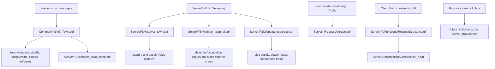
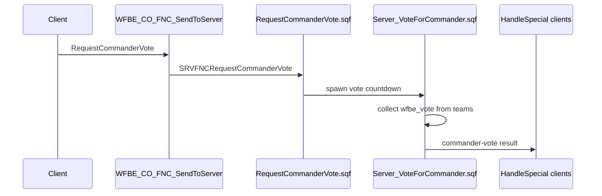
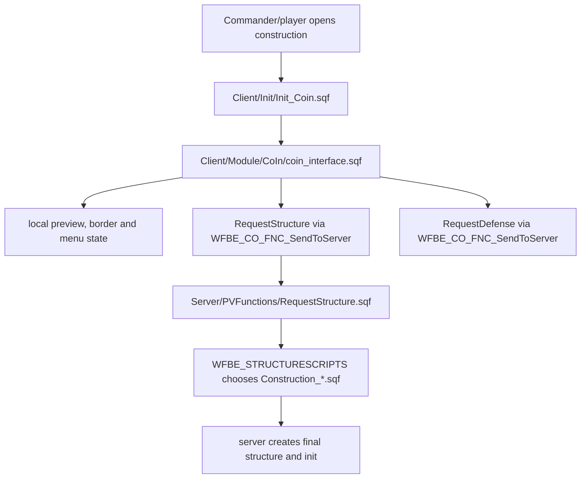

# Gameplay Systems Atlas

This page maps the main gameplay systems that make Warfare feel like Warfare: towns, economy, commander flow, upgrades, construction and factories. It is source-backed against `Missions/[55-2hc]warfarev2_073v48co.chernarus`.

## System Flow



## Town Initialization

### Source files

- `mission.sqm`
- `Common/Init/Init_Town.sqf`
- `Server/Init/Init_Towns.sqf`
- `Server/FSM/server_town_camp.sqf`
- `Server/FSM/server_town.sqf`
- `Server/FSM/server_town_ai.sqf`

`mission.sqm` places town logics and calls `Common/Init/Init_Town.sqf` with town name, optional dubbing name, start supply value, max supply value, town value and town group template/type; for example `mission.sqm:128` wires Kamenka and `:3265` stores the town-mode removal lists before `Common\Init\Init_TownMode.sqf`.

`Init_Town.sqf` waits for town mode and mission parameters, skips disabled towns from `TownTemplate`, then sets the core town variables (`Common/Init/Init_Town.sqf:25`, `:35-40`, `:63-64`, `:87-88`):

| Variable | Purpose |
| --- | --- |
| `name` | Display/logging name. |
| `range` | Town range, currently initialized to 600. |
| `startingSupplyValue` | Reset floor after capture and initial SV. |
| `maxSupplyValue` | Supply value cap. |
| `lastSupplyMissionRun` | Supply mission cooldown bookkeeping. |
| `supplyMissionCoolDownEnabled` | Whether town supply mission is currently cooling down. |
| `wfbe_town_type` | Chosen town group template/type; arrays are randomized to one template. |
| `camps` | Synchronized camp logics. |
| `wfbe_town_defenses` | Synchronized defense logics. |
| `wfbe_town_dubbing` | Radio/dubbing name. |
| `sideID` | Owning side ID, defaulting to defender when unset. |
| `supplyValue` | Current town SV, public. |

Camp creation is server-owned. For each synchronized camp, the server creates a camp bunker model, flag object and side/supply variables, then starts `Server/FSM/server_town_camp.sqf` once all camps are initialized (`Common/Init/Init_Town.sqf:75-130`).

Client town initialization waits for `camps`, assigns camp marker names and records town ownership on camp logic objects (`Common/Init/Init_Town.sqf:151-160`).

## Town Starting Modes

`Server/Init/Init_Towns.sqf` runs after `townInit` when starting mode or patrols are enabled (`Server/Init/Init_Towns.sqf:3`) and finishes by setting `townInitServer = true` (`:183`).

Supported starting modes:

| Mode | Behavior |
| --- | --- |
| `0` | No special starting distribution; server sets `townInitServer = true` directly. |
| `1` | 50/50 split: towns nearest west start become west; remaining towns become east. |
| `2` | Nearby towns: each side gets a limited number of nearby towns. |
| `3` | Random 25/25/50 style setup: west/east/resistance distribution, using boundaries when available. |

Resistance patrols are enabled by setting `wfbe_patrol_enabled` on selected towns; old `respatrol.fsm` references are commented, while `server_town_ai.sqf` later starts `Server/FSM/server_patrols.sqf`.

## Town Capture And Supply Value

`Server/Init/Init_Server.sqf:510` starts one global town loop:

```sqf
[] Spawn {[] execVM 'Server\FSM\server_town.sqf'};
```

`server_town.sqf` iterates every town while the game is running. It performs:

- active entity scan near each town for `Man`, `Car`, `Motorcycle`, `Tank`, `Air` and `Ship` (`Server/FSM/server_town.sqf:57`);
- side counts for west/east/resistance (`server_town.sqf:65-71`);
- capture-mode logic (`server_town.sqf:13`, `:112-156`);
- supply value reduction during attack (`server_town.sqf:209-213`);
- supply value restoration when protected (`server_town.sqf:217-222`);
- time-based supply growth when configured (`server_town.sqf:78-97`);
- town capture event publication (`server_town.sqf:235-240`);
- camp side updates (`server_town.sqf:241`);
- town defense removal/recreation (`server_town.sqf:244-255`);
- performance audit recording (`server_town.sqf:263-265`).

Capture modes observed in source:

| Mode | Behavior |
| --- | --- |
| `0` | Classic capture; mixed hostile presence blocks capture. |
| `1` | Dominion logic; strongest side can reduce opposing side counts. |
| `2` | Dominion plus camp ownership requirement: a side must hold all camps before capture proceeds. |

On capture, the loop:

- resets/updates `sideID` and `supplyValue`;
- sends side messages;
- publishes `[nil, "TownCaptured", [_location, _sideID, _newSID]]` via `WFBE_CO_FNC_SendToClients`;
- calls `WFBE_SE_FNC_SetCampsToSide` if camps are enabled;
- removes old town defense units;
- creates new defender/occupation defenses if enabled.

Performance note: this loop deliberately sleeps `0.05` between towns (`server_town.sqf:259`) and records active time, town count, nearEntities count, detected units, network writes and capture count through `PerformanceAudit_Record` (`:263-265`).

## Town AI Activation

`Server/Init/Init_Server.sqf:512-514` starts `Server/FSM/server_town_ai.sqf` only when defender or occupation AI is enabled.

`server_town_ai.sqf` is separate from town ownership/capture. It:

- initializes `wfbe_active`, `wfbe_active_air`, `wfbe_active_sideIDs`, `wfbe_inactivity`, `wfbe_active_vehicles` and `wfbe_town_teams` (`Server/FSM/server_town_ai.sqf:24-31`);
- scans each town for enemies, excluding aircraft from activation scans to prevent fly-by spawns (`server_town_ai.sqf:85`, `:90`);
- publishes side-scoped active visibility through `wfbe_active_sideIDs` (`server_town_ai.sqf:107`);
- chooses defender or occupation group templates;
- spawns/manages town AI via server, client delegation or headless delegation (`server_town_ai.sqf:159-180`);
- mans static defenses through `WFBE_SE_FNC_OperateTownDefensesUnits` (`server_town_ai.sqf:185`);
- despawns town AI and active vehicles after inactivity (`server_town_ai.sqf:191-222`);
- starts patrols with `Server/FSM/server_patrols.sqf` when enabled (`server_town_ai.sqf:228-230`).

AI delegation mode comes from `WFBE_C_AI_DELEGATION`:

| Mode | Behavior |
| --- | --- |
| `0` or fallback | Server creates town units with `WFBE_CO_FNC_CreateTownUnits`. |
| `1` | Server delegates town AI to clients through `WFBE_SE_FNC_DelegateAITown`. |
| `2` | Server delegates town AI to headless clients when `WFBE_HEADLESSCLIENTS_ID` is populated. |

Risk notes:

- Town AI activation and capture loops are independent; changing one can make the other stale.
- Detection range differs for inactive vs active towns.
- `wfbe_active_sideIDs` and `wfbe_attacker_sideIDs` are side-scoped visibility tools; avoid replacing them with global reveal flags.

## Economy And Resource Loop

`Server/Init/Init_Server.sqf:531` starts resources only when there are at least two present sides:

```sqf
[] ExecVM "Server\FSM\updateresources.sqf";
```

`Server/FSM/updateresources.sqf` loops over `WFBE_PRESENTSIDES` and computes:

- town supply with `WFBE_CO_FNC_GetTownsSupply` (`Server/FSM/updateresources.sqf:29`);
- income from supply value, depending on `WFBE_C_ECONOMY_INCOME_SYSTEM`;
- player and commander share when using commander-percent systems (`updateresources.sqf:38-42`);
- side supply increase through `ChangeSideSupply` when currency system is supply-based (`updateresources.sqf:49`);
- team funds through `WFBE_CO_FNC_ChangeTeamFunds` (`updateresources.sqf:63`);
- AI commander funds through `ChangeAICommanderFunds` when no player commander exists (`updateresources.sqf:67`).

Important parameters:

| Parameter | Role |
| --- | --- |
| `WFBE_C_ECONOMY_INCOME_SYSTEM` | Selects income mode. |
| `WFBE_C_ECONOMY_INCOME_INTERVAL` | Base resource tick interval. |
| `WFBE_C_ECONOMY_INCOME_COEF` | Multiplier for income mode 3. |
| `WFBE_C_ECONOMY_INCOME_DIVIDED` | Commander income divisor in mode 3. |
| `WFBE_C_ECONOMY_CURRENCY_SYSTEM` | Whether side supply currency is active. |
| `WFBE_C_ECONOMY_SUPPLY_MAX_TEAM_LIMIT` | Upper supply cap gate in resource loop. |
| `wfbe_commander_percent` | Per-side commander share, initialized on side logic. |

`Common_StagnateSupplyIncomeNoPlayers.sqf` is a live supply-income modifier, not only a retained helper: it is compiled at `Common/Init/Init_Common.sqf:160`, called by `Common/Functions/Common_ChangeSideSupply.sqf:17` when the caller passes the stagnation flag, and reached by the resource loop's supply-income call (`Server/FSM/updateresources.sqf:49`). If a side has no skill data and no players, it increments no-player ticks and can reduce supply income (`Common_StagnateSupplyIncomeNoPlayers.sqf:38-50`). It publishes `TEAM_WEST_TICKS_NO_PLAYERS` and `TEAM_EAST_TICKS_NO_PLAYERS` (`:55-56`).

Risk notes:

- Economy, AntiStack and side presence interact; changing AntiStack guards can change income behavior.
- Resource sleeps use `GetSleepFPS` (`Server/FSM/updateresources.sqf:74`; `Common/Functions/Common_GetSleepFPS.sqf:6-9`), so tick rate may adapt to server FPS.
- `WFBE_C_ECONOMY_SUPPLY_MAX_TEAM_LIMIT` gates the whole income block when side supply exceeds the limit.
- Side-supply and upgrade authority are part of the client-authoritative economy class. See [Deep-review findings](Deep-Review-Findings) DR-22/DR-23 and [Economy](Economy-Towns-And-Supply#authority-model).

## Commander Flow

### Source files

- `Server/PVFunctions/RequestCommanderVote.sqf`
- `Server/PVFunctions/RequestNewCommander.sqf`
- `Server/Functions/Server_VoteForCommander.sqf`
- `Server/Functions/Server_AssignNewCommander.sqf`
- `Common/Functions/Common_SetCommanderVotes.sqf`
- `Common/Functions/Common_GetCommanderTeam.sqf`

Commander vote flow:



`RequestCommanderVote.sqf` only starts a vote when side logic `wfbe_votetime <= 0` (`Server/PVFunctions/RequestCommanderVote.sqf:8`). It seeds votes with `SetCommanderVotes`, spawns `WFBE_SE_FNC_VoteForCommander`, sends `VotingForNewCommander`, and notifies clients with `HandleSpecial` (`:17-22`).

`Server_VoteForCommander.sqf` counts down `WFBE_C_GAMEPLAY_VOTE_TIME` (`Server/Functions/Server_VoteForCommander.sqf:14`), collects team votes (`:26`), resolves a winner or AI commander fallback, sets side logic `wfbe_commander` (`:49`), notifies clients (`:52`) and stops AI commander state when a player commander is elected (`:56`).

`RequestNewCommander.sqf` directly assigns a commander when no vote is running (`Server/PVFunctions/RequestNewCommander.sqf:8-12`), then spawns `WFBE_SE_FNC_AssignForCommander` and sends `new-commander-assigned` (`:13-14`).

Risk notes:

- `Server_AssignNewCommander.sqf` treats `_this` both as side and array (`Server/Functions/Server_AssignNewCommander.sqf:3-4`). DR-15 confirms this as a call-shape bug because `RequestNewCommander.sqf:13` calls it with `[_side, _assigned_commander]`; code-owner fix is `_side = _this select 0` plus removing the duplicate `new-commander-assigned` broadcast (`RequestNewCommander.sqf:14`, `Server_AssignNewCommander.sqf:9`). See [Deep-review findings](Deep-Review-Findings) DR-15.
- Commander identity lives on side logic and is public; client UI and resource distribution both depend on it.

## Upgrades

### Source files

- `Server/PVFunctions/RequestUpgrade.sqf`
- `Server/Functions/Server_ProcessUpgrade.sqf`
- `Common/Config/Core_Upgrades/Upgrades_*.sqf`
- `Common/Config/Core_Upgrades/Check_Upgrades.sqf`
- `Client/GUI/GUI_UpgradeMenu.sqf`

`RequestUpgrade.sqf` is a thin PVF wrapper that spawns `WFBE_SE_FNC_ProcessUpgrade` (`Server/PVFunctions/RequestUpgrade.sqf:5`). It is registered in the server PVF list at `Common/Init/Init_PublicVariables.sqf:20`, and the client upgrade UI sends it at `Client/GUI/GUI_UpgradeMenu.sqf:161` after locally gating on `wfbe_upgrading` (`:137`).

`Server_ProcessUpgrade.sqf`:

- reads upgrade time from `WFBE_C_UPGRADES_<side>_TIMES` (`Server/Functions/Server_ProcessUpgrade.sqf:17`);
- sets side logic `wfbe_upgrading = true` and `wfbe_upgrading_id` (`Server_ProcessUpgrade.sqf:20-21`);
- notifies clients with `HandleSpecial ['upgrade-started', id, level]` (`Server_ProcessUpgrade.sqf:24`);
- waits for either a sync variable or elapsed upgrade time for player-started upgrades;
- increments side logic `wfbe_upgrades` (`Server_ProcessUpgrade.sqf:40-43`);
- clears `wfbe_upgrading` and `wfbe_upgrading_id` (`Server_ProcessUpgrade.sqf:44-46`);
- refreshes existing artillery pieces when the artillery ammo upgrade completes (`Server_ProcessUpgrade.sqf:48-82`);
- notifies clients with `HandleSpecial ['upgrade-complete', id, level]` (`Server_ProcessUpgrade.sqf:87`).

`Check_Upgrades.sqf` fills missing AI commander upgrade order entries from enabled upgrade levels (`Common/Config/Core_Upgrades/Check_Upgrades.sqf:40`). It is a repair/normalization helper, not the live upgrade processor.

Risk notes:

- Some feature code checks upgrade levels directly from `WFBE_CO_FNC_GetSideUpgrades`; changing upgrade indices affects many systems.
- Existing artillery is special: it needs explicit ammo refresh after artillery ammo upgrades because it may not pass through buy/build init again.
- Player-triggered upgrade purchasing is client-authoritative today; hardening should re-derive commander authority, cost, dependencies and next level on the server. See [Deep-review findings](Deep-Review-Findings) DR-23.

## Construction And Base Structures

### Source files

- `Client/Init/Init_Coin.sqf`
- `Client/Module/CoIn/coin_interface.sqf`
- `Server/PVFunctions/RequestStructure.sqf`
- `Server/Construction/Construction_HQSite.sqf`
- `Server/Construction/Construction_SmallSite.sqf`
- `Server/Construction/Construction_MediumSite.sqf`
- `Server/Construction/Construction_StationaryDefense.sqf`
- `Client/Init/Init_BaseStructure.sqf`

Construction flow:



`Init_Coin.sqf` builds the CoIn item list from side structure arrays and defense arrays. The client invokes it for deployed/undeployed HQ construction areas and repair-truck construction at `Client/Init/Init_Client.sqf:494`, `:496` and `:739`. It sets:

- `BIS_COIN_categories` (`Client/Init/Init_Coin.sqf:80`);
- `BIS_COIN_items` (`Init_Coin.sqf:81`);
- funds display and supply/cash mode (`Init_Coin.sqf:9-12`);
- construction/defense category mapping.

`coin_interface.sqf` owns the camera, preview object, local helper/border, input handlers, selected object state and final request dispatch (`Client/Module/CoIn/coin_interface.sqf:50-77`, `:119-156`, `:561-637`). It calls:

- `RequestAutoWallConstructinChange` when toggling auto wall construction (`coin_interface.sqf:217`);
- `RequestStructure` for HQ deploy/mobilize and structures (`coin_interface.sqf:494`, `:718`);
- `RequestDefense` for defenses (`coin_interface.sqf:722`);
- `RequestChangeScore` for commander build score (`coin_interface.sqf:685`).

`RequestStructure.sqf` resolves display structure name to real structure type and construction script using:

- `WFBE_<side>STRUCTURES`;
- `WFBE_<side>STRUCTURENAMES` (`Server/PVFunctions/RequestStructure.sqf:9`, `:18`);
- `WFBE_<side>STRUCTURESCRIPTS` (`RequestStructure.sqf:20`).

It sends a `building-started` `HandleSpecial` for major structures and starts `Server/Construction/Construction_<script>.sqf` (`RequestStructure.sqf:15`, `:21`). `RequestDefense.sqf` similarly checks `WFBE_<side>DEFENSENAMES` and calls `ConstructDefense` (`Server/PVFunctions/RequestDefense.sqf:8-10`). Keep the exploit proof and validation design in [Deep-review findings](Deep-Review-Findings) DR-6; this atlas only preserves the call path and source anchors.

`Construction_HQSite.sqf` toggles deployed HQ and mobile HQ. It uses `wfbe_hqinuse` as a side-logic lock (`Server/Construction/Construction_HQSite.sqf:14-15`, `:104`), updates `wfbe_hq` and `wfbe_hq_deployed` (`:29-32`, `:79-80`), base areas, killed/hit/damage handlers and client structure init.

`Construction_SmallSite.sqf` and `Construction_MediumSite.sqf` create temporary construction-site objects using BIS object mapper, optionally track completion via `wfbe_structures_logic` (`Construction_SmallSite.sqf:70`, `:99`; `Construction_MediumSite.sqf:70`, `:114`), delete temporary objects and create final structures with hit/damage/killed handlers and `Client/Init/Init_BaseStructure.sqf` (`Construction_SmallSite.sqf:120-131`; `Construction_MediumSite.sqf:135-146`).

Risk notes:

- CoIn uses local preview objects and client camera state; server must still be the authority for final creation. For current request-handler authority risk, use [Deep-review findings](Deep-Review-Findings) DR-6; for implementation order, use [Economy authority first cut](Economy-Authority-First-Cut#3-migrate-construction-and-defense-debitacceptance).
- `coin_interface.sqf` still contains old commented direct publicVariable code near the newer PVF path.
- Construction mode changes affect `wfbe_structures_logic`, which other repair/build-completion code may inspect.
- HQ deploy/mobilize deletes and replaces the HQ object; client-side killed handlers and JIP handling must be preserved.

## Factories And Unit Production

### Source files

- `Client/GUI/GUI_Menu_BuyUnits.sqf`
- `Client/Functions/Client_BuildUnit.sqf`
- `Server/Functions/Server_BuyUnit.sqf`
- side unit/config arrays under `Common/Config/Core_Units/*`
- side structure arrays under `Common/Config/Core_Structures/*`

There are two main production paths:

| Path | Owner | Source | Use |
| --- | --- | --- | --- |
| Player local build | Client | `GUI_Menu_BuyUnits.sqf` -> `Client_BuildUnit.sqf` | Player buys units/vehicles near a factory. |
| AI/server build | Server | `AIBuyUnit` -> `Server_BuyUnit.sqf` | AI teams and server-side production. |

The buy menu:

- detects current factory range via `barracksInRange`, `lightInRange`, `heavyInRange`, `aircraftInRange`, `depotInRange`, `hangarInRange`; these globals are initialized at `Client/Init/Init_Client.sqf:311-320` and refreshed by `Client/FSM/updateavailableactions.fsm:157-203`;
- filters by tab/factory type and selected faction;
- validates funds (`Client/GUI/GUI_Menu_BuyUnits.sqf:102-108`);
- checks depot infantry camp ownership requirements;
- calculates crew costs;
- applies infantry limit from barracks upgrade;
- increments the per-client queue cap (`GUI_Menu_BuyUnits.sqf:145-146`);
- spawns `BuildUnit` (`GUI_Menu_BuyUnits.sqf:154-155`) and deducts player funds locally (`:156`).

`Client_BuildUnit.sqf`:

- computes spawn position from structure offsets or nearby pad helper objects;
- uses a local queue on the building (`queu`) with a random `varQueu` token (`Client/Functions/Client_BuildUnit.sqf:167-172`);
- waits for queue position and build time;
- creates infantry or vehicle locally using common creation helpers (`Client_BuildUnit.sqf:217`, `:249`);
- initializes fired/missile/reload handlers and crew (`Client_BuildUnit.sqf:309-329`, `:368-449`);
- decrements the per-client queue counter only at normal tail cleanup (`Client_BuildUnit.sqf:469`) or some early building-dead paths (`:211-213`); DR-33a notes the crewless-vehicle `exitWith` at `:365` skips that normal decrement.

`Server_BuyUnit.sqf`:

- uses server-side queue state and build time (`Server/Functions/Server_BuyUnit.sqf:21-76`);
- exits if the factory is destroyed or a player takes over the AI team (`Server_BuyUnit.sqf:12-16`, `:47-54`, `:78-82`);
- creates units/vehicles server-side (`Server_BuyUnit.sqf:86`, `:97`);
- applies vehicle fired/missile/reload handlers (`Server_BuyUnit.sqf:98-106`);
- creates crew and updates queue state (`Server_BuyUnit.sqf:134-214`).

Risk notes:

- Player and AI production paths duplicate substantial vehicle initialization logic. Any new vehicle feature may need both `Client_BuildUnit.sqf` and `Server_BuyUnit.sqf`.
- Building queue cleanup has timeout behavior based on longest build time; changing queue variables can strand factories. Client queue caps are initialized at `Client/Init/Init_Client.sqf:185-196`.
- Spawn pads are type-based helper objects near factories; pad class changes can alter spawn placement.
- Buy menu affordability and player unit creation are client-side, so server-side validation should be considered before adding high-value or exploitable purchases. See [Deep-review findings](Deep-Review-Findings) DR-14; queue/perf follow-ups are DR-33.

## Victory And Endgame

`Server/Init/Init_Server.sqf:528` starts `Server/FSM/server_victory_threeway.sqf` after core server setup. The victory loop is server-authoritative and runs at a coarse cadence (`Server/FSM/server_victory_threeway.sqf:9-11`, `:46`).

The end-of-match AntiStack/profile flush and `failMission` tail starts after the loop (`server_victory_threeway.sqf:52-88`). Keep victory correctness analysis in [Deep-review findings](Deep-Review-Findings) DR-11/DR-36; this atlas only anchors where the loop starts, runs and tears down.

## Safe Extension Points

| Change type | Preferred starting point |
| --- | --- |
| New town behavior | `server_town.sqf` for ownership/SV, `server_town_ai.sqf` for AI activation, not both by accident. |
| New income behavior | `updateresources.sqf`, side supply helpers and relevant UI display code. |
| New commander action | Existing PVF command pattern plus `HandleSpecial` client notification where needed. |
| New upgrade effect | `Server_ProcessUpgrade.sqf` for completion effects plus every direct upgrade-level consumer. |
| New structure | Side `Structures_*.sqf`, `RequestStructure.sqf` script mapping, matching construction script and `Init_BaseStructure.sqf`. |
| New purchasable unit | Unit config arrays, buy menu filtering, `Client_BuildUnit.sqf`, and `Server_BuyUnit.sqf` if AI can use it. |

## Open Questions For Claude / Future Review

- Trace structure repair/completion logic that consumes `wfbe_structures_logic`.
- Compare client and server unit-build initialization for drift, especially countermeasures, IRS, artillery and special vehicle actions.
- Map exact dependencies between `Init_BaseStructure.sqf` and structure lifecycle/repair markers.

