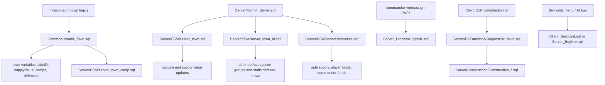
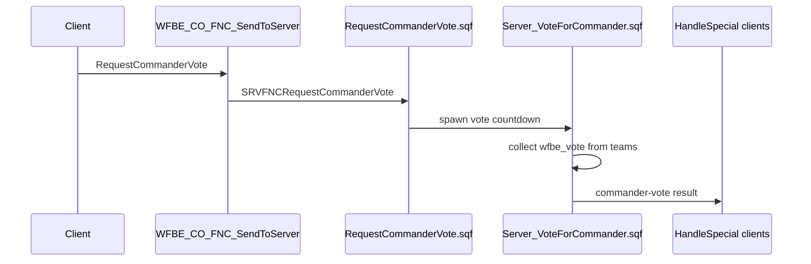
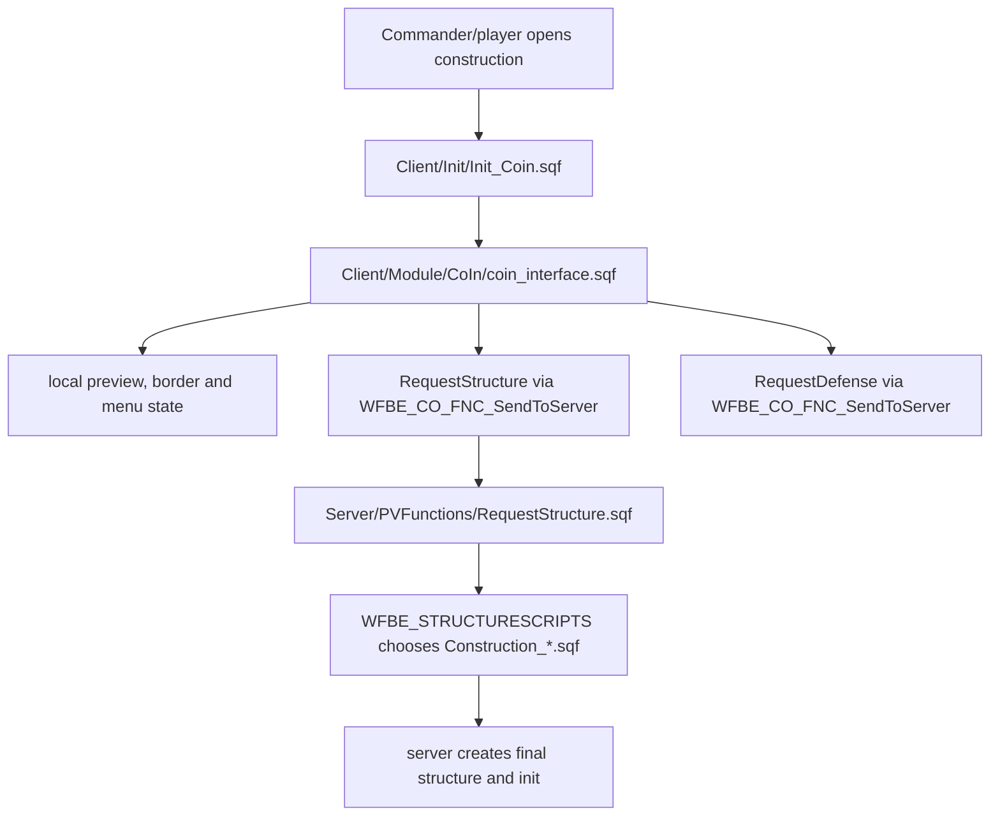

# Gameplay Systems Atlas

This page maps the main gameplay systems that make Warfare feel like Warfare: towns, economy, commander flow, upgrades, construction and factories. It is source-backed against `Missions/[55-2hc]warfarev2_073v48co.chernarus`.

## System Flow



## Town Initialization

### Source files

- `mission.sqm`
- `Common/Init/Init_Town.sqf`
- `Server/Init/Init_Towns.sqf`
- `Server/FSM/server_town_camp.sqf`
- `Server/FSM/server_town.sqf`
- `Server/FSM/server_town_ai.sqf`

`mission.sqm` places town logics and calls `Common/Init/Init_Town.sqf` with town name, optional dubbing name, start supply value, max supply value, town value and town group template/type.

`Init_Town.sqf` waits for town mode and mission parameters, skips disabled towns from `TownTemplate`, then sets the core town variables:

| Variable | Purpose |
| --- | --- |
| `name` | Display/logging name. |
| `range` | Town range, currently initialized to 600. |
| `startingSupplyValue` | Reset floor after capture and initial SV. |
| `maxSupplyValue` | Supply value cap. |
| `lastSupplyMissionRun` | Supply mission cooldown bookkeeping. |
| `supplyMissionCoolDownEnabled` | Whether town supply mission is currently cooling down. |
| `wfbe_town_type` | Chosen town group template/type; arrays are randomized to one template. |
| `camps` | Synchronized camp logics. |
| `wfbe_town_defenses` | Synchronized defense logics. |
| `wfbe_town_dubbing` | Radio/dubbing name. |
| `sideID` | Owning side ID, defaulting to defender when unset. |
| `supplyValue` | Current town SV, public. |

Camp creation is server-owned. For each synchronized camp, the server creates a camp bunker model, flag object and side/supply variables, then starts `Server/FSM/server_town_camp.sqf` once all camps are initialized.

Client town initialization waits for `camps`, assigns camp marker names and records town ownership on camp logic objects.

## Town Starting Modes

`Server/Init/Init_Towns.sqf` runs after `townInit` when starting mode or patrols are enabled.

Supported starting modes:

| Mode | Behavior |
| --- | --- |
| `0` | No special starting distribution; server sets `townInitServer = true` directly. |
| `1` | 50/50 split: towns nearest west start become west; remaining towns become east. |
| `2` | Nearby towns: each side gets a limited number of nearby towns. |
| `3` | Random 25/25/50 style setup: west/east/resistance distribution, using boundaries when available. |

Resistance patrols are enabled by setting `wfbe_patrol_enabled` on selected towns; old `respatrol.fsm` references are commented, while `server_town_ai.sqf` later starts `Server/FSM/server_patrols.sqf`.

## Town Capture And Supply Value

`Server/Init/Init_Server.sqf` starts one global town loop:

```sqf
[] Spawn {[] execVM 'Server\FSM\server_town.sqf'};
```

`server_town.sqf` iterates every town while the game is running. It performs:

- active entity scan near each town for `Man`, `Car`, `Motorcycle`, `Tank`, `Air` and `Ship`;
- side counts for west/east/resistance;
- capture-mode logic;
- supply value reduction during attack;
- supply value restoration when protected;
- time-based supply growth when configured;
- town capture event publication;
- camp side updates;
- town defense removal/recreation;
- performance audit recording.

Capture modes observed in source:

| Mode | Behavior |
| --- | --- |
| `0` | Classic capture; mixed hostile presence blocks capture. |
| `1` | Dominion logic; strongest side can reduce opposing side counts. |
| `2` | Dominion plus camp ownership requirement: a side must hold all camps before capture proceeds. |

On capture, the loop:

- resets/updates `sideID` and `supplyValue`;
- sends side messages;
- publishes `[nil, "TownCaptured", [_location, _sideID, _newSID]]` via `WFBE_CO_FNC_SendToClients`;
- calls `WFBE_SE_FNC_SetCampsToSide` if camps are enabled;
- removes old town defense units;
- creates new defender/occupation defenses if enabled.

Performance note: this loop deliberately sleeps `0.05` between towns and records active time, town count, nearEntities count, detected units, network writes and capture count through `PerformanceAudit_Record`.

## Town AI Activation

`Server/Init/Init_Server.sqf` starts `Server/FSM/server_town_ai.sqf` only when defender or occupation AI is enabled.

`server_town_ai.sqf` is separate from town ownership/capture. It:

- initializes `wfbe_active`, `wfbe_active_air`, `wfbe_active_sideIDs`, `wfbe_inactivity`, `wfbe_active_vehicles` and `wfbe_town_teams`;
- scans each town for enemies, excluding aircraft from activation scans to prevent fly-by spawns;
- publishes side-scoped active visibility through `wfbe_active_sideIDs`;
- chooses defender or occupation group templates;
- spawns/manages town AI via server, client delegation or headless delegation;
- mans static defenses through `WFBE_SE_FNC_OperateTownDefensesUnits`;
- despawns town AI and active vehicles after inactivity;
- starts patrols with `Server/FSM/server_patrols.sqf` when enabled.

AI delegation mode comes from `WFBE_C_AI_DELEGATION`:

| Mode | Behavior |
| --- | --- |
| `0` or fallback | Server creates town units with `WFBE_CO_FNC_CreateTownUnits`. |
| `1` | Server delegates town AI to clients through `WFBE_SE_FNC_DelegateAITown`. |
| `2` | Server delegates town AI to headless clients when `WFBE_HEADLESSCLIENTS_ID` is populated. |

Risk notes:

- Town AI activation and capture loops are independent; changing one can make the other stale.
- Detection range differs for inactive vs active towns.
- `wfbe_active_sideIDs` and `wfbe_attacker_sideIDs` are side-scoped visibility tools; avoid replacing them with global reveal flags.
- Confirmed finding cross-links: town-AI occupied-vehicle deletion is tracked in [Town AI vehicle safety](Town-AI-Vehicle-Despawn-Safety); use [Deep-review findings](Deep-Review-Findings) DR-21 for HC disconnect/no failover and DR-42 for static-defense HC update-back.

## Economy And Resource Loop

`Server/Init/Init_Server.sqf` starts resources only when there are at least two present sides:

```sqf
[] ExecVM "Server\FSM\updateresources.sqf";
```

`Server/FSM/updateresources.sqf` loops over `WFBE_PRESENTSIDES` and computes:

- town supply with `WFBE_CO_FNC_GetTownsSupply`;
- income from supply value, depending on `WFBE_C_ECONOMY_INCOME_SYSTEM`;
- player and commander share when using commander-percent systems;
- side supply increase through `ChangeSideSupply` when currency system is supply-based;
- team funds through `WFBE_CO_FNC_ChangeTeamFunds`;
- AI commander funds through `ChangeAICommanderFunds` when no player commander exists.

Important parameters:

| Parameter | Role |
| --- | --- |
| `WFBE_C_ECONOMY_INCOME_SYSTEM` | Selects income mode. |
| `WFBE_C_ECONOMY_INCOME_INTERVAL` | Base resource tick interval. |
| `WFBE_C_ECONOMY_INCOME_COEF` | Multiplier for income mode 3. |
| `WFBE_C_ECONOMY_INCOME_DIVIDED` | Commander income divisor in mode 3. |
| `WFBE_C_ECONOMY_CURRENCY_SYSTEM` | Whether side supply currency is active. |
| `WFBE_C_ECONOMY_SUPPLY_MAX_TEAM_LIMIT` | Upper supply cap gate in resource loop. |
| `wfbe_commander_percent` | Per-side commander share, initialized on side logic. |

`Common_StagnateSupplyIncomeNoPlayers.sqf` is a supply-income modifier that uses AntiStack database side-skill calls first; if a side has no skill data and no players, it increments no-player ticks and can reduce supply income. It publishes `TEAM_WEST_TICKS_NO_PLAYERS` and `TEAM_EAST_TICKS_NO_PLAYERS`.

Risk notes:

- Economy, AntiStack and side presence interact; changing AntiStack guards can change income behavior.
- Resource sleeps use `GetSleepFPS`, so tick rate may adapt to server FPS.
- `WFBE_C_ECONOMY_SUPPLY_MAX_TEAM_LIMIT` gates the whole income block when side supply exceeds the limit.
- Confirmed finding cross-links: [Deep-review findings](Deep-Review-Findings) DR-22 covers side-supply overspend windfall; DR-41 covers attack-wave direct-PV supply forgery. Use [Attack-wave authority playbook](Attack-Wave-Authority-Playbook) before touching that path.

## Commander Flow

### Source files

- `Server/PVFunctions/RequestCommanderVote.sqf`
- `Server/PVFunctions/RequestNewCommander.sqf`
- `Server/Functions/Server_VoteForCommander.sqf`
- `Server/Functions/Server_AssignNewCommander.sqf`
- `Common/Functions/Common_SetCommanderVotes.sqf`
- `Common/Functions/Common_GetCommanderTeam.sqf`

Commander vote flow:



`RequestCommanderVote.sqf` only starts a vote when side logic `wfbe_votetime <= 0`. It seeds votes with `SetCommanderVotes`, spawns `WFBE_SE_FNC_VoteForCommander`, sends `VotingForNewCommander`, and notifies clients with `HandleSpecial`.

`Server_VoteForCommander.sqf` counts down `WFBE_C_GAMEPLAY_VOTE_TIME`, collects team votes, resolves a winner or AI commander fallback, sets side logic `wfbe_commander`, notifies clients and stops AI commander state when a player commander is elected.

`RequestNewCommander.sqf` directly assigns a commander when no vote is running, then spawns `WFBE_SE_FNC_AssignForCommander` and sends `new-commander-assigned`.

Risk notes:

- `Server_AssignNewCommander.sqf` treats `_this` both as side and array (`_side = _this; _commander = _this select 1`). This is confirmed as [Deep-review findings](Deep-Review-Findings) DR-15, not just an open question.
- Commander identity lives on side logic and is public; client UI and resource distribution both depend on it.

## Upgrades

### Source files

- `Server/PVFunctions/RequestUpgrade.sqf`
- `Server/Functions/Server_ProcessUpgrade.sqf`
- `Common/Config/Core_Upgrades/Upgrades_*.sqf`
- `Common/Config/Core_Upgrades/Check_Upgrades.sqf`
- `Client/GUI/GUI_UpgradeMenu.sqf`

`RequestUpgrade.sqf` is a thin PVF wrapper that spawns `WFBE_SE_FNC_ProcessUpgrade`.

`Server_ProcessUpgrade.sqf`:

- reads upgrade time from `WFBE_C_UPGRADES_<side>_TIMES`;
- sets side logic `wfbe_upgrading = true` and `wfbe_upgrading_id`;
- notifies clients with `HandleSpecial ['upgrade-started', id, level]`;
- waits for either a sync variable or elapsed upgrade time for player-started upgrades;
- increments side logic `wfbe_upgrades`;
- clears `wfbe_upgrading` and `wfbe_upgrading_id`;
- refreshes existing artillery pieces when the artillery ammo upgrade completes;
- notifies clients with `HandleSpecial ['upgrade-complete', id, level]`.

`Check_Upgrades.sqf` fills missing AI commander upgrade order entries from enabled upgrade levels. It is a repair/normalization helper, not the live upgrade processor.

Risk notes:

- Some feature code checks upgrade levels directly from `WFBE_CO_FNC_GetSideUpgrades`; changing upgrade indices affects many systems.
- Existing artillery is special: it needs explicit ammo refresh after artillery ammo upgrades because it may not pass through buy/build init again.
- Confirmed finding cross-link: [Deep-review findings](Deep-Review-Findings) DR-23 covers upgrade request forgery / missing server-side commander and funds validation.

## Construction And Base Structures

### Source files

- `Client/Init/Init_Coin.sqf`
- `Client/Module/CoIn/coin_interface.sqf`
- `Server/PVFunctions/RequestStructure.sqf`
- `Server/Construction/Construction_HQSite.sqf`
- `Server/Construction/Construction_SmallSite.sqf`
- `Server/Construction/Construction_MediumSite.sqf`
- `Server/Construction/Construction_StationaryDefense.sqf`
- `Client/Init/Init_BaseStructure.sqf`

Construction flow:



`Init_Coin.sqf` builds the CoIn item list from side structure arrays and defense arrays. It sets:

- `BIS_COIN_categories`;
- `BIS_COIN_items`;
- funds display and supply/cash mode;
- construction/defense category mapping.

`coin_interface.sqf` owns the camera, preview object, local helper/border, input handlers, selected object state and final request dispatch. It calls:

- `RequestAutoWallConstructinChange` when toggling auto wall construction;
- `RequestStructure` for HQ deploy/mobilize and structures;
- `RequestDefense` for defenses;
- `RequestChangeScore` for commander build score.

`RequestStructure.sqf` resolves display structure name to real structure type and construction script using:

- `WFBE_<side>STRUCTURES`;
- `WFBE_<side>STRUCTURENAMES`;
- `WFBE_<side>STRUCTURESCRIPTS`.

It sends a `building-started` `HandleSpecial` for major structures and starts `Server/Construction/Construction_<script>.sqf`.

`Construction_HQSite.sqf` toggles deployed HQ and mobile HQ. It uses `wfbe_hqinuse` as a side-logic lock, updates `wfbe_hq`, `wfbe_hq_deployed`, base areas, killed/hit/damage handlers and client structure init.

`Construction_SmallSite.sqf` and `Construction_MediumSite.sqf` create temporary construction-site objects using BIS object mapper, optionally track completion via `wfbe_structures_logic`, delete temporary objects and create final structures with hit/damage/killed handlers and `Client/Init/Init_BaseStructure.sqf`.

Risk notes:

- CoIn uses local preview objects and client camera state; server must still be the authority for final creation.
- `coin_interface.sqf` still contains old commented direct publicVariable code near the newer PVF path.
- Construction mode changes affect `wfbe_structures_logic`, which other repair/build-completion code may inspect.
- HQ deploy/mobilize deletes and replaces the HQ object; client-side killed handlers and JIP handling must be preserved.
- Confirmed finding cross-link: [Deep-review findings](Deep-Review-Findings) DR-6 covers construction authority, where the server request mostly validates class existence while trusting client-side payment, placement and authority checks. See [Construction and CoIn systems atlas](Construction-And-CoIn-Systems-Atlas) for the dedicated map.

## Factories And Unit Production

### Source files

- `Client/GUI/GUI_Menu_BuyUnits.sqf`
- `Client/Functions/Client_BuildUnit.sqf`
- `Server/Functions/Server_BuyUnit.sqf`
- side unit/config arrays under `Common/Config/Core_Units/*`
- side structure arrays under `Common/Config/Core_Structures/*`

There are two main production paths:

| Path | Owner | Source | Use |
| --- | --- | --- | --- |
| Player local build | Client | `GUI_Menu_BuyUnits.sqf` -> `Client_BuildUnit.sqf` | Player buys units/vehicles near a factory. |
| AI/server build | Server | `AIBuyUnit` -> `Server_BuyUnit.sqf` | AI teams and server-side production. |

The buy menu:

- detects current factory range via `barracksInRange`, `lightInRange`, `heavyInRange`, `aircraftInRange`, `depotInRange`, `hangarInRange`;
- filters by tab/factory type and selected faction;
- validates funds;
- checks depot infantry camp ownership requirements;
- calculates crew costs;
- applies infantry limit from barracks upgrade;
- spawns `BuildUnit` and deducts player funds.

`Client_BuildUnit.sqf`:

- computes spawn position from structure offsets or nearby pad helper objects;
- uses a local queue on the building (`queu`);
- waits for queue position and build time;
- creates infantry or vehicle locally using common creation helpers;
- initializes cargo, lock actions, salvage truck, balance, countermeasures, artillery, missile handlers, engine stealth actions and crew.

`Server_BuyUnit.sqf`:

- uses server-side queue state and build time;
- exits if the factory is destroyed or a player takes over the AI team;
- creates units/vehicles server-side;
- applies vehicle fired/missile/reload/IRS/countermeasure/artillery handlers;
- creates crew and updates statistics.

Risk notes:

- Player and AI production paths duplicate substantial vehicle initialization logic. Any new vehicle feature may need both `Client_BuildUnit.sqf` and `Server_BuyUnit.sqf`.
- Building queue cleanup has timeout behavior based on longest build time; changing queue variables can strand factories.
- Spawn pads are type-based helper objects near factories; pad class changes can alter spawn placement.
- Buy menu affordability is client-side, so server-side validation should be considered before adding high-value or exploitable purchases.
- Confirmed finding cross-link: [Deep-review findings](Deep-Review-Findings) DR-14 covers player purchase authority; use [Factory and purchase systems atlas](Factory-And-Purchase-Systems-Atlas) before changing buy-unit behavior.

## Victory And Endgame Gateway

Victory detection is owned by `Server/FSM/server_victory_threeway.sqf`, not by the town capture or economy loops above. Keep it separate when changing gameplay flow.

Confirmed finding cross-links: [Deep-review findings](Deep-Review-Findings) DR-11 covers winner inversion / persisted win-tally correctness, DR-12 covers threeway no-detection, DR-13 covers duplicate game-end logging and DR-36 explains the guard/precedence mechanism plus the clean perf/JIP review.

## Safe Extension Points

| Change type | Preferred starting point |
| --- | --- |
| New town behavior | `server_town.sqf` for ownership/SV, `server_town_ai.sqf` for AI activation, not both by accident. |
| New income behavior | `updateresources.sqf`, side supply helpers and relevant UI display code. |
| New commander action | Existing PVF command pattern plus `HandleSpecial` client notification where needed. |
| New upgrade effect | `Server_ProcessUpgrade.sqf` for completion effects plus every direct upgrade-level consumer. |
| New structure | Side `Structures_*.sqf`, `RequestStructure.sqf` script mapping, matching construction script and `Init_BaseStructure.sqf`. |
| New purchasable unit | [Factory and purchase systems atlas](Factory-And-Purchase-Systems-Atlas), unit metadata arrays, buy menu filtering, `Client_BuildUnit.sqf`, and `Server_BuyUnit.sqf` if AI can use it. |

## Remaining Questions For Future Review

- `Server_AssignNewCommander.sqf` call-shape handling is now DR-15 in [Deep-review findings](Deep-Review-Findings); future work should fix or explicitly preserve it, not re-open it as an unknown.
- Trace structure repair/completion logic that consumes `wfbe_structures_logic`.
- Compare client and server unit-build initialization for drift, especially countermeasures, IRS, artillery and special vehicle actions. The first source-backed map is now in [Factory and purchase systems atlas](Factory-And-Purchase-Systems-Atlas).
- Verify whether supply-income stagnation is currently called from the active resource loop or only retained as a helper.
- Map exact dependencies between `Init_BaseStructure.sqf`, range globals like `barracksInRange`, and the buy menu.

## Continue Reading

Previous: [Networking/PV](Networking-And-Public-Variables) | Next: [Construction and CoIn](Construction-And-CoIn-Systems-Atlas)

Main map: [Home](Home) | Fast path: [Quickstart](Quickstart-For-Humans-And-Agents) | Agent file: [`agent-context.json`](agent-context.json)
