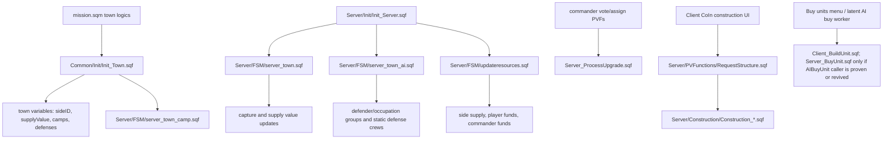

# Gameplay Systems Atlas

This page maps the main gameplay systems that make Warfare feel like Warfare: towns, economy, commander flow, upgrades, construction and factories. It is source-backed against `Missions/[55-2hc]warfarev2_073v48co.chernarus`.

## System Flow



## Town Initialization

### Source files

- `mission.sqm`
- `Common/Init/Init_Town.sqf`
- `Server/Init/Init_Towns.sqf`
- `Server/FSM/server_town_camp.sqf`
- `Server/FSM/server_town.sqf`
- `Server/FSM/server_town_ai.sqf`

`mission.sqm` places town logics and calls `Common/Init/Init_Town.sqf` with town name, optional dubbing name, start supply value, max supply value, town value and town group template/type.

`Init_Town.sqf` waits for town mode and mission parameters, skips disabled towns from `TownTemplate`, then sets the core town variables. Source anchors: `Common/Init/Init_Town.sqf:31-40` for name/SV/type setup, `:64-71` for defenses and dubbing, and `:87-88` for public owner/SV initialization.

| Variable | Purpose |
| --- | --- |
| `name` | Display/logging name. |
| `range` | Town range, currently initialized to 600. |
| `startingSupplyValue` | Reset floor after capture and initial SV. |
| `maxSupplyValue` | Supply value cap. |
| `lastSupplyMissionRun` | Supply mission cooldown bookkeeping. |
| `supplyMissionCoolDownEnabled` | Whether town supply mission is currently cooling down. |
| `wfbe_town_type` | Chosen town group template/type; arrays are randomized to one template. |
| `camps` | Synchronized camp logics. |
| `wfbe_town_defenses` | Synchronized defense logics. |
| `wfbe_town_dubbing` | Radio/dubbing name. |
| `sideID` | Owning side ID, defaulting to defender when unset. |
| `supplyValue` | Current town SV, public. |

Camp creation is server-owned. For each synchronized camp, the server creates a camp bunker model, flag object and side/supply variables, then starts `Server/FSM/server_town_camp.sqf` once all camps are initialized. Source anchors: `Common/Init/Init_Town.sqf:116-119` for camp side/SV inheritance and `:130-134` for the camp loop handoff and `townInitServer` wait.

Client town initialization waits for `camps`, assigns camp marker names and records town ownership on camp logic objects.

## Town Starting Modes

`Server/Init/Init_Towns.sqf` runs after `townInit` when starting mode or patrols are enabled.

Supported starting modes:

| Mode | Behavior |
| --- | --- |
| `0` | No special starting distribution; server sets `townInitServer = true` directly. |
| `1` | 50/50 split: towns nearest west start become west; remaining towns become east. |
| `2` | Nearby towns: each side gets a limited number of nearby towns. |
| `3` | Random 25/25/50 style setup: west/east/resistance distribution, using boundaries when available. |

Resistance patrols are enabled by setting `wfbe_patrol_enabled` on selected towns; old `respatrol.fsm` references are commented, while `server_town_ai.sqf` later starts `Server/FSM/server_patrols.sqf`. Source anchors: `Server/Init/Init_Towns.sqf:169-175` for patrol flags and `:183` for `townInitServer = true`.

## Town Capture And Supply Value

`Server/Init/Init_Server.sqf` starts one global town loop:

```sqf
[] Spawn {[] execVM 'Server\FSM\server_town.sqf'};
```

`server_town.sqf` iterates every town while the game is running. Source anchors: `Server/Init/Init_Server.sqf:510` starts the loop; `Server/FSM/server_town.sqf:57` performs the active-entity scan; `:81-97` handles configured SV growth; `:207-222` handles attack/protection SV updates; `:240` publishes `TownCaptured`; and `:263-265` records performance-audit data. It performs:

- active entity scan near each town for `Man`, `Car`, `Motorcycle`, `Tank`, `Air` and `Ship`;
- side counts for west/east/resistance;
- capture-mode logic;
- supply value reduction during attack;
- supply value restoration when protected;
- time-based supply growth when configured;
- town capture event publication;
- camp side updates;
- town defense removal/recreation;
- performance audit recording.

Capture modes observed in source:

| Mode | Behavior |
| --- | --- |
| `0` | Classic capture; mixed hostile presence blocks capture. |
| `1` | Dominion logic; strongest side can reduce opposing side counts. |
| `2` | Dominion plus camp ownership requirement: a side must hold all camps before capture proceeds. |

On capture, the loop:

- resets/updates `sideID` and `supplyValue`;
- sends side messages;
- publishes `[nil, "TownCaptured", [_location, _sideID, _newSID]]` via `WFBE_CO_FNC_SendToClients`;
- calls `WFBE_SE_FNC_SetCampsToSide` if camps are enabled;
- removes old town defense units;
- creates new defender/occupation defenses if enabled.

Performance note: this loop deliberately sleeps `0.05` between towns and records active time, town count, nearEntities count, detected units, network writes and capture count through `PerformanceAudit_Record` (`Server/FSM/server_town.sqf:259-265`).

## Town AI Activation

`Server/Init/Init_Server.sqf` starts `Server/FSM/server_town_ai.sqf` only when defender or occupation AI is enabled.

`server_town_ai.sqf` is separate from town ownership/capture. Source anchors: `Server/Init/Init_Server.sqf:514` starts the loop when enabled; `Server/FSM/server_town_ai.sqf:17` reads `WFBE_C_AI_DELEGATION`; `:27-30` initializes active-side and active-vehicle state; `:85` scans nearby non-air entities; `:107` publishes side-scoped active visibility; `:159-179` covers client/headless/server delegation paths; `:185` operates static defenses; `:199-222` cleans up active state/vehicles/defenses; `:230` starts patrols; and `:245-247` records performance-audit data. It:

- initializes `wfbe_active`, `wfbe_active_air`, `wfbe_active_sideIDs`, `wfbe_inactivity`, `wfbe_active_vehicles` and `wfbe_town_teams`;
- scans each town for enemies, excluding aircraft from activation scans to prevent fly-by spawns;
- publishes side-scoped active visibility through `wfbe_active_sideIDs`;
- chooses defender or occupation group templates;
- spawns/manages town AI via server, client delegation or headless delegation;
- mans static defenses through `WFBE_SE_FNC_OperateTownDefensesUnits`;
- despawns town AI and active vehicles after inactivity;
- starts patrols with `Server/FSM/server_patrols.sqf` when enabled.

AI delegation mode comes from `WFBE_C_AI_DELEGATION`:

| Mode | Behavior |
| --- | --- |
| `0` or fallback | Server creates town units with `WFBE_CO_FNC_CreateTownUnits`. |
| `1` | Server delegates town AI to clients through `WFBE_SE_FNC_DelegateAITown`. |
| `2` | Server delegates town AI to headless clients when `WFBE_HEADLESSCLIENTS_ID` is populated. |

Risk notes:

- Town AI activation and capture loops are independent; changing one can make the other stale.
- Detection range differs for inactive vs active towns.
- `wfbe_active_sideIDs` and `wfbe_attacker_sideIDs` are side-scoped visibility tools; avoid replacing them with global reveal flags.
- Confirmed finding cross-links: town-AI occupied-vehicle deletion is tracked in [Town AI vehicle safety](Town-AI-Vehicle-Despawn-Safety); use [Deep-review findings](Deep-Review-Findings) DR-21 for HC disconnect/no failover and DR-42 for static-defense HC update-back.

## Economy And Resource Loop

Owner pages:

- [Economy, towns and supply](Economy-Towns-And-Supply) owns the economy authority matrix, supply missions, supply-helicopter PR #1 context and current source caveats.
- [Economy authority first cut](Economy-Authority-First-Cut) owns the smallest patch order for side-supply clamps and server-led migration candidates.
- [Towns, camps and capture atlas](Towns-Camps-And-Capture-Atlas) owns town lifecycle details that feed the economy.

Runtime shape: `Server/Init/Init_Server.sqf:531` starts `Server/FSM/updateresources.sqf` only when there are at least two present sides. The loop reads economy parameters, gets town supply, can route side-supply changes through `ChangeSideSupply`, pays teams, optionally pays AI commander funds and sleeps through `GetSleepFPS`.

Current stable tuning constants worth checking before balance work:

| Constant | Current value / source | Development meaning |
| --- | --- | --- |
| `WFBE_C_ECONOMY_CURRENCY_SYSTEM` | `0` at `Init_CommonConstants.sqf:151` | Funds plus side supply are both active. |
| `WFBE_C_ECONOMY_INCOME_SYSTEM` | `3` at `Init_CommonConstants.sqf:156` | Commander-percent income split is the default. |
| `WFBE_C_ECONOMY_SUPPLY_SYSTEM` | `1` at `Init_CommonConstants.sqf:161` | Supply increases automatically over time. |
| `WFBE_C_ECONOMY_INCOME_COEF` / `WFBE_C_ECONOMY_INCOME_DIVIDED` | `8` / `1.2` at `Init_CommonConstants.sqf:162-163` | Town SV income is multiplied, then divided for commander/player split behavior. |
| `WFBE_C_ECONOMY_INCOME_PERCENT_MAX` | `30` at `Init_CommonConstants.sqf:164` | Commander income UI should not exceed 30 percent without a balance decision. |
| `WFBE_C_MAX_ECONOMY_SUPPLY_LIMIT` | `40000`, or `900000` in debug, at `Init_CommonConstants.sqf:160` | Global economy supply ceiling differs sharply between debug and normal play. |
| `WFBE_C_ECONOMY_SUPPLY_MAX_TEAM_LIMIT` | `50000` at `Init_CommonConstants.sqf:166` | Team supply cap is also used by attack-wave pricing assumptions. |
| `WFBE_C_ECONOMY_SUPPLY_MISSION_MULTIPLIER` | `20` at `Init_CommonConstants.sqf:167` | Supply mission rewards multiply town SV by this factor. |
| `WFBE_C_AI_COMMANDER_MOVE_INTERVALS` / `WFBE_C_AI_COMMANDER_SUPPLY_TRUCKS_MAX` | `3600` / `5` at `Init_CommonConstants.sqf:96-97` | AI commander movement and supply-truck behavior are intentionally slow/coarse. |
| `WFBE_C_AI_DELEGATION_FPS_INTERVAL` / `WFBE_C_AI_DELEGATION_FPS_MIN` / `WFBE_C_AI_DELEGATION_GROUPS_MAX` | `180` / `25` / `1` at `Init_CommonConstants.sqf:98-100` | Delegation is conservative: clients report every 3 minutes and can receive one group only when FPS is high enough. |
| `WFBE_C_PLAYERS_AI_MAX` / `WFBE_C_PLAYERS_SQUADS_MAX_PLAYERS` | `16` / `4` at `Init_CommonConstants.sqf:243,264` | Player AI followers and human squad membership are separate caps. |

Factory buy-cap note: the buy menu derives infantry queue capacity from `WFBE_C_PLAYERS_AI_MAX` and barracks upgrade level, then adds `+10` for the commander team and later Soldier role skill can scale the current cap by 1.5x. Vehicle crew can consume the same queue capacity when crew is bought with the vehicle. Use [Player AI caps and role balance](Player-AI-Caps-And-Role-Balance) and [Factory/purchase atlas](Factory-And-Purchase-Systems-Atlas) before changing these numbers.

`Common_StagnateSupplyIncomeNoPlayers.sqf` is a supply-income modifier that uses AntiStack database side-skill calls first; if a side has no skill data and no players, it increments no-player ticks and can reduce supply income. It publishes `TEAM_WEST_TICKS_NO_PLAYERS` and `TEAM_EAST_TICKS_NO_PLAYERS` (`Common/Functions/Common_StagnateSupplyIncomeNoPlayers.sqf:38-68`).

Risk notes:

- Economy, AntiStack and side presence interact; changing AntiStack guards can change income behavior.
- Resource sleeps use `GetSleepFPS`, so tick rate may adapt to server FPS.
- `WFBE_C_ECONOMY_SUPPLY_MAX_TEAM_LIMIT` currently gates the income block on computed town supply income, not current side-supply balance; see [Economy, towns and supply](Economy-Towns-And-Supply) before changing this loop.
- Confirmed finding cross-links: [Deep-review findings](Deep-Review-Findings) DR-22 covers side-supply overspend windfall; DR-41 covers attack-wave direct-PV supply forgery. Use [Attack-wave authority playbook](Attack-Wave-Authority-Playbook) before touching that path.

## Commander Flow

Owner pages:

- [Commander/HQ lifecycle atlas](Commander-HQ-Lifecycle-Atlas) owns commander state, HQ state and command-menu lifecycle context.
- [Commander vote/reassignment](Commander-Vote-And-Reassignment-Playbook) owns the patch-ready vote/reassign evidence and smoke gates.
- [AI commander autonomy audit](AI-Commander-Autonomy-Audit) owns AI commander branch/context boundaries.

Runtime shape: clients request votes or reassignment through PVF wrappers, server workers update side-logic commander state and clients receive `HandleSpecial` notifications. Do not infer trusted AI/no-commander fallback behavior from the high-level flow: **DR-47** confirms `Server_VoteForCommander.sqf` and `GUI_VoteMenu.sqf` disagree about AI/no-commander fallback semantics. Use the vote/reassignment playbook before changing this path.

Risk notes:

- `Server_AssignNewCommander.sqf` treats `_this` both as side and array (`_side = _this; _commander = _this select 1`). This is confirmed as [Deep-review findings](Deep-Review-Findings) DR-15, not just an open question.
- `Server_VoteForCommander.sqf` has the DR-47 server/UI no-commander mismatch above in both source Chernarus and maintained Vanilla Takistan; patch server semantics and UI preview together.
- Commander identity lives on side logic and is public; client UI and resource distribution both depend on it.

## Upgrades

Owner page: [Upgrades and research atlas](Upgrades-And-Research-Atlas).

Runtime shape: `RequestUpgrade.sqf` is a thin PVF wrapper into `Server_ProcessUpgrade.sqf`. The server worker sets side upgrade state, waits for sync/time completion, increments `wfbe_upgrades`, refreshes artillery ammo on the relevant upgrade and notifies clients. Client upgrade initiation still performs affordability/debit/send locally, so upgrade authority work belongs in the owner atlas plus [Economy authority first cut](Economy-Authority-First-Cut).

Risk notes:

- Some feature code checks upgrade levels directly from `WFBE_CO_FNC_GetSideUpgrades`; changing upgrade indices affects many systems.
- Existing artillery is special: it needs explicit ammo refresh after artillery ammo upgrades because it may not pass through buy/build init again.
- Confirmed finding cross-link: [Deep-review findings](Deep-Review-Findings) DR-23 covers upgrade request forgery / missing server-side commander and funds validation.

## Construction And Base Structures

Gateway page: use [Construction and CoIn systems atlas](Construction-And-CoIn-Systems-Atlas) for structure arrays, placement rules, CoIn runtime behavior, server request handlers, HQ lifecycle, repair flows, base-area notes, DR-6 authority details and DR-20 HQ-killed idempotency routing.

Runtime shape: construction is a split client-preview/server-create path. `Init_Coin.sqf` adapts side structure/defense arrays into BIS CoIn data, `coin_interface.sqf` owns display/camera/preview state and dispatches PVF requests, and server construction workers create final objects/handlers. Treat this page as a route into the construction atlas rather than the canonical construction walkthrough.

Risk notes:

- CoIn uses local preview objects and client camera state; server must still be the authority for final creation.
- `coin_interface.sqf` still contains old commented direct publicVariable code near the newer PVF path.
- Construction mode changes affect `wfbe_structures_logic`, which other repair/build-completion code may inspect.
- HQ deploy/mobilize deletes and replaces the HQ object; client-side killed handlers and JIP handling must be preserved.
- Confirmed finding cross-links: [Deep-review findings](Deep-Review-Findings) DR-6 owns construction-authority proof, and DR-20 owns the HQ-killed N-fold score/idempotency defect. `Server_OnHQKilled.sqf:46-50` and `:74-81` award score without a done guard after redundant HQ killed detection paths. [Construction and CoIn systems atlas](Construction-And-CoIn-Systems-Atlas) owns the runtime map and extension checklist. This page stays a gateway.

## Factories And Unit Production

Gateway page: use [Factory and purchase systems atlas](Factory-And-Purchase-Systems-Atlas) for config chains, range globals, buy-menu filtering, queue model, common creation helpers, DR-14 authority notes and DR-33 queue hazards.

Runtime shape: player purchases run through `GUI_Menu_BuyUnits.sqf` and `Client_BuildUnit.sqf`; they are local buy/build threads with factory range globals, UI filters, local funds/group/queue checks, build waits, spawn placement and vehicle/crew initialization. `Init_Server.sqf:10` compiles `AIBuyUnit = Server_BuyUnit.sqf`, but stable master source search finds no active caller outside the compile and worker itself. Treat `AIBuyUnit` as latent unless a branch proves or intentionally revives it. Attack-wave production is a separate direct-PV side path, not normal factory production.

Risk notes:

- Player and latent AI/server production paths duplicate substantial vehicle initialization logic. Any new vehicle feature may need both `Client_BuildUnit.sqf` and `Server_BuyUnit.sqf` only if the server worker is revived or a branch proves a live caller.
- Building queue cleanup has timeout behavior based on longest build time; changing queue variables can strand factories.
- Spawn pads are type-based helper objects near factories; pad class changes can alter spawn placement.
- Buy menu affordability is client-side, so server-side validation should be considered before adding high-value or exploitable purchases.
- Confirmed finding cross-link: [Deep-review findings](Deep-Review-Findings) DR-14 covers player purchase authority; use [Factory and purchase systems atlas](Factory-And-Purchase-Systems-Atlas) before changing buy-unit behavior.

## Victory And Endgame Gateway

Victory detection is owned by `Server/FSM/server_victory_threeway.sqf`, not by the town capture or economy loops above. Keep it separate when changing gameplay flow.

Confirmed finding cross-links: [Deep-review findings](Deep-Review-Findings) DR-11 covers winner inversion / persisted win-tally correctness, DR-12 covers threeway no-detection, DR-13 covers duplicate game-end logging and DR-36 explains the guard/precedence mechanism plus the clean perf/JIP review.

## Safe Extension Points

| Change type | Preferred starting point |
| --- | --- |
| New town behavior | `server_town.sqf` for ownership/SV, `server_town_ai.sqf` for AI activation, not both by accident. |
| New income behavior | `updateresources.sqf`, side supply helpers and relevant UI display code. |
| New commander action | Existing PVF command pattern plus `HandleSpecial` client notification where needed. |
| New upgrade effect | `Server_ProcessUpgrade.sqf` for completion effects plus every direct upgrade-level consumer. |
| New structure | Side `Structures_*.sqf`, `RequestStructure.sqf` script mapping, matching construction script and `Init_BaseStructure.sqf`. |
| New purchasable unit | [Factory and purchase systems atlas](Factory-And-Purchase-Systems-Atlas), unit metadata arrays, buy menu filtering and `Client_BuildUnit.sqf`; include `Server_BuyUnit.sqf` only when reviving/proving AI commander production. |

## Resolved Follow-Ups

These were previously open questions on this page; they now have source-backed homes or findings:

| Topic | Current answer |
| --- | --- |
| Commander assignment call shape | `Server_AssignNewCommander.sqf` call-shape handling is confirmed as [Deep-review findings](Deep-Review-Findings) DR-15. Future code work should fix or explicitly preserve it, not re-open it as an unknown. |
| `wfbe_structures_logic` consumer | Construction workers add/remove construction-site logic objects (`Server/Construction/Construction_SmallSite.sqf:70,99`; `Construction_MediumSite.sqf:70,114`). `Server_HandleBuildingRepair.sqf` can consume/remove those logic entries if called, but no active source caller was found; WASP base repair is a separate live flow. Use [Construction and CoIn systems atlas](Construction-And-CoIn-Systems-Atlas) for the owning map. |
| Client/server unit-build drift | The first source-backed map lives in [Factory and purchase systems atlas](Factory-And-Purchase-Systems-Atlas); DR-33 tracks queue hazards. Current stable source treats `Server/Functions/Server_BuyUnit.sqf` as a latent worker because `AIBuyUnit` has no static caller beyond `Init_Server.sqf:10`; only treat vehicle changes as dual-path work if that worker is revived, proven dynamic, or merged from an AI commander production branch. |
| Supply-income stagnation | This helper is live when side-supply income is routed through `ChangeSideSupply`: `Server/FSM/updateresources.sqf:49` passes `_includeStagnation = true`, `Common/Functions/Common_ChangeSideSupply.sqf:15-17` calls `WFBE_CO_FNC_StagnateSupplyIncomeNoPlayers`, and `Common/Functions/Common_StagnateSupplyIncomeNoPlayers.sqf:38-68` updates/publicizes no-player counters and clamps the income amount. |
| Base-structure markers vs range globals | `Client/Init/Init_BaseStructure.sqf` creates local base/command-center markers and command-center range ellipses; it does not own buy-menu range booleans. Range globals are initialized in `Client/Init/Init_Client.sqf:311-320`, updated by `Client/FSM/updateavailableactions.fsm:157-203`, and consumed by `Client/GUI/GUI_Menu.sqf:4-26` and `Client/GUI/GUI_Menu_BuyUnits.sqf:50,80,165-170`. |

## Continue Reading

Previous: [Networking/PV](Networking-And-Public-Variables) | Next: [Construction and CoIn](Construction-And-CoIn-Systems-Atlas)

Main map: [Home](Home) | Fast path: [Quickstart](Quickstart-For-Humans-And-Agents) | Agent file: [`agent-context.json`](agent-context.json)
