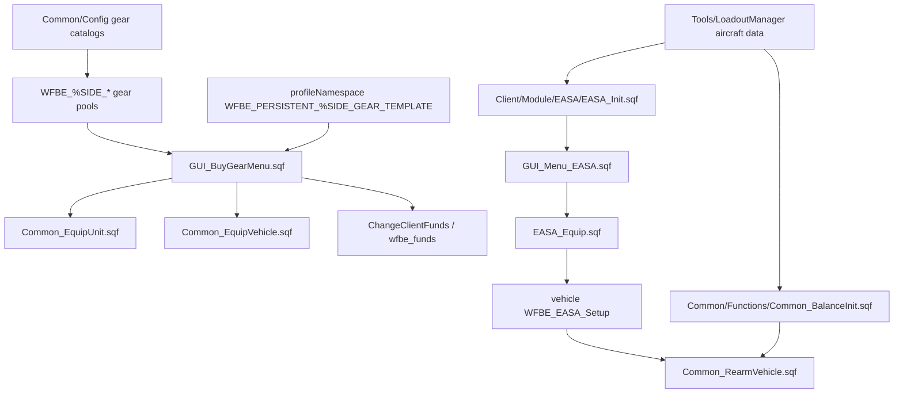

# Gear, Loadout And EASA Atlas

This page maps the gear purchase, profile-template, aircraft loadout and generated balance systems. It connects the live client UI to the generated SQF emitted by `Tools/LoadoutManager`.

All mission paths are relative to `Missions/[55-2hc]warfarev2_073v48co.chernarus/`.

## Read This First

| Need | Start here |
| --- | --- |
| Change player gear purchase UI | `Client/GUI/GUI_BuyGearMenu.sqf`, then `Client/Functions/Client_UI_Gear_*.sqf`. |
| Fix profile-template persistence | [Gear template profile filter](Gear-Template-Profile-Filter), then `Client/Functions/Client_UI_Gear_SaveTemplateProfile.sqf`. |
| Fix vehicle/backpack cargo application | [Vehicle cargo equip loop bounds](Vehicle-Cargo-Equip-Loop-Bounds), then `Common/Functions/Common_EquipVehicle.sqf` and `Common_EquipBackpack.sqf`. |
| Fix service rearm/refuel/repair/heal affordability parity | [Service menu affordability guards](Service-Menu-Affordability-Guards), then `Client/GUI/GUI_Menu_Service.sqf`. |
| Change gear catalog data | `Common/Config/Config_Weapons.sqf`, `Config_Magazines.sqf`, `Config_SetTemplates.sqf`, `Config_SortWeapons.sqf`, `Config_SortMagazines.sqf`. |
| Change aircraft loadouts | `Tools/LoadoutManager/Data/Vehicles/Aircrafts/**`, not generated `Client/Module/EASA/EASA_Init.sqf` by hand. |
| Change aircraft balance | `Tools/LoadoutManager` data classes, then regenerate `Common/Functions/Common_BalanceInit.sqf`. |
| Debug EASA in-game | `Client/GUI/GUI_Menu_EASA.sqf`, `Client/Module/EASA/EASA_Equip.sqf`, `Common/Functions/Common_RearmVehicle.sqf`. |

## Current Branch Scope

Refreshed 2026-06-24 for gear-template and cargo-loop evidence against current docs/source `HEAD@4b9591314c96` / cargo anchor `HEAD@c96ee1670ddb`, current stable/B74.1 `origin/master@f8a76de349da` / `origin/claude/b74.1-aicom@f8a76de349da`, current B74.2 `origin/claude/b74.2-aicom@21b62b04`, current B69 `origin/claude/b69@8d465fce`, adjacent B74 `origin/claude/b74-aicom-spend@b23f557f`, current Miksuu `master@b8389e748243`, `origin/perf/quick-wins@0076040f8a5e`, historical release commit `a96fdda28087` and historical EASA QoL commit `a66d46912e2a`. Targeted diffs from the 2026-06-21 gear-template checkpoint `43c3ba05` and the 2026-06-22 checkpoint `72b5f0de98f9` to `HEAD` over checked profile/template paths returned no source changes; checked `d472da6a..21b62b04`, `origin/master..origin/claude/b74.2-aicom` and B69..B74 template deltas are empty. Cargo helper paths are source-unchanged from `b2544207` / `ebfdca96542f` to `HEAD`; current stable/B74.1, current B74.2, B69, B74 and historical release fix all five cargo loops in both maintained roots, while docs/source, current Miksuu and historical EASA QoL remain old-shape and perf fixes Chernarus only. Checked `d472da6a..21b62b04` and `origin/master..origin/claude/b74.2-aicom` cargo-helper deltas are empty. Service/EASA paths were rechecked through docs/source `HEAD@b798fd66` and remain source-unchanged from `e9dd7f37`, `8906ee89`, `9b3fc38e` and `8b71e2a1`; current B74.2 `origin/claude/b74.2-aicom@21b62b04` has no checked service/EASA menu/module/stringtable delta over current stable or the older `d472da6a` B74.2 snapshot. Current origin exposes no live `release/*` service/EASA rescue head, but does expose branch-only `origin/claude/trello-service-ammo-count@9159f935874e` and `origin/claude/trello-easa-weapon-categories@0881911849da`.

| Area | Branch result | Canonical route |
| --- | --- | --- |
| Profile/template save, import and creation gates | Branch-split after current-stable task 44 and unchanged through current B74.1/B74.2: docs/source `4b9591314c96`, current Miksuu `b8389e748243`, perf `0076040f8a5e`, historical release `a96fdda28087`, historical EASA QoL `a66d46912e2a` and old upstream `miksuu/Gear_template_error@5b056013` keep undefined `_u_upgrade` in `Client_UI_Gear_SaveTemplateProfile.sqf:33,52,75` where the checked helper exists. Current stable/B74.1 `origin/master@f8a76de34`, current B74.2 `21b62b04`, B69 `8d465fce` and B74 `b23f557f` fix that save-filter comparison in both maintained roots at `:34,57,82`; checked `d472da6a..21b62b04`, current-stable-to-B74.2 and B69-to-B74 template deltas are empty. All checked refs still keep the six-field `Init_ProfileGear.sqf:17` guard before reading `:25`, the AddTemplate Barracks-or-Gear gate at `Client_UI_Gear_AddTemplate.sqf:136` and Gear-only FillTemplates display at `Client_UI_Gear_FillTemplates.sqf:17`. Live Trello buy-menu gear-display / EASA category branches have no checked template-path delta. | [Gear template profile filter](Gear-Template-Profile-Filter) |
| Vehicle/backpack cargo application | Docs/source `HEAD@c96ee1670ddb` is source-unchanged from `ebfdca96542f` / `b2544207` for checked cargo helper paths and still carries inclusive loops in both maintained roots. Current Miksuu `master@b8389e748243` and historical EASA QoL commit `a66d4691` remain old-shape. Current stable/B74.1 `origin/master@f8a76de34` / `origin/claude/b74.1-aicom@f8a76de34`, current B74.2 `origin/claude/b74.2-aicom@21b62b04`, B69 `origin/claude/b69@8d465fce`, adjacent B74 `origin/claude/b74-aicom-spend@b23f557f` and historical release commit `a96fdda2` fix all five loops to `(count(_items) - 1)` in both maintained roots. Checked `d472da6a..21b62b04` is empty for cargo helpers. Perf fixes Chernarus only; perf Vanilla remains old-shape. Live `origin/claude/trello-buymenu-gear-display@db1291beba` and `origin/claude/trello-easa-weapon-categories@08819118` have no checked cargo-helper delta. | [Vehicle cargo equip loop bounds](Vehicle-Cargo-Equip-Loop-Bounds) |
| Service rearm/refuel/repair/heal | Docs/source `HEAD@b798fd66`, current Miksuu upstream `master@b8389e748243`, perf and historical EASA QoL keep the old cached-price/action-debit shape. Current stable/B74.1 `origin/master@f8a76de34`, current B74.2 `origin/claude/b74.2-aicom@21b62b04`, current B69 `origin/claude/b69@8d465fce`, adjacent B74 `origin/claude/b74-aicom-spend@b23f557f` and historical release commit `a96fdda2` use newer controller code and partially guard rearm/refuel in both maintained roots, but repair/heal and broader action-time context/funds checks remain open. The `d472da6a..21b62b04` diff is empty for checked service/EASA paths. `origin/claude/trello-service-ammo-count@9159f935874e` adds ammo-percent UI rows/status in both maintained roots, not affordability closure. | [Service menu affordability guards](Service-Menu-Affordability-Guards) |
| EASA purchase | Docs/source, current Miksuu upstream, perf, historical release and historical EASA QoL still use strict `_funds > price` and client-side `EASA_Equip` / `ChangePlayerFunds` debit. Current stable/B74.1, current B74.2 `origin/claude/b74.2-aicom@21b62b04`, current B69 and adjacent B74 are split: source Chernarus uses `_funds >= price` at `GUI_Menu_EASA.sqf:118`, but maintained Vanilla remains strict `>` at the same line. Line drift: docs/Miksuu/perf use `GUI_Menu_EASA.sqf:47-49`; historical release uses `:76-78`; historical EASA QoL uses `:58-60` in Chernarus and old lines in Vanilla. | [Service menu affordability guards](Service-Menu-Affordability-Guards), [BuyMenu EASA QoL branch audit](BuyMenu-EASA-QoL-Branch-Audit) |
| EASA QoL / category branches | Historical EASA QoL commit `a66d4691` adds current-loadout highlighting/preselect only in Chernarus; it does not fix exact-funds purchase, stale/unsupported context handling, profile templates, cargo loops or maintained Vanilla propagation. Current origin exposes no `feat/buymenu-easa-qol` head on 2026-06-23. Branch-only `origin/claude/trello-easa-weapon-categories@0881911849da` supplies the missing `WFBE_EASA_FNC_LoadoutCat` compile/file (`EASA_Init.sqf:2`, `EASA_LoadoutCat.sqf:1-57`) for the already-present guarded category call site (`GUI_Menu_EASA.sqf:34-36`); it is not exact-funds, stale-context or authority closure. | [BuyMenu EASA QoL branch audit](BuyMenu-EASA-QoL-Branch-Audit), [Service menu affordability guards](Service-Menu-Affordability-Guards) |

## System Map



## Gear Catalog Data Model

Gear metadata is stored in `missionNamespace` under weapon class names and `Mag_<class>` names.

| Source | Responsibility | Evidence |
| --- | --- | --- |
| `Common/Config/Config_Weapons.sqf` | Defines weapon metadata and price/upgrade/category fields. | `Config_Weapons.sqf:20-42` |
| `Common/Config/Config_Magazines.sqf` | Defines magazine metadata using `Mag_<class>` keys. | `Config_Magazines.sqf:16-32` |
| `Common/Config/Config_SortWeapons.sqf` | Builds side pools such as `WFBE_%SIDE_Primary`, `Pistols`, `Secondary`, `Equipment`, `All`. | `Config_SortWeapons.sqf:19-57` |
| `Common/Config/Config_SortMagazines.sqf` | Builds side magazine pools. | `Config_SortMagazines.sqf:13-29` |
| `Common/Config/Config_SetTemplates.sqf` | Builds side template arrays under `WFBE_%SIDE_Template`. | `Config_SetTemplates.sqf:33-47`, `:113-132` |

The buy-gear dialog fills its views from those side pools. `GUI_BuyGearMenu.sqf:122-130` selects templates or side gear arrays based on the current tab.

## Buy Gear Runtime

`Rsc/Dialogs.hpp:530-533` loads `Client/GUI/GUI_BuyGearMenu.sqf` for `WFBE_BuyGearMenu` (`idd=503000`). Client init compiles the gear helpers at `Client/Init/Init_Client.sqf:116-126`.

The controller is a fast polling UI loop:

- It uses `WFBE_MenuAction` action codes rather than `MenuAction` (`GUI_BuyGearMenu.sqf:27`, `:47-62`).
- It updates views for `gear`, `backpack` and `vehicle` modes (`GUI_BuyGearMenu.sqf:144-146`).
- It applies purchases locally through `WFBE_CO_FNC_EquipUnit` or `WFBE_CO_FNC_EquipVehicle` (`GUI_BuyGearMenu.sqf:429`, `:439`).
- It deducts money client-side with `WFBE_CL_FNC_ChangeClientFunds` (`GUI_BuyGearMenu.sqf:441`).
- It sleeps `0.01` while open (`GUI_BuyGearMenu.sqf:503`).

This is a legacy client-authoritative path. It fits the broader economy ceiling from [Deep-review findings](Deep-Review-Findings) DR-14 and DR-16: buying units, selling structures and gear/EASA purchases all rely on trusted client-side checks and money mutation unless a future redesign introduces server validation or BattlEye script filters.

## Profile Templates

Profile templates are loaded only when the OA version gate compiles the profile functions (`Client/Init/Init_Client.sqf:169-172`). The profile key is:

`WFBE_PERSISTENT_%SIDE_GEAR_TEMPLATE`

Evidence:

- `Client/Init/Init_ProfileVariables.sqf:37-42` reads the profile key.
- `Client/Init/Init_ProfileGear.sqf:128-144` validates and replaces side templates.
- `Client/Functions/Client_UI_Gear_SaveTemplateProfile.sqf:94-95` writes the profile key and calls `saveProfileNamespace`.

### Template Risk

The `_u_upgrade` undefined-variable bug is branch-split. Current docs/source, Miksuu, perf, historical release, historical EASA QoL and old upstream `miksuu/Gear_template_error` still reference `_u_upgrade` at `Client_UI_Gear_SaveTemplateProfile.sqf:33,52,75` where the checked helper exists. Current stable/B74.1 `origin/master@f8a76de34`, current B74.2 `origin/claude/b74.2-aicom@21b62b04`, B69 `origin/claude/b69@8d465fce` and adjacent B74 `origin/claude/b74-aicom-spend@b23f557f` fix task 44 in both maintained roots: the weapon, magazine and backpack loops now compare `_get select 3` (the item's own required upgrade level) against both `_upgrade_barracks` and `_upgrade_gear` at `:34,57,82`. The `d472da6a..21b62b04` diff is empty for checked template paths. The focused patch shape and smoke plan remain in [Gear template profile filter](Gear-Template-Profile-Filter) for docs/source and old-shape refs.

The visible template list also filters by current gear upgrade (`Client_UI_Gear_FillTemplates.sqf:15-22`). Higher-upgrade saved templates can be valid but hidden until the side upgrades gear again; support/debug docs should distinguish hidden-by-upgrade from deleted profile data.

Template creation has a separate UX/support trap. `Client_UI_Gear_AddTemplate.sqf:34-132` rejects foreign weapons, magazines and backpack items when `WFBE_Allow_HostileGearSaving` is false, then exits with a generic "foreign equipment" hint at `:132`. It can also reject an otherwise well-formed template when its max upgrade is above current gear or barracks level (`:150`). Because the current source initializes `WFBE_Allow_HostileGearSaving = true` in `Init_Client.sqf:10`, this foreign-equipment refusal is a dormant/config-sensitive behavior in the checked-in profile, not the default live path. If that flag is ever tightened, add clearer UI copy and smoke hostile gear, backpacks, saved profile rows and higher-upgrade templates together.

The buy-gear dialog also has a template-coverage gap for vehicle/backpack cargo. Template creation at `GUI_BuyGearMenu.sqf:454` passes only selected weapons, magazines and backpack content into `WFBE_CL_FNC_UI_Gear_AddTemplate`; the nearby TODO at `:482` still says "template for veh / bp". Price calculation does include vehicle/backpack content at `:485`, so a purchase can still apply those selections, but profile-template persistence is not a full snapshot of the visible vehicle/backpack gear state. Support docs should distinguish "purchase can apply cargo" from "template can save cargo".

## EASA Runtime

EASA is the aircraft loadout system. It is not an Arma 3 pylon system; it is Arma 2 OA weapon/magazine mutation.

| Step | Source | Notes |
| --- | --- | --- |
| Service menu opens EASA | `Client/GUI/GUI_Menu_Service.sqf:30-37`, `:240-244` | Requires service context, driver and EASA upgrade gating. |
| Dialog loads aircraft rows | `Client/GUI/GUI_Menu_EASA.sqf:3-5` | Reads `WFBE_EASA_Vehicles` and `WFBE_EASA_Loadouts`. |
| AA rows are filtered | `GUI_Menu_EASA.sqf:16-20` | Uses `WFBE_C_GAMEPLAY_AIR_AA_MISSILES` and `WFBE_UP_AIRAAM`. |
| Purchase applies loadout | `GUI_Menu_EASA.sqf:46-50` | Calls `EASA_Equip`, deducts funds with `ChangePlayerFunds`. |
| Equip mutates vehicle | `Client/Module/EASA/EASA_Equip.sqf:28-36` | Adds magazines/weapons; Wildcat uses turret-specific commands. |
| Vehicle stores chosen setup | `EASA_Equip.sqf:36` | `WFBE_EASA_Setup` is public vehicle state. |
| Rearm reapplies setup | `Common/Functions/Common_RearmVehicle.sqf:65-69` | Reapplies saved EASA setup after balance/AA restriction pass. |

`EASA_Init.sqf:667-668` marks AA missile rows by checking each loadout magazine's `CfgMagazines >> ammo`, then `CfgAmmo >> airLock` and inherited class `MissileBase`, then stores:

- `WFBE_EASA_Vehicles`
- `WFBE_EASA_Loadouts`
- `WFBE_EASA_Default`

Focused EASA review found two local correctness edges in the menu flow:

- `GUI_Menu_EASA.sqf:40-53` uses `_funds > price`, so an exact-funds purchase is rejected and can display "missing $0" even though the player has the listed price.
- The service menu opens EASA from a cached vehicle/context snapshot, and `EASA_Equip.sqf:8-38` silently exits if the current vehicle is unsupported. Without an action-time recheck, a stale menu can debit/show success while equipping nothing.
- `GUI_Menu_EASA.sqf:3-4` has an earlier fail-open variant: when the dialog loads on an unsupported current vehicle, it exits after logging `"GUI_Menu_EASA.sqf: Player vehicle [%1] was not found within the list."` but does not `closeDialog 0`. Treat blank/partial EASA surfaces as stale-context evidence, not just cosmetic UI weirdness.

Historical EASA QoL commit `a66d4691` adds EASA current-loadout highlighting/preselect in the menu (`GUI_Menu_EASA.sqf:29-40`) but does not change the purchase action at `GUI_Menu_EASA.sqf:46-50` or `EASA_Equip.sqf`. Current origin exposes no `feat/buymenu-easa-qol` head on 2026-06-23, so treat that commit as historical UI-orientation evidence only. Current stable/B74.1/B74.2 fix exact-funds purchase in source Chernarus only; maintained Vanilla and old-shape refs still reject exact funds, and stale/unsupported context gates remain open. See [BuyMenu EASA QoL branch audit](BuyMenu-EASA-QoL-Branch-Audit) and [Service menu affordability guards](Service-Menu-Affordability-Guards).

Current stable/B74.1 also contains display-only EASA category scaffolding: `WFBE_C_EASA_CATEGORIES` defaults on in Chernarus `Init_CommonConstants.sqf:821` and maintained Vanilla `:623`, and the EASA menu prefixes row labels only when `WFBE_EASA_FNC_LoadoutCat` exists (`GUI_Menu_EASA.sqf:34-36`). `origin/claude/trello-easa-weapon-categories@0881911849da` is the branch-only wiring candidate that compiles the helper from `EASA_Init.sqf:2` and adds the classifier file in both maintained roots. Smoke category labels and maintained Vanilla exact-funds separately before any promotion wording.

### DR-28 Authority Finding

Claude DR-28 completed the source review for EASA and vehicle service actions. The flow is client-authoritative:

- `GUI_Menu_EASA.sqf:46-50` performs the affordability check on the client, calls `EASA_Equip`, then debits via `ChangePlayerFunds`.
- `EASA_Equip.sqf:28-36` mutates the local aircraft with `addWeapon` / `addMagazine` or turret variants, then only broadcasts the chosen `WFBE_EASA_Setup` index.
- `GUI_Menu_Service.sqf` rearm (MenuAction == 1, current stable/B74.1 line `:484`) and refuel (MenuAction == 3, `:507`) both guard the debit with an explicit `_funds >= price` check in current stable/B74.1/B74.2/B69/B74 (comment: "QoL: affordability guard (parity with repair/heal)"). Repair (MenuAction == 2, `:496-497`) debits when `_repairPrice > 0` and heal (MenuAction == 5, `:519-520`) when `_healPrice > 0`, relying on button-disable state rather than an action-time funds comparison. The residual gap — repair and heal lacking explicit action-time funds checks — is documented in [Service menu affordability guards](Service-Menu-Affordability-Guards).

This is not a separate one-off bug class. It completes the economy authority map: build, buy, sell, side supply, upgrades, ICBM/special weapons, gear, EASA and service actions all rely on client-side spend/effect authority unless a future hardening pass moves the ledger and effect validation server-side or constrains the client with BattlEye script filters.

## Generated Files And LoadoutManager

`Tools/LoadoutManager/Program.cs:6` runs `SqfFileGenerator.GenerateCommonBalanceInitAndTheEasaFileForEachTerrain()`.

The generator writes:

| Generated target | Writer evidence | Purpose |
| --- | --- | --- |
| `Client/Module/EASA/EASA_Init.sqf` | `Data/Terrains/BaseTerrain.cs:99` | Vehicle list, loadout rows and default EASA setup. |
| `Common/Functions/Common_BalanceInit.sqf` | `BaseTerrain.cs:100` | Generated vehicle balance mutations. |
| `Common/Common_ReturnAircraftNameFromItsType.sqf` | `BaseTerrain.cs:101` | Aircraft display/radar-name helper. |
| `version.sqf` | `BaseTerrain.cs:102` | Terrain-specific generated version metadata. |
| `Common/Functions/Common_ModifyAirVehicle.sqf` insertion block | `BaseTerrain.cs:84-86` | Generated aircraft damage-model changes. |

Do not hand-edit generated EASA/balance output unless you are making an emergency local experiment and plan to port it back into the C# data model. The next LoadoutManager run can overwrite generated SQF.

## Balance And AA Gates

`Common/Functions/Common_BalanceInit.sqf:3-4` intentionally exits on server to prevent an occasional freeze:

```sqf
if (isServer) exitWith {};
```

That creates a subtle locality edge:

- `Server/Functions/Server_BuyUnit.sqf:139` calls `BalanceInit` on server-created vehicles, but generated balance exits immediately there.
- `Common/Functions/Common_RearmVehicle.sqf:50` calls `BalanceInit` during rearm on whoever runs the script.
- `Server_BuyUnit.sqf:157-160` and `Common_RearmVehicle.sqf:55-58` also call `WFBE_CO_FNC_RemoveAAMissiles` based on `WFBE_C_GAMEPLAY_AIR_AA_MISSILES` and `WFBE_UP_AIRAAM`.

AA policy is path-dependent. EASA filters AA rows through `WFBE_C_GAMEPLAY_AIR_AA_MISSILES` and `WFBE_UP_AIRAAM` (`GUI_Menu_EASA.sqf:15-20`), client build and server buy paths also call `WFBE_CO_FNC_RemoveAAMissiles` (`Client_BuildUnit.sqf:287-293`; `Server_BuyUnit.sqf:155-162`), and rearm reapplies the same gate (`Common_RearmVehicle.sqf:53-60`). Start/pre-placed vehicles and unusual creation paths still need live smoke before claiming every aircraft/SAM follows the same AA policy.

Safe rule: when changing aircraft balance or AA loadouts, test initial spawn, start vehicles, purchased vehicles, EASA purchase and service/rearm behavior separately. A client-side rearm path may apply balance that a server-side spawn path skips.

## Dangerous Loadout Metadata

The C# data model contains explicit crash-warning classes:

| Source | Evidence |
| --- | --- |
| `Tools/LoadoutManager/Data/Weapons/WeaponType.cs` | `WARNING_GAME_CRASH_DO_NOT_USE_IN_LOADOUTS_CRV7PG` maps to `CRV7_PG` at `:121-122`. |
| `Tools/LoadoutManager/Data/Ammunition/AmmunitionType.cs` | The matching warning ammunition enum exists under the singular `Data/Ammunition` folder. |
| `Tools/LoadoutManager/Data/Ammunition/Implementations/.../WARNING_GAME_CRASH_DO_NOT_USE_IN_LOADOUTS_TWELVEROUNDCRV7PG.cs` | Warning implementation exists for the 12-round CRV7PG ammunition. |
| `Tools/LoadoutManager/Data/Vehicles/Aircrafts/Implementations/BLUFOR/WILDCAT.cs` | Wildcat vanilla turret default references the warning ammunition at `:35-38`. |

Treat `WARNING_GAME_CRASH_DO_NOT_USE_IN_LOADOUTS_*` as hard blockers, not normal TODO names. Do not copy them into new loadouts without testing the exact vehicle/turret behavior in Arma 2 OA.

## Known Risks

| Risk | Evidence | Recommended action |
| --- | --- | --- |
| Gear purchase, EASA purchase and service actions are client-authoritative. | `GUI_BuyGearMenu.sqf:429-441`, `GUI_Menu_EASA.sqf:46-50`, `EASA_Equip.sqf:28-36`, `GUI_Menu_Service.sqf:196-200`, `:217-219`; Claude DR-28. | For public-server hardening, decide between a server funds/effects ledger and BattlEye script filters. If touching service code first, use [Service menu affordability guards](Service-Menu-Affordability-Guards) for local price/funds/context parity, but treat that as a correctness patch rather than real anti-cheat. |
| EASA exact-funds and stale-context handling are locally wrong. | `GUI_Menu_EASA.sqf:3-4` exits early on unsupported current vehicle without closing the dialog; `:40-53` rejects `_funds == price`; `GUI_Menu_Service.sqf:30-41`, `:240-244` and `EASA_Equip.sqf:8-38` allow stale/unsupported vehicle context to no-op after menu selection. | Recheck current vehicle, support eligibility, selected row and funds at action time; close or recover the dialog on unsupported vehicles; use `>=` for affordability if exact cash should buy the listed loadout. Smoke exact-price, under-price, unsupported/stale vehicle and driver-switch cases. |
| Profile template upgrade filtering references undefined `_u_upgrade` on docs/source and old-shape refs. | Docs/source, Miksuu, perf, historical release, historical EASA QoL and old upstream `miksuu/Gear_template_error` keep `Client_UI_Gear_SaveTemplateProfile.sqf:33`, `:52`, `:75` where the helper exists; current stable/B74.1 `origin/master@f8a76de34`, current B74.2 `21b62b04`, B69 and adjacent B74 fix the comparisons at `:34`, `:57`, `:82`, with `d472da6a..21b62b04` empty for checked template paths. [Gear template profile filter](Gear-Template-Profile-Filter) owns the patch shape and branch matrix. | Patch old-shape targets before trusting saved templates to enforce upgrade gates; do not reopen the save-filter edit on current stable/B74-shaped refs. |
| Profile template import guard allows six-element rows before reading index 6. | `Client/Init/Init_ProfileGear.sqf:17` accepts `count _x >= 6`, then `:25` reads `_x select 6` for backpack data; [Gear template profile filter](Gear-Template-Profile-Filter) and [Current Branch Scope](#current-branch-scope) preserve the branch matrix. | Require `count _x >= 7` before selecting backpack data, or branch old six-field templates through a compatibility default. Smoke old profile rows and current seven-field rows. |
| Buy-gear templates do not fully capture vehicle/backpack cargo selections. | `GUI_BuyGearMenu.sqf:454` passes only weapon, magazine and backpack-content arrays into `AddTemplate`; `:482` still carries a vehicle/backpack template TODO; `:485` includes vehicle/backpack content in price calculation. | Decide whether templates should save the full visible buy-gear state. If yes, extend the template schema deliberately and add old-profile compatibility gates. |
| Respawn penalty mode `5` can skip custom gear at base/HQ despite no charge. | `Client_OnRespawnHandler.sqf:54-70`; [Respawn and death lifecycle atlas](Respawn-And-Death-Lifecycle-Atlas). | If mode `5` means charge-on-mobile only, make `_skip` respect `_charge`; smoke custom gear respawn at base and mobile with insufficient funds. |
| Vehicle/backpack cargo equip loops overrun by one. | `Common_EquipVehicle.sqf:27,33,39` and `Common_EquipBackpack.sqf:35,41` use inclusive `for '_i' from 0 to count(_items)` bounds in old-shape targets; [Vehicle cargo equip loop bounds](Vehicle-Cargo-Equip-Loop-Bounds) owns the fix route and [Current Branch Scope](#current-branch-scope) preserves the branch split. Current stable/B74.1/current B74.2/B69/B74/release-shaped refs already use `(count(_items) - 1)` in both maintained roots. | Port or preserve the fixed loop bounds for any target branch still carrying inclusive loops, including docs/source, current Miksuu `b8389e748243`, historical EASA QoL and perf Vanilla, then propagate Vanilla and smoke cargo application. |
| Buy-gear click-pool bounds are not currently proven off-by-one. | `GUI_BuyGearMenu.sqf:44-45` accepts one-based click slots with `<= _size`; `Dialogs.hpp` emits magazine slot IDs as `1..12` and gun slot IDs as `1..8`, and `Client_RemoveMagazineGear.sqf:21` treats the value as one-based cumulative size. | Do not file this as a confirmed bug. A small hardening patch could still reject `< 1` before calling remove. |
| EASA/Economy duplicate dialog IDD. | `Rsc/Dialogs.hpp:3209-3212`, `:3287-3290`; Claude DR-17. [UI IDD collision repair](UI-IDD-Collision-Repair) owns the exact branch matrix and smoke checklist. | Preserve or port the stable/release dialog IDD split before adding scripts that use display-ID lookup. |
| Balance exits on server, but server spawn code calls it. | `Common_BalanceInit.sqf:3-4`, `Server_BuyUnit.sqf:139` | Test spawn/rearm separately; document intended locality before moving balance logic. |
| AA missile gating is not proven universal. | `GUI_Menu_EASA.sqf:15-20`, `Client_BuildUnit.sqf:287-293`, `Server_BuyUnit.sqf:155-162`, `Common_RearmVehicle.sqf:53-60`. | Smoke start/pre-placed aircraft, purchased aircraft, SAMs, EASA loadouts and service rearm before treating `WFBE_C_GAMEPLAY_AIR_AA_MISSILES` / `WFBE_UP_AIRAAM` as complete coverage. |
| Generated files can be overwritten. | `BaseTerrain.cs:99-102` | Change LoadoutManager data classes first, then regenerate. |
| Crash-warning CRV7PG metadata still exists. | `WeaponType.cs:121-122`, `WILDCAT.cs:35-38` | Keep warning names visible and avoid using them in new loadout combinations. |

## Safe Change Rules

- Edit gear catalog SQF for infantry/vehicle cargo metadata; edit LoadoutManager C# for aircraft/EASA/balance metadata.
- After changing mission SQF, remember the Chernarus source mission is canonical; generated missions require LoadoutManager propagation.
- After changing LoadoutManager, inspect generated `EASA_Init.sqf` and `Common_BalanceInit.sqf` diffs before trusting the output.
- Do not confuse `RscMenu_Economy` (idd 23000) with `RscMenu_EASA` (idd 24000) when scripting display-ID lookups. On branches that predate [UI IDD collision repair](UI-IDD-Collision-Repair), verify actual IDD values before using numeric display-ID targets.
- Do not assume server-side validation exists for gear/EASA funds or upgrade gates.

## Agent Index Facts

```json
[
  {"fact":"gear_metadata_store","source":"Common/Config/Config_Weapons.sqf:34-42; Config_Magazines.sqf:24-32","summary":"Weapon and magazine metadata are missionNamespace-backed arrays keyed by class name or Mag_<class>."},
  {"fact":"gear_templates_profile_key","source":"Client_UI_Gear_SaveTemplateProfile.sqf:94","summary":"Saved gear templates persist under WFBE_PERSISTENT_%SIDE_GEAR_TEMPLATE."},
  {"fact":"gear_purchase_authority","source":"GUI_BuyGearMenu.sqf:429-441","summary":"Gear purchases apply equipment and deduct funds client-side."},
  {"fact":"easa_generated_runtime","source":"BaseTerrain.cs:99; EASA_Init.sqf:668","summary":"EASA runtime arrays are generated by LoadoutManager, then published as WFBE_EASA_Vehicles/Loadouts/Default."},
  {"fact":"easa_vehicle_state","source":"EASA_Equip.sqf:36; Common_RearmVehicle.sqf:65-69","summary":"The selected EASA setup is stored on the vehicle as public WFBE_EASA_Setup and reapplied during rearm."},
  {"fact":"easa_authority_dr28","source":"GUI_Menu_EASA.sqf:46-50; EASA_Equip.sqf:28-36","summary":"EASA affordability, debit and loadout application are client-side; the server receives only public vehicle setup state."},
  {"fact":"easa_exact_funds_stale_context","source":"GUI_Menu_EASA.sqf:40-53; GUI_Menu_Service.sqf:30-41,240-244; EASA_Equip.sqf:8-38","summary":"EASA rejects exact-funds purchases and can no-op after stale/unsupported vehicle context unless action-time guards are added."},
  {"fact":"service_authority_dr28","source":"GUI_Menu_Service.sqf:196-200; GUI_Menu_Service.sqf:217-219","summary":"Vehicle service rearm/refuel debit unconditionally and run client-local effects without a server authority check; Service-Menu-Affordability-Guards.md owns the small local parity patch."},
  {"fact":"gear_easa_branch_scope_2026_06_24","source":"docs/source HEAD@4b9591314c96 profile/template paths, HEAD@c96ee1670ddb cargo paths and HEAD@b798fd66 service/EASA paths; origin/master@f8a76de34 / origin/claude/b74.1-aicom@f8a76de34; origin/claude/b74.2-aicom@21b62b04 plus d472da6a..21b62b04 empty for checked profile/template, cargo and service/EASA paths; origin/claude/b69@8d465fce; origin/claude/b74-aicom-spend@b23f557f; current Miksuu master@b8389e748243; perf/quick-wins@0076040f; historical release a96fdda2; historical EASA QoL a66d4691; origin/claude/trello-service-ammo-count@9159f935; origin/claude/trello-easa-weapon-categories@08819118; origin/claude/trello-buymenu-gear-display@db1291beba","summary":"Gear profile/template save filtering is branch-split: docs/source and old refs keep undefined _u_upgrade, while current stable/B74.1/B69/B74/B74.2 fix it in both maintained roots. The six-field profile import guard and template creation/display policy remain open across checked refs; cargo loops are fixed on current stable/B74.1/B69/B74/B74.2 and historical release, but current Miksuu, perf Vanilla and docs/EASA old-shape targets still need the loop-bound port. Service/EASA remains partial and is current-B74.2-head verified at 21b62b04 for checked paths: stable-shaped refs guard service rearm/refuel only and fix Chernarus EASA exact-funds, but repair/heal, Vanilla exact-funds, stale-context checks and server authority remain open. Trello service ammo-count, EASA weapon-category and buy-menu gear-display branches are branch-only UI/wiring evidence, not template-path, cargo-loop, authority or affordability closure."},
  {"fact":"balance_server_exit","source":"Common_BalanceInit.sqf:3-4; Server_BuyUnit.sqf:139","summary":"Generated balance exits on server even though server buy code calls it."},
  {"fact":"crv7pg_warning","source":"WeaponType.cs:121-122; WILDCAT.cs:35-38","summary":"CRV7PG warning metadata is explicitly marked as game-crash dangerous and still referenced in Wildcat data."}
]
```

## Continue Reading

Previous: [Client UI systems atlas](Client-UI-Systems-Atlas) | Next: [Tools/build workflow](Tools-And-Build-Workflow)

Main map: [Home](Home) | Fast path: [Quickstart](Quickstart-For-Humans-And-Agents) | Agent file: [`agent-context.json`](agent-context.json)
