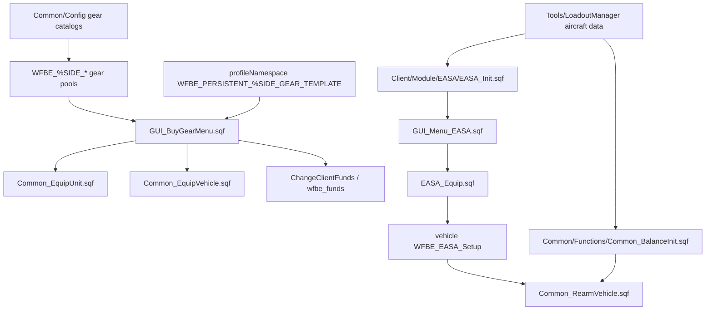

# Gear, Loadout And EASA Atlas

This page maps the gear purchase, profile-template, aircraft loadout and generated balance systems. It connects the live client UI to the generated SQF emitted by `Tools/LoadoutManager`.

All mission paths are relative to `Missions/[55-2hc]warfarev2_073v48co.chernarus/`.

## Read This First

| Need | Start here |
| --- | --- |
| Change player gear purchase UI | `Client/GUI/GUI_BuyGearMenu.sqf`, then `Client/Functions/Client_UI_Gear_*.sqf`. |
| Change gear catalog data | `Common/Config/Config_Weapons.sqf`, `Config_Magazines.sqf`, `Config_SetTemplates.sqf`, `Config_SortWeapons.sqf`, `Config_SortMagazines.sqf`. |
| Change aircraft loadouts | `Tools/LoadoutManager/Data/Vehicles/Aircrafts/**`, not generated `Client/Module/EASA/EASA_Init.sqf` by hand. |
| Change aircraft balance | `Tools/LoadoutManager` data classes, then regenerate `Common/Functions/Common_BalanceInit.sqf`. |
| Debug EASA in-game | `Client/GUI/GUI_Menu_EASA.sqf`, `Client/Module/EASA/EASA_Equip.sqf`, `Common/Functions/Common_RearmVehicle.sqf`. |

## System Map



## Gear Catalog Data Model

Gear metadata is stored in `missionNamespace` under weapon class names and `Mag_<class>` names.

| Source | Responsibility | Evidence |
| --- | --- | --- |
| `Common/Config/Config_Weapons.sqf` | Defines weapon metadata and price/upgrade/category fields. | `Config_Weapons.sqf:20-42` |
| `Common/Config/Config_Magazines.sqf` | Defines magazine metadata using `Mag_<class>` keys. | `Config_Magazines.sqf:16-32` |
| `Common/Config/Config_SortWeapons.sqf` | Builds side pools such as `WFBE_%SIDE_Primary`, `Pistols`, `Secondary`, `Equipment`, `All`. | `Config_SortWeapons.sqf:19-57` |
| `Common/Config/Config_SortMagazines.sqf` | Builds side magazine pools. | `Config_SortMagazines.sqf:13-29` |
| `Common/Config/Config_SetTemplates.sqf` | Builds side template arrays under `WFBE_%SIDE_Template`. | `Config_SetTemplates.sqf:33-47`, `:113-132` |

The buy-gear dialog fills its views from those side pools. `GUI_BuyGearMenu.sqf:122-130` selects templates or side gear arrays based on the current tab.

## Buy Gear Runtime

`Rsc/Dialogs.hpp:530-533` loads `Client/GUI/GUI_BuyGearMenu.sqf` for `WFBE_BuyGearMenu` (`idd=503000`). Client init compiles the gear helpers at `Client/Init/Init_Client.sqf:116-126`.

The controller is a fast polling UI loop:

- It uses `WFBE_MenuAction` action codes rather than `MenuAction` (`GUI_BuyGearMenu.sqf:27`, `:47-62`).
- It updates views for `gear`, `backpack` and `vehicle` modes (`GUI_BuyGearMenu.sqf:144-146`).
- It applies purchases locally through `WFBE_CO_FNC_EquipUnit` or `WFBE_CO_FNC_EquipVehicle` (`GUI_BuyGearMenu.sqf:429`, `:439`).
- It deducts money client-side with `WFBE_CL_FNC_ChangeClientFunds` (`GUI_BuyGearMenu.sqf:441`).
- It sleeps `0.01` while open (`GUI_BuyGearMenu.sqf:503`).

This is a legacy client-authoritative path. It fits the broader economy ceiling from [Deep-review findings](Deep-Review-Findings) DR-14 and DR-16: buying units, selling structures and gear/EASA purchases all rely on trusted client-side checks and money mutation unless a future redesign introduces server validation or BattlEye script filters.

## Profile Templates

Profile templates are loaded only when the OA version gate compiles the profile functions (`Client/Init/Init_Client.sqf:169-172`). The profile key is:

`WFBE_PERSISTENT_%SIDE_GEAR_TEMPLATE`

Evidence:

- `Client/Init/Init_ProfileVariables.sqf:37-42` reads the profile key.
- `Client/Init/Init_ProfileGear.sqf:128-144` validates and replaces side templates.
- `Client/Functions/Client_UI_Gear_SaveTemplateProfile.sqf:94-95` writes the profile key and calls `saveProfileNamespace`.

### Template Risk

`Client_UI_Gear_SaveTemplateProfile.sqf` references `_u_upgrade` at `:33`, `:52` and `:75`, but the variable is not defined in the inspected function. That likely weakens or breaks the intended upgrade filtering for saved profile templates. Treat profile-template validation as suspect until this variable is fixed or replaced with the correct item upgrade field.

## EASA Runtime

EASA is the aircraft loadout system. It is not an Arma 3 pylon system; it is Arma 2 OA weapon/magazine mutation.

| Step | Source | Notes |
| --- | --- | --- |
| Service menu opens EASA | `Client/GUI/GUI_Menu_Service.sqf:30-37`, `:240-244` | Requires service context, driver and EASA upgrade gating. |
| Dialog loads aircraft rows | `Client/GUI/GUI_Menu_EASA.sqf:3-5` | Reads `WFBE_EASA_Vehicles` and `WFBE_EASA_Loadouts`. |
| AA rows are filtered | `GUI_Menu_EASA.sqf:16-20` | Uses `WFBE_C_GAMEPLAY_AIR_AA_MISSILES` and `WFBE_UP_AIRAAM`. |
| Purchase applies loadout | `GUI_Menu_EASA.sqf:46-50` | Calls `EASA_Equip`, deducts funds with `ChangePlayerFunds`. |
| Equip mutates vehicle | `Client/Module/EASA/EASA_Equip.sqf:28-36` | Adds magazines/weapons; Wildcat uses turret-specific commands. |
| Vehicle stores chosen setup | `EASA_Equip.sqf:36` | `WFBE_EASA_Setup` is public vehicle state. |
| Rearm reapplies setup | `Common/Functions/Common_RearmVehicle.sqf:65-69` | Reapplies saved EASA setup after balance/AA restriction pass. |

`EASA_Init.sqf:667-668` marks AA missile rows by checking each loadout magazine's `CfgMagazines >> ammo`, then `CfgAmmo >> airLock` and inherited class `MissileBase`, then stores:

- `WFBE_EASA_Vehicles`
- `WFBE_EASA_Loadouts`
- `WFBE_EASA_Default`

## Generated Files And LoadoutManager

`Tools/LoadoutManager/Program.cs:6` runs `SqfFileGenerator.GenerateCommonBalanceInitAndTheEasaFileForEachTerrain()`.

The generator writes:

| Generated target | Writer evidence | Purpose |
| --- | --- | --- |
| `Client/Module/EASA/EASA_Init.sqf` | `Data/Terrains/BaseTerrain.cs:99` | Vehicle list, loadout rows and default EASA setup. |
| `Common/Functions/Common_BalanceInit.sqf` | `BaseTerrain.cs:100` | Generated vehicle balance mutations. |
| `Common/Common_ReturnAircraftNameFromItsType.sqf` | `BaseTerrain.cs:101` | Aircraft display/radar-name helper. |
| `version.sqf` | `BaseTerrain.cs:102` | Terrain-specific generated version metadata. |
| `Common/Functions/Common_ModifyAirVehicle.sqf` insertion block | `BaseTerrain.cs:84-86` | Generated aircraft damage-model changes. |

Do not hand-edit generated EASA/balance output unless you are making an emergency local experiment and plan to port it back into the C# data model. The next LoadoutManager run can overwrite generated SQF.

## Balance And AA Gates

`Common/Functions/Common_BalanceInit.sqf:3-4` intentionally exits on server to prevent an occasional freeze:

```sqf
if (isServer) exitWith {};
```

That creates a subtle locality edge:

- `Server/Functions/Server_BuyUnit.sqf:139` calls `BalanceInit` on server-created vehicles, but generated balance exits immediately there.
- `Common/Functions/Common_RearmVehicle.sqf:50` calls `BalanceInit` during rearm on whoever runs the script.
- `Server_BuyUnit.sqf:157-160` and `Common_RearmVehicle.sqf:55-58` also call `WFBE_CO_FNC_RemoveAAMissiles` based on `WFBE_C_GAMEPLAY_AIR_AA_MISSILES` and `WFBE_UP_AIRAAM`.

Safe rule: when changing aircraft balance, test both initial spawn and service/rearm behavior. A client-side rearm path may apply balance that a server-side spawn path skips.

## Dangerous Loadout Metadata

The C# data model contains explicit crash-warning classes:

| Source | Evidence |
| --- | --- |
| `Tools/LoadoutManager/Data/Weapons/WeaponType.cs` | `WARNING_GAME_CRASH_DO_NOT_USE_IN_LOADOUTS_CRV7PG` maps to `CRV7_PG` at `:121-122`. |
| `Tools/LoadoutManager/Data/Ammunition/AmmunitionType.cs` | The matching warning ammunition enum exists under the singular `Data/Ammunition` folder. |
| `Tools/LoadoutManager/Data/Ammunition/Implementations/.../WARNING_GAME_CRASH_DO_NOT_USE_IN_LOADOUTS_TWELVEROUNDCRV7PG.cs` | Warning implementation exists for the 12-round CRV7PG ammunition. |
| `Tools/LoadoutManager/Data/Vehicles/Aircrafts/Implementations/BLUFOR/WILDCAT.cs` | Wildcat vanilla turret default references the warning ammunition at `:35-38`. |

Treat `WARNING_GAME_CRASH_DO_NOT_USE_IN_LOADOUTS_*` as hard blockers, not normal TODO names. Do not copy them into new loadouts without testing the exact vehicle/turret behavior in Arma 2 OA.

## Known Risks

| Risk | Evidence | Recommended action |
| --- | --- | --- |
| Gear purchase and EASA purchase are client-authoritative. | `GUI_BuyGearMenu.sqf:429-441`, `GUI_Menu_EASA.sqf:46-50` | For public-server hardening, decide between server-validated purchase PVFs and BattlEye script filters. |
| Profile template upgrade filtering references undefined `_u_upgrade`. | `Client_UI_Gear_SaveTemplateProfile.sqf:33`, `:52`, `:75` | Fix before trusting saved templates to enforce upgrade gates. |
| `Common_EquipVehicle.sqf` loop bounds may overrun. | Scout finding: `for '_i' from 0 to count(_items)` around cargo loops. | Review and change to `count(_items)-1` if confirmed in source. |
| EASA/Economy duplicate dialog IDD. | `Rsc/Dialogs.hpp:3209-3212`, `:3287-3290`; Claude DR-17. | Give one dialog a distinct IDD before adding scripts that use `findDisplay 23000`. |
| Balance exits on server, but server spawn code calls it. | `Common_BalanceInit.sqf:3-4`, `Server_BuyUnit.sqf:139` | Test spawn/rearm separately; document intended locality before moving balance logic. |
| Generated files can be overwritten. | `BaseTerrain.cs:99-102` | Change LoadoutManager data classes first, then regenerate. |
| Crash-warning CRV7PG metadata still exists. | `WeaponType.cs:121-122`, `WILDCAT.cs:35-38` | Keep warning names visible and avoid using them in new loadout combinations. |

## Safe Change Rules

- Edit gear catalog SQF for infantry/vehicle cargo metadata; edit LoadoutManager C# for aircraft/EASA/balance metadata.
- After changing mission SQF, remember the Chernarus source mission is canonical; generated missions require LoadoutManager propagation.
- After changing LoadoutManager, inspect generated `EASA_Init.sqf` and `Common_BalanceInit.sqf` diffs before trusting the output.
- Do not rely on dialog IDD `23000` to identify EASA until the duplicate Economy IDD is resolved.
- Do not assume server-side validation exists for gear/EASA funds or upgrade gates.

## Agent Index Facts

```json
[
  {"fact":"gear_metadata_store","source":"Common/Config/Config_Weapons.sqf:34-42; Config_Magazines.sqf:24-32","summary":"Weapon and magazine metadata are missionNamespace-backed arrays keyed by class name or Mag_<class>."},
  {"fact":"gear_templates_profile_key","source":"Client_UI_Gear_SaveTemplateProfile.sqf:94","summary":"Saved gear templates persist under WFBE_PERSISTENT_%SIDE_GEAR_TEMPLATE."},
  {"fact":"gear_purchase_authority","source":"GUI_BuyGearMenu.sqf:429-441","summary":"Gear purchases apply equipment and deduct funds client-side."},
  {"fact":"easa_generated_runtime","source":"BaseTerrain.cs:99; EASA_Init.sqf:668","summary":"EASA runtime arrays are generated by LoadoutManager, then published as WFBE_EASA_Vehicles/Loadouts/Default."},
  {"fact":"easa_vehicle_state","source":"EASA_Equip.sqf:36; Common_RearmVehicle.sqf:65-69","summary":"The selected EASA setup is stored on the vehicle as public WFBE_EASA_Setup and reapplied during rearm."},
  {"fact":"balance_server_exit","source":"Common_BalanceInit.sqf:3-4; Server_BuyUnit.sqf:139","summary":"Generated balance exits on server even though server buy code calls it."},
  {"fact":"crv7pg_warning","source":"WeaponType.cs:121-122; WILDCAT.cs:35-38","summary":"CRV7PG warning metadata is explicitly marked as game-crash dangerous and still referenced in Wildcat data."}
]
```

## Continue Reading

Previous: [Client UI systems atlas](Client-UI-Systems-Atlas) | Next: [Tools/build workflow](Tools-And-Build-Workflow)

Main map: [Home](Home) | Fast path: [Quickstart](Quickstart-For-Humans-And-Agents) | Agent file: [`agent-context.json`](agent-context.json)
