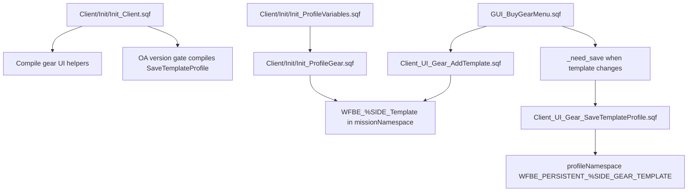

# Gear Template Profile Filter

This page documents two profile-template persistence bugs in the buy-gear system: the save filter's undefined upgrade variable, and the load/import guard that accepts six-field rows before reading backpack data. It is a focused implementation note for the rows in [Feature status](Feature-Status-Register) and the gear atlas.

All mission paths are relative to `Missions/[55-2hc]warfarev2_073v48co.chernarus/`.

## Current Flow



## Source Evidence

| Source | Evidence |
| --- | --- |
| `Client/Init/Init_Client.sqf:116-126` | Compiles gear UI helpers including add/delete/fill/template functions. |
| `Client/Init/Init_Client.sqf:169-172` | Under the OA version gate, compiles `WFBE_CL_FNC_UI_Gear_SaveTemplateProfile` and runs profile variable loading. |
| `Client/Init/Init_ProfileVariables.sqf:37-42` | Reads `WFBE_PERSISTENT_%SIDE_GEAR_TEMPLATE` from `profileNamespace` and validates through `Init_ProfileGear.sqf`. |
| `Client/Init/Init_ProfileGear.sqf:17,25` | Accepts stored rows with `count _x >= 6`, then reads `_x select 6` as backpack data. |
| `Client/Init/Init_ProfileGear.sqf:25-136` | Re-validates stored profile templates for shape, side membership, price and max upgrade before replacing mission templates. |
| `Client/Functions/Client_UI_Gear_AddTemplate.sqf:15,37,83,110,136-148` | Builds `_u_upgrade` as the maximum required upgrade in the new template, then appends the template and sets `_need_save = true`. |
| `Client/GUI/GUI_BuyGearMenu.sqf:509` | Spawns `WFBE_CL_FNC_UI_Gear_SaveTemplateProfile` after the dialog closes when `_need_save` is true. |
| `Client/Functions/Client_UI_Gear_SaveTemplateProfile.sqf:17-19` | Privates and sets `_template_upgrade = _x select 3`. |
| `Client/Functions/Client_UI_Gear_SaveTemplateProfile.sqf:33,52,75` | Uses `_u_upgrade`, which is not private or assigned in this function. |
| `Client/Functions/Client_UI_Gear_SaveTemplateProfile.sqf:94-95` | Writes the filtered array to `profileNamespace` and calls `saveProfileNamespace`. |
| `Client/Functions/Client_UI_Gear_FillTemplates.sqf:15-22` | The visible template list only adds templates whose stored upgrade level is at or below current `WFBE_UP_GEAR`. |

## Bug Shape

`Client_UI_Gear_SaveTemplateProfile.sqf` intends to filter templates so only side-valid and currently unlocked items are saved to the player's profile. The function has a correctly named `_template_upgrade` value, but the three per-item upgrade checks reference `_u_upgrade` instead:

```sqf
if ((_get select 3) > _upgrade_barracks && _u_upgrade > _upgrade_gear) then {_can_save = false};
```

`_u_upgrade` exists in `Client_UI_Gear_AddTemplate.sqf`, where it is the computed max upgrade for a newly created template. It does not exist in `Client_UI_Gear_SaveTemplateProfile.sqf`.

Separate creation-gate nuance: `Client_UI_Gear_AddTemplate.sqf:135-136` accepts a new template when the computed requirement is below either current Barracks upgrade or current Gear upgrade:

```sqf
if (_u_upgrade <= (_upgrades select WFBE_UP_BARRACKS) || _u_upgrade <= (_upgrades select WFBE_UP_GEAR)) then {
```

That may be intentional because some infantry equipment gates are Barracks-led while others are Gear-led. It still needs owner confirmation before profile/template cleanup: `Client_UI_Gear_FillTemplates.sqf:15-22` later hides visible templates above current `WFBE_UP_GEAR` only, and `Client_UI_Gear_SaveTemplateProfile.sqf` has its own undefined `_u_upgrade` filter bug. If the intended rule is "unlocked by either relevant tech lane," keep the OR and document which item classes use which lane. If the intended rule is "both infantry tech and gear tech must support it," change AddTemplate, FillTemplates and SaveTemplateProfile together.

Practical impact:

- The save pass can hit an undefined-variable script error when a template item's upgrade exceeds the current barracks upgrade and the expression evaluates the second operand.
- Even when no error is hit, saved-template upgrade filtering cannot be trusted as written because the intended second comparison reads the wrong variable.
- `Init_ProfileGear.sqf` still validates profile templates on load, so this is mainly a persistence/filter correctness bug, not proof that the live buy-gear UI lets locked gear equip by itself.
- `Client_UI_Gear_FillTemplates.sqf` intentionally hides templates above the current gear upgrade instead of showing them as locked. This can make valid saved templates look missing until the side upgrades gear again.
- The broader gear/EASA/service authority issue remains separate: purchases and effects are still client-authoritative legacy flows, covered by [Server authority migration map](Server-Authority-Migration-Map) and [Gear/loadout/EASA atlas](Gear-Loadout-And-EASA-Atlas).

## Patch Options

| Option | Shape | Tradeoff |
| --- | --- | --- |
| Use item upgrade directly | Replace `_u_upgrade > _upgrade_gear` with `(_get select 3) > _upgrade_gear` in all three checks. | Most local and easiest to reason about: reject each item if its own upgrade exceeds both barracks and gear. |
| Use template max upgrade | Replace `_u_upgrade` with `_template_upgrade`. | Matches the already-read template field, but rejects based on the template max when checking each item. This is close to `AddTemplate` behavior. |
| Recompute local max | Initialize `_u_upgrade = _template_upgrade` or recompute max before per-item checks. | More churn than needed unless the owner wants to normalize stale profile data during save. |

Recommended first patch:

```sqf
if ((_get select 3) > _upgrade_barracks && (_get select 3) > _upgrade_gear) then {_can_save = false};
```

Apply that replacement at the weapon, magazine and backpack-content checks. Keep `Init_ProfileGear.sqf` load validation unchanged unless a smoke test proves it filters too aggressively or too loosely.

## Import Bounds Paired Fix

`Client/Init/Init_ProfileGear.sqf` has a separate profile-load compatibility bug. It accepts any stored template row with at least six fields, then reads field 6 as backpack data:

```sqf
if (count _x >= 6) then {
    ...
    _magazines = _x select 5;
    _backpack = _x select 6;
```

Arrays are zero-indexed, so a six-field legacy row has valid indexes `0..5`; reading index 6 is one past the end. Maintained Vanilla Takistan carries the same `:17`/`:25` shape. Patch this in the same profile-template pass as the save filter, but keep the behavior choice explicit:

| Option | Shape | Tradeoff |
| --- | --- | --- |
| Require current seven-field rows | Change the guard to `if (count _x >= 7) then { ... }`. | Smallest correctness patch; drops old six-field rows instead of trying to repair them. |
| Preserve legacy six-field rows | If `count _x == 6`, inject `_backpack = []` or normalize the row before validation. | More compatible for old profiles, but needs smoke for both old and current row shapes. |

Validation for this paired fix:

1. `Init_ProfileGear.sqf` never reads `_x select 6` unless the row has at least seven fields, or it intentionally supplies an empty backpack default for six-field rows.
2. Current seven-field templates still load and recalculate price/upgrade fields.
3. Old six-field profile rows either fail closed without an RPT out-of-range error or load with an explicit empty backpack default.
4. Maintained Vanilla receives the same profile-load fix after propagation.

## Validation Plan

Source checks:

1. `Client_UI_Gear_SaveTemplateProfile.sqf` has no `_u_upgrade` reference.
2. The function still writes `WFBE_PERSISTENT_%SIDE_GEAR_TEMPLATE`.
3. `Client_UI_Gear_AddTemplate.sqf` still computes and stores template max upgrade in field 3.
4. `Init_ProfileGear.sqf` still recalculates stored profile price and max upgrade on load.
5. `Init_ProfileGear.sqf` no longer accepts six-field rows and then reads index 6 without a compatibility default.
6. AddTemplate, FillTemplates and SaveTemplateProfile all use the same intended Barracks/Gear lane rule after the owner decision.

Arma smoke:

1. Create a gear template with currently allowed gear; close the menu and confirm it persists after restart/rejoin.
2. Try to save a template containing gear above both barracks and gear upgrade levels; confirm it is not written and no RPT undefined-variable error appears.
3. Upgrade barracks/gear and confirm the same template becomes saveable when the relevant level is unlocked.
4. Confirm templates still disappear from the visible list when `Client_UI_Gear_FillTemplates.sqf` filters them above current `WFBE_UP_GEAR`.
5. Decide whether hidden higher-upgrade templates should remain invisible or appear as locked rows so players understand they were not deleted.

Generated mission:

- Patch source Chernarus first.
- Propagate Vanilla Takistan with `Tools/LoadoutManager` from a checkout whose ancestor folder is literally named `a2waspwarfare`.
- Do not hand-edit divergent/stubbed `Modded_Missions` unless the owner picks a maintenance model.

## Agent Notes

- This is a correctness and persistence bug in profile-template filtering.
- The import-bound issue is a paired profile persistence bug, not proof that live gear purchase authority is hardened or broken in a new way.
- It is not the same as full gear purchase authority. Do not claim public-server gear hardening after this patch.
- Keep this page paired with [Gear/loadout/EASA atlas](Gear-Loadout-And-EASA-Atlas), [Client UI systems atlas](Client-UI-Systems-Atlas) and [Feature status](Feature-Status-Register).

## Continue Reading

Previous: [Gear/loadout/EASA atlas](Gear-Loadout-And-EASA-Atlas) | Next: [UI IDD collision repair](UI-IDD-Collision-Repair)

Main map: [Home](Home) | Agent file: [`agent-feature-status.jsonl`](agent-feature-status.jsonl) | Backlog: [`agent-hardening-backlog.jsonl`](agent-hardening-backlog.jsonl)
