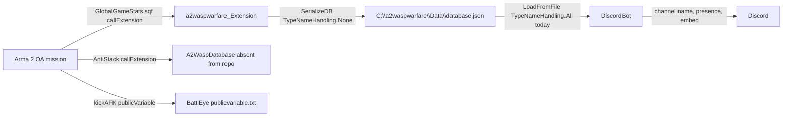

# Integration Trust Boundary Audit

This page is the compact security and operations view for code that crosses out of the SQF mission into C# processes, disk files, Discord, BattlEye filters or absent server-side extensions. Use [External integrations](External-Integrations) for the architecture overview; use this page when deciding what to harden first.

## Why This Matters

The mission has three very different integration boundaries that are easy to conflate:

- `DiscordBot` reads a local JSON file into a token-holding Discord process.
- `a2waspwarfare_Extension` writes mission status to `database.json` for the bot.
- AntiStack calls a separate `A2WaspDatabase` extension that is not present in this repo.

Treating those as one "extension risk" leads to bad fixes. The active high-risk JSON sink is in the Discord bot reader, not in the in-repo mission status writer. AntiStack is a separate deployment dependency with SQF-side `call compile` return handling.

## Boundary Register

| Boundary | Source evidence | Current verdict | First safe action |
| --- | --- | --- | --- |
| DiscordBot `database.json` reader | `DiscordBot/src/ExtensionData/GameData/GameData.cs:32-56`, `DiscordBot/src/GameStatusUpdater.cs:9-84`, `DiscordBot/src/CommandHandler.cs:49-52,127-130,211` | High local-write-gated RCE risk: `LoadFromFile()` deserializes `database.json` with Newtonsoft `TypeNameHandling.All` on the timer path and command/embed path. Slash commands are auth-gated, but the JSON reader is still too trusting for a process holding a Discord token. | Change the active reader to `TypeNameHandling.None`, keep `GameData` as a flat DTO, and add fixture tests with hostile `$type` metadata. |
| DiscordBot legacy JSON helper | `DiscordBot/src/ExtensionData/GameData/GameDataDeSerialization.cs:31-36` | `HandleGameDataCreationOrLoading()` is still callable and deserializes caller-provided JSON with `TypeNameHandling.Auto`, even though the startup path now calls `GameData.LoadFromFile()`. | Delete it, make it private behind safe DTO parsing, or force `TypeNameHandling.None` before any command/runtime path can revive it. |
| In-repo `a2waspwarfare_Extension` writer | `Extension/src/ExtensionMethods.cs:10-35`, `Extension/src/BaseExtensionClass/Implementations/GLOBALGAMESTATS.cs:13-18`, `Extension/src/SerializationManager.cs:20-55`, mission caller `Server/CallExtensions/GlobalGameStats.sqf:1-23` | Not an SQF RCE path in the current source: the mission discards the `callExtension` return and the active writer uses `TypeNameHandling.None`. Still a robustness risk because `SerializeDB()` is `async void`, uses temp/replace file writes, and has hardcoded `C:\a2waspwarfare\Data`. | Convert write handling to a visible `Task` or synchronous fire-and-log path, make first-run replace behavior explicit, and keep serializer type-name handling disabled. |
| Dead extension deserialization scaffold | `Extension/src/SerializationManager.cs:79-124` | Commented code contains a `TypeNameHandling.Auto` deserialization landmine. It is not active today, but it is dangerous if revived as persistence load code. | Delete the dead path or replace it with a safe DTO-only loader before any persistence revival. |
| AntiStack `A2WaspDatabase` extension | `Server/Module/AntiStack/callDatabase*.sqf` wrappers call `"A2WaspDatabase" callExtension` and then `call compile` returned strings. The DLL is not in this repo. | Deployment split plus return-trust risk. Building `Extension` does not satisfy AntiStack, and missing/slow/untrusted DB output can affect live-server balance logic. Current source has an ON/OFF parameter and disabled-mode guards, but enabled mode still trusts return shape. | Use [AntiStack database extension audit](AntiStack-Database-Extension-Audit): add extension presence/failure detection, bounded waits and shape checks before reading compiled values. Do not propose Arma 3-only parser APIs for OA. |
| BattlEye filter bundle | `BattlEyeFilter/publicvariable.txt:1-2` | The shipped filter only supports the `kickAFK` publicVariable kick trick. It is not comprehensive public-server hardening. | Treat production `BEpath`, `scripts.txt`, `server.cfg` and broader PV filters as owner/deployment evidence until supplied. |

## Data Flow

## Patch Order

1. Harden `DiscordBot` JSON intake first.
   - Replace `TypeNameHandling.All` with `TypeNameHandling.None`.
   - Keep the DTO flat: score, map, uptime and player-count fields only.
   - Add fixture coverage for normal `database.json`, missing file fallback and hostile `$type` metadata.

2. Make the `a2waspwarfare_Extension` write path boring and observable.
   - Avoid `async void` for file persistence.
   - Preserve the mission behavior where `GlobalGameStats.sqf` does not execute extension output.
   - Remove or safely rewrite the commented `TypeNameHandling.Auto` load scaffold.

3. Treat AntiStack as a separate server dependency.
   - Do not claim AntiStack works because `Extension` builds.
   - Use [AntiStack database extension audit](AntiStack-Database-Extension-Audit) for the wrapper procedure table and disabled-mode guard map.
   - Add missing-DLL and timeout handling before public hosting.
   - If return data is still compiled in OA SQF, validate type, length and expected shape before using it.

4. Treat BattlEye as defense in depth only.
   - The in-repo AFK filter is useful feature plumbing, not a public-server hardening suite.
   - Keep server-authority fixes as the real remediation for PVF, economy and support flows.

## Validation Pack

| Check | Proves |
| --- | --- |
| `dotnet`/MSBuild build for `DiscordBot` with a normal fixture `database.json`. | The bot still reads mission status after serializer hardening. |
| Fixture `database.json` containing `$type` metadata. | The bot does not honor JSON type metadata. |
| Missing/empty `database.json` fixture. | Existing fallback behavior still works. |
| Extension write smoke with no existing data file and with an existing data file. | Temp/replace behavior works on first run and normal updates. |
| AntiStack missing-DLL or disabled-extension smoke. | Server remains stable when the out-of-repo extension is unavailable. |
| Owner confirms production `BEpath` files. | Any BattlEye hardening claim is based on deployment truth, not this repo's AFK-only filter. |

## Deployment Inventory Gate

Before claiming a server deployment is documented or reproducible, record the actual locations and artifact versions for:

- `a2waspwarfare_Extension` / `GLOBALGAMESTATS` built artifact;
- separate `A2WaspDatabase` AntiStack extension, if AntiStack is enabled;
- DiscordBot `token.txt` and `preferences.json`;
- production `BEpath` and whether `scripts.txt`/broader filters live outside this repo;
- external `server.cfg` and `basic.cfg`, if the host does not keep them in the repo checkout.

## Agent Notes

- Do not describe the in-repo `a2waspwarfare_Extension` active writer as the current RCE sink; the source-backed sink is the DiscordBot reader.
- Do not use Arma 3-only `parseSimpleArray` advice for AntiStack hardening. This mission targets Arma 2 OA 1.64.
- Do not call the BattlEye filter "public-server hardening" unless production files beyond `BattlEyeFilter/publicvariable.txt` are supplied and tested.
- Do not make gameplay authority claims from integration fixes. PVF, economy, construction, support and ICBM authority still need server-side validation.

## Continue Reading

Previous: [External integrations](External-Integrations) | Next: [AntiStack database extension audit](AntiStack-Database-Extension-Audit)

Main map: [Home](Home) | Hardening: [Hardening roadmap](Hardening-Implementation-Roadmap) | Agent file: [`agent-hardening-backlog.jsonl`](agent-hardening-backlog.jsonl)
