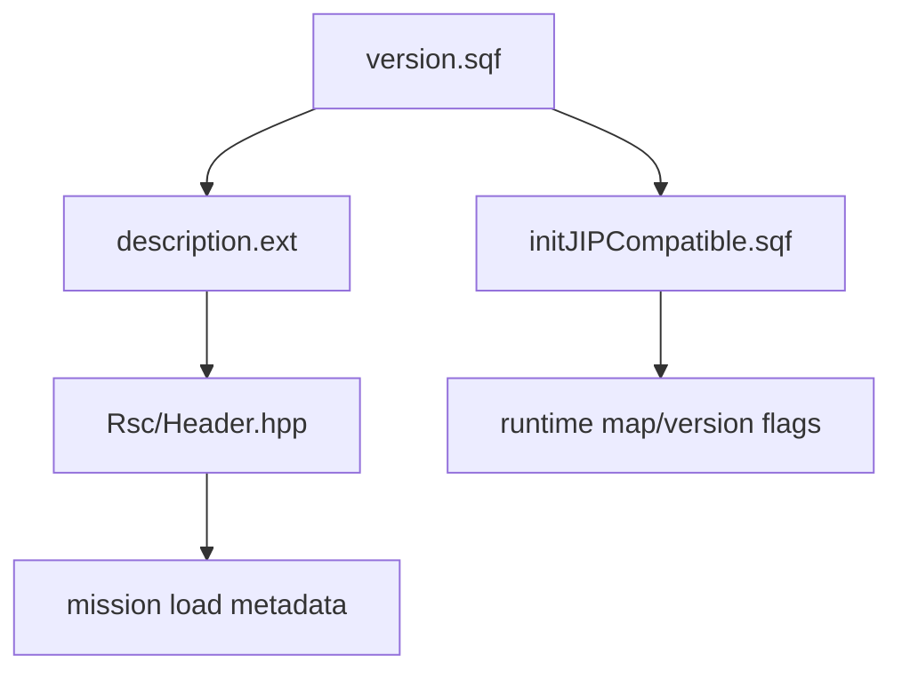

# Mission Config Version Include Graph

This page owns the small but important `version.sqf` contract that sits between mission metadata, generated terrain outputs and runtime boot flags. Use it with [Mission parameters/localization/build inputs](Mission-Parameters-Localization-And-Generated-Build-Inputs), [Mission entrypoints](Mission-Entrypoints-And-Lifecycle), [Content structure and maps](Content-Structure-And-Maps) and [Tools/build](Tools-And-Build-Workflow).

All source paths below are relative to `Missions/[55-2hc]warfarev2_073v48co.chernarus/` unless another root is named.

Current recheck on 2026-06-23 at docs/source `HEAD@101930f47`: a fresh checkout has no present generated `version.sqf` in source Chernarus or maintained Vanilla Takistan, and checked refs do not track live Chernarus/Vanilla `version.sqf` files. Checked refs: docs/source `HEAD@101930f47`, current stable/B74.1 `origin/master@f8a76de34` / `origin/claude/b74.1-aicom@f8a76de34`, current B74.2 `origin/claude/b74.2-aicom@21b62b04`, current B69 `origin/claude/b69@8d465fce`, adjacent B74 `origin/claude/b74-aicom-spend@b23f557f`, current Miksuu `b8389e748243`, `origin/perf/quick-wins@0076040f` and historical `a96fdda2`. Docs/source is unchanged from `7b1187d32` for the checked version/tooling paths, and the scoped `d472da6a..21b62b04` plus `origin/master..origin/claude/b74.2-aicom` diffs are empty for live/template `version.sqf`, generated-version tooling and include consumers. Current stable/B74.1/B74.2/B69/B74 add the same tracked Chernarus `version.sqf.template`, but that is only a reference template and does not satisfy the live generated `version.sqf` gate for source Chernarus or maintained Vanilla Takistan. LoadoutManager remains the generation path.

## Include Chain

`version.sqf` is not just a release-note file. It feeds both static mission config and runtime bootstrap:

| Consumer | Evidence | Contract |
| --- | --- | --- |
| `description.ext` | `description.ext:39` on docs/source, Miksuu and perf; `:38` on current stable/B74.1/B74.2/B69/B74 and historical `a96fdda2` | Includes generated terrain metadata before `Rsc/Header.hpp`. |
| `Rsc/Header.hpp` | `Rsc/Header.hpp:5,9,21` | Uses `WF_RESPAWNDELAY`, `WF_MISSIONNAME` and `WF_MAXPLAYERS` for mission header values. |
| `initJIPCompatible.sqf` | `initJIPCompatible.sqf:4`; mission/max-player logs at `:29,:31` on docs/Miksuu/perf/`a96fdda2` and `:29,:32` on stable-shaped refs; runtime map flag conversion at `:111-113` | Includes `version.sqf`, logs mission metadata, and converts `IS_CHERNARUS_MAP_DEPENDENT` into runtime `IS_chernarus_map_dependent`. |
| Vanilla/CO UI gate | `description.ext:61-63`, `Rsc/Header.hpp:12-14` | Uses the `VANILLA` preprocessor macro for OA/CO-dependent config. This is separate from the `Missions_Vanilla` folder name. |

## Generated Contract Shape

| Mission root | Generated contract observed |
| --- | --- |
| Source Chernarus | Expected generated `version.sqf` carries `WF_MAXPLAYERS = 55`, a Chernarus mission name, `IS_CHERNARUS_MAP_DEPENDENT` and `IS_NAVAL_MAP`. Verify the generated file in the target root before pack/smoke claims. |
| Maintained Vanilla Takistan | Expected generated `version.sqf` carries `WF_MAXPLAYERS = 61` and a Takistan mission name; the sampled/generated Takistan shape comments out the Chernarus/naval flags. Verify the generated file in the target root before pack/smoke claims. |

These generated files are ignored by git, so do not assume a clean checkout has them. Docs/source, Miksuu, perf and historical `a96fdda2` write `version.sqf` from `Tools/LoadoutManager/Data/Terrains/BaseTerrain.cs:102` and emit the checked map/naval/name defines at `:359,:361,:364`; current stable/B74.1/B74.2/B69/B74 use `BaseTerrain.cs:115` and `:372,:374,:377`. `Tools/LoadoutManager/FileManagement/FileManager.cs:92-100` treats `version.sqf` as a generated/special terrain file during copy/delete.

Release gate: if any claimed mission root lacks a generated `version.sqf`, that root is blocked for pack, smoke and release wording. Verify the file exists and that its `WF_MAXPLAYERS`, `WF_MISSIONNAME`, `WF_RESPAWNDELAY`, map flags and debug/log flags match the terrain profile before treating later SQF validation as meaningful. The machine checklist is `agent-release-readiness.json` `versionSqfGeneratedInput`.

## Map Flag Semantics

`IS_CHERNARUS_MAP_DEPENDENT` is currently a binary switch. If the macro is absent, runtime code falls into non-Chernarus/Takistan-style defaults. This affects faction defaults and many class choices through `IS_chernarus_map_dependent`.

Source anchors:

- `initJIPCompatible.sqf:111-113` sets the runtime boolean.
- `initJIPCompatible.sqf:254-266` branches source boot behavior on it.
- `Common/Init/Init_CommonConstants.sqf:383-395` selects Chernarus-style versus Takistan-style faction defaults.
- `Common/Init/Init_Common.sqf:256-257` selects side root names from the same boolean.
- `Common/Config/Core_Structures/*` and `Common/Functions/Common_AddVehicleTexture.sqf` contain many Chernarus/non-Chernarus class branches.

Practical rule for modded maps: if a terrain is not truly Takistan-like, do not rely on the absence of `IS_CHERNARUS_MAP_DEPENDENT` as a neutral default. Add or document the intended terrain profile.

## Naval Flag

`IS_NAVAL_MAP` is live content metadata. Runtime init converts it into `IS_naval_map`, and unit/root configs use that to add boat classes.

Evidence:

- `initJIPCompatible.sqf:16-20` sets `IS_naval_map`.
- `Common/Config/Core_Units/Units_CO_US.sqf:307,335` adds `Zodiac`.
- `Common/Config/Core_Units/Units_CO_RU.sqf:262,292` adds `PBX`.

Terrain authors should verify naval intent before generating or packaging a new mission root; the flag changes purchasable content.

## Developer Rules

- Treat `version.sqf` as required generated terrain metadata, not optional docs.
- Missing generated `version.sqf` is a boot/release blocker for that mission root, even when all tracked source files look clean.
- Verify `WF_MAXPLAYERS`, `WF_MISSIONNAME`, `WF_RESPAWNDELAY`, `IS_CHERNARUS_MAP_DEPENDENT`, `IS_NAVAL_MAP`, `WF_DEBUG` and `WF_LOG_CONTENT` in the target mission root before release packaging.
- Do not confuse `Missions_Vanilla` with the `VANILLA` preprocessor macro. The folder is a generated target label; the macro gates OA/CO config paths inside mission headers.
- If a modded map needs different defaults than Chernarus and Takistan, document or implement a real terrain profile instead of inheriting the binary fallback by accident.

## Continue Reading

Previous: [Mission entrypoints and lifecycle](Mission-Entrypoints-And-Lifecycle) | Next: [Mission parameters/localization/build inputs](Mission-Parameters-Localization-And-Generated-Build-Inputs)

Main map: [Home](Home) | Content map: [Content structure and maps](Content-Structure-And-Maps) | Tooling: [Tools and build workflow](Tools-And-Build-Workflow)
