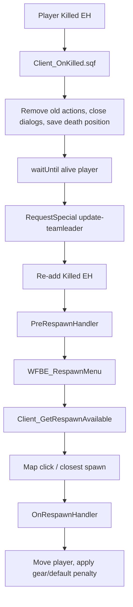

# Respawn And Death Lifecycle Atlas

This page maps player death, custom respawn selection, gear restoration, MASH/mobile/camp spawn options and AI respawn. It also separates live respawn behavior from the dead MASH marker relay.

## Source Scope

Source-refreshed 2026-06-14 on docs head `a640e722`; targeted diffs from `1f0b9018` through `HEAD` over checked Chernarus and maintained Vanilla respawn, MASH, skill, camp/threeway and AI-respawn paths returned no source changes at that checkpoint. MASH branch scope was refreshed again 2026-06-24 on repo docs branch `HEAD@f938b0c0b7ea`: checked maintained-root MASH deploy, marker relay, init and respawn-availability paths are unchanged from `443055cf`, `2b5139219faa` and `db3015f18ea3`. Docs/perf/Miksuu-shaped roots still keep the old deploy/relay shape, while current stable/B74.1 `origin/master@f8a76de34` / `origin/claude/b74.1-aicom@f8a76de34`, current B74.2 `origin/claude/b74.2-aicom@21b62b04`, current B69 `origin/claude/b69@8d465fcede7f`, adjacent B74 `origin/claude/b74-aicom-spend@b23f557fc912` and historical `a96fdda28087` remove the maintained-root deploy/module path. Checked `0139a3468609..origin/master`, `origin/master..origin/claude/b74.2-aicom`, `d472da6a..21b62b04` and B69..B74 MASH path deltas are empty; current origin exposed no live `release/*` or `*mash*` heads on 2026-06-24. Paths below are relative to source root `Missions/[55-2hc]warfarev2_073v48co.chernarus` unless a maintained-root or branch note says otherwise; use the MASH matrix below for branch-sensitive deploy/marker claims.

## Why This Matters

Respawn touches client UI, action-menu recovery, skill reapply, gear economics, camp ownership, MASH/officer skills, mobile ambulances, AI team continuity, kill scoring and HQ/MHQ state. Small changes here can break player action menus after death, make gear penalties unfair, multiply kill scoring, or accidentally turn a local respawn feature into a networked authority surface.

## Engine And Mission Shell

| Area | Evidence | Meaning |
| --- | --- | --- |
| Engine respawn mode | `Rsc/Header.hpp:3-6` sets `respawn = 3`, `respawnDelay = WF_RESPAWNDELAY` and `respawnDialog = false`. | The mission suppresses the default engine dialog and implements its own death camera + respawn menu. |
| Player death handler compile | `Client/Init/Init_Client.sqf:111,127` compiles `WFBE_CL_FNC_OnKilled` and `WFBE_CL_FNC_UI_Respawn_Selector`. | Player death and respawn marker animation are local client functions. |
| Initial client placement | `Client/Init/Init_Client.sqf:471-488` chooses the newest base factory/HQ fallback and places the joining client near it. | First spawn is not the same path as post-death respawn menu selection. |
| Player killed EH rebind | `Client/Functions/Client_OnKilled.sqf:77-89` adds a new `Killed` EH to the fresh player object and calls `PreRespawnHandler`. | Death clears EH/action state on the old unit, so rebind/reapply is a core lifecycle step. |
| AI respawn EH | `Server/AI/AI_AddMultiplayerRespawnEH.sqf:1` attaches `MPRespawn` handling for non-player leaders. | AI leader respawn is server-side and separate from the player menu. |

## Player Flow

### Death Handler Responsibilities

`Client_OnKilled.sqf` removes stale action IDs from the dead body (`:25-45`), closes active dialogs (`:49-52`), records `WFBE_DeathLocation` (`:54`), fades out (`:57-58`), waits for the engine to create the new player object (`:60`), updates the server-side team leader via `RequestSpecial` (`:63-64`), ensures local group leadership (`:67-72`), binds the new `Killed` EH (`:77-84`), calls `PreRespawnHandler` (`:87-89`), starts the death camera (`:92-150`) and opens `WFBE_RespawnMenu` (`:155-156`).

Branch-only B74.6 current-head note: `origin/claude/b745@712a7a668` adds death-camera guardrails after the old B74.5 head `b996bcb3`. In source Chernarus and maintained Vanilla, `Client_OnKilled.sqf:132` now exits the camera path if `WFBE_DeathLocation` is nil, not an array or has fewer than three elements; `:137-138` creates `WFBE_DeathCamera` and exits if it is nil before later `camCommit` / `waitUntil camCommitted` calls at `:153,:156`. The same guard shape is present in touched full modded Napf/Eden/Lingor forks at `Client_OnKilled.sqf:60,65-66,76,78`. Treat this as branch-only RPT/FPS regression evidence, not current stable or release behavior; smoke death, respawn-menu open, camera fallback, disconnect/invalid-body cases and RPT cleanliness before promotion.

`Client_PreRespawnHandler.sqf` is the action/skill recovery hook. It reapplies the skill effect (`:5`), restarts `updateactions.fsm` (`:6`), re-adds the WF menu and player-AI actions (`:8-10`), re-runs WASP death/action glue (`:11`), recompiles RPG drop support (`:12`) and adds the Fired/HandleDamage hooks (`:13,32`). This is why the current source-only skill idempotency fix still needs respawn smoke: `Skill_Init.sqf` should run once, but `WFBE_SK_FNC_Apply` must still run after death.

### Respawn Menu Responsibilities

`GUI_RespawnMenu.sqf` owns the custom UI loop. It focuses the map on death position (`:5-7`), starts or reuses `WFBE_RespawnTime` from `WFBE_C_RESPAWN_DELAY` (`:12-23`), refreshes available spawn locations once per second (`:43-49`), creates/deletes local spawn markers (`:55-87`), updates the countdown and selected label (`:89-101`), lets map clicks choose the nearest spawn within 500 meters (`:103-110`) and calls `OnRespawnHandler` after the timer (`:130-156`). The selector animation loop lives in `Client_UI_Respawn_Selector.sqf:14-35` and sleeps every `0.03` seconds while a selected target exists.

## Spawn Sources

| Source | Player availability | AI availability | Notes |
| --- | --- | --- | --- |
| HQ/base factories | `Client_GetRespawnAvailable.sqf:7-31` starts with HQ and adds Barracks/Light/Heavy/Air factories. | `AI_AdvancedRespawn.sqf:77-104` and `AI_SquadRespawn.sqf:65-90` fall back to HQ or closest structure. | Dead HQ is removed if another base spawn exists. |
| Mobile ambulance class list | `Client_GetRespawnAvailable.sqf:32-45` scans `WFBE_%1AMBULANCES` near death location using upgraded range. | `AI_AdvancedRespawn.sqf:44-53`; `AI_SquadRespawn.sqf:43-51`. | Player preview requires free cargo; final placement also requires alive/unlocked vehicle state in `OnRespawnHandler.sqf:27-33`. |
| Officer MASH/FARP | `Client_GetRespawnAvailable.sqf:47-58` reads local `WFBE_Client_Logic getVariable "wfbe_mash"` and range-checks it. | No equivalent AI MASH path found in audited AI respawn scripts. | Live for the local deploying client; team-shared MASH respawn is not proven by source. |
| Squad leader | `Client_GetRespawnAvailable.sqf:60-65` allows leader respawn if enabled and close to death location. | AI uses team `wfbe_respawn` object/string state instead. | `WFBE_C_RESPAWN_LEADER == 2` forces default gear when chosen. |
| Threeway defender towns | `Client_GetRespawnAvailable.sqf:67-76`; `Common_GetRespawnThreeway.sqf:6-8`. | Not seen in AI respawn scripts except via camps. | Defender can respawn in fully-held side towns in threeway mode. |
| Camps | `Client_GetRespawnAvailable.sqf:78-81`; `Common_GetRespawnCamps.sqf:11-94`. | `AI_AdvancedRespawn.sqf:37-40`; `AI_SquadRespawn.sqf:36-39`. | Modes: classic, nearby camps, defender-only; optional hostile safe-radius rules. |

Mini-scout follow-up 2026-06-04 confirmed two practical spawn-table caveats:

- Service Point and Command Center base respawns are explicitly commented out in `Client_GetRespawnAvailable.sqf:23-26`; the live base set is HQ plus Barracks/Light/Heavy/Air factories.
- Mobile respawn is conditional, not just object-based: `Client_GetRespawnAvailable.sqf:33-45` requires an ambulance-class vehicle inside the upgrade-gated range and with free cargo space before it enters the candidate list. The actual respawn handler then rechecks alive/unlocked state before moving the player into cargo (`Client_OnRespawnHandler.sqf:27-33`), so a vehicle can appear in the menu and fail the stricter final placement if it dies or becomes locked before the countdown ends. Camp availability has its own hostile-safe filtering in `Common_GetRespawnCamps.sqf:11-94`.
- Threeway defender town respawn inherits the camp-count fallback. `Common_GetTotalCamps.sqf:9-12` and `Common_GetTotalCampsOnSide.sqf:15-22` both return `1` when a town has zero camps, and `Common_GetRespawnThreeway.sqf:6-8` treats equality as "all camps owned." Because `Client_GetRespawnAvailable.sqf:67-75` appends that result directly, a side-owned zero-camp town can become a respawn source unless an owner confirms that the `1` fallback is intended for this caller.

### Branch Intel - Mobile Respawn Map Circles

Draft PR #78 / `origin/claude/trello-map-radius-circles@77dd71ba` is a branch-only local map-marker/map-indicator candidate on current stable base `origin/master@f8a76de34`, not current stable behavior. The payload is six maintained-root files / +192 / -4 and `git diff --check` is clean. It adds `Client/Functions/Client_AmbulanceRedeployCircles.sqf:1-69` in source Chernarus plus maintained Vanilla Takistan and launches it from `Init_Client.sqf:1227`; current stable has no `Client_AmbulanceRedeployCircles`, `AmbRange_` or launcher hits.

The watcher self-gates on `WFBE_C_RESPAWN_MOBILE`, builds a side-local classname list from `WFBE_%1AMBULANCES` and `WFBE_%1REDEPLOYTRUCKS`, reads the current side respawn-range upgrade and `WFBE_C_RESPAWN_RANGES`, creates yellow local border ellipses for same-side vehicles of those types and then repositions, resizes or deletes rings every five seconds (`Client_AmbulanceRedeployCircles.sqf:1-69`). The radius matches the respawn availability radius in current stable (`Client_GetRespawnAvailable.sqf:33-37,55-58`; constants Chernarus `Init_CommonConstants.sqf:44,674,678`, Vanilla `:44,476,480`). Treat PR #78 as local player feedback only; it does not change respawn authority, spawn eligibility, cargo checks, default-gear rules or AI respawn behavior.

Important caveat: the branch visualizes radius around vehicle classes, not the full respawn-menu eligibility contract. The watcher does not duplicate ambulance free-cargo filtering (`Client_GetRespawnAvailable.sqf:33-45`) or redeploy-truck Medic-only, parked/engine-off, free-seat and 500m enemy-town checks (`:54-81`). If promoted, smoke must compare ring visibility against actual selectable respawn entries so players are not shown a "usable" circle around an unusable truck.

No revive framework is wired in the audited source. The 2026-06-04 respawn scout found no mission-script `revive`/`reviving`/`revived` path under source Chernarus, and the live architecture is kill event, custom death camera, respawn menu, then `Client_OnRespawnHandler.sqf`. Do not document MASH as a revive feature; it is a respawn candidate source with a dead marker-sharing edge.

## Gear And Penalty Rules

`Client_OnRespawnHandler.sqf` moves the player to the chosen spawn and applies custom or default gear. It forces default gear for mobile, MASH or leader respawn when the corresponding parameter equals `2` (`:11-24`). Mobile respawn can put the player into the vehicle if cargo is free and it is unlocked (`:26-33`).

Custom gear is reused from `wfbe_custom_gear` when `WFBE_RespawnDefaultGear` is false and the selected spawn allows custom gear (`:35-79`). Penalty mode is `WFBE_C_RESPAWN_PENALTY`:

- `0`: no custom-gear charge.
- `2`: full custom gear price.
- `3`: half price.
- `4`: quarter price.
- `5`: intended as charge-on-mobile only.

Patch-ready edge: in mode `5`, `_charge` becomes false for base/HQ structures (`Client_OnRespawnHandler.sqf:54-59`), but `_skip` is still set when `_funds < _price` (`:61-70`). That means an unpaid base respawn can still lose custom gear if the player cannot afford the theoretical price. A future patch should gate the skip on `_charge` too, or explicitly define mode `5` as "custom gear requires affordability everywhere but only charges on mobile" if that was intended.

Default gear is class-specific by skill type (`Client_OnRespawnHandler.sqf:81-106`): Spotter, Officer, Soldier, Engineer, SpecOps and Medic each map to a side-specific default gear variable.

## Parameters And Defaults

`Rsc/Parameters.hpp:399-447` exposes the live admin parameters:

| Parameter | Mission parameter default | Fallback if nil | Notes |
| --- | ---: | ---: | --- |
| `WFBE_C_RESPAWN_CAMPS_MODE` | `1` | `2` at `Init_CommonConstants.sqf:275` | Parameter wins in normal mission launch; fallback protects older/missing params. |
| `WFBE_C_RESPAWN_CAMPS_RULE_MODE` | `1` | `2` at `:277` | Hostile safe-radius policy. |
| `WFBE_C_RESPAWN_DELAY` | `30` | `10` at `:278` | Player UI and AI waits read this. |
| `WFBE_C_RESPAWN_LEADER` | `0` | `2` at `:279` | `2` means enabled with default gear. |
| `WFBE_C_RESPAWN_MOBILE` | `1` | `2` at `:281` | `2` means enabled with default gear. |
| `WFBE_C_RESPAWN_PENALTY` | `0` | `4` at `:282` | Parameter default disables penalty; fallback quarters custom gear price. |
| `WFBE_C_RESPAWN_CAMPS_RANGE` | `400` | `550` at `:276` | Camp scan/range behavior. |

## MASH Split: Live Respawn, Dead Marker Relay

Canonical statement for docs/Miksuu/perf-shaped roots: **local officer MASH respawn is source-supported; shared/JIP-safe MASH marker synchronization is orphaned in maintained roots.** Current stable/B74.1 `origin/master@f8a76de34` / `origin/claude/b74.1-aicom@f8a76de34`, current B74.2 `origin/claude/b74.2-aicom@21b62b04`, current B69 `origin/claude/b69@8d465fce`, adjacent B74 `origin/claude/b74-aicom-spend@b23f557f` and historical `a96fdda2` are different: they remove the maintained-root MASH deploy/module path while leaving some config/classname residues. Older B69 refs `0a1ccb4d05c5` and `80d3267c1b2b` are provenance for the same removal shape, not current-head proof. No Arma runtime smoke was run for this docs pass, so describe source paths as source-supported or source-removed rather than runtime-proven.

Live pieces on docs/Miksuu/perf-shaped roots:

- Officer action is added only when `WFBE_C_RESPAWN_MASH > 0` in `Client/Module/Skill/Skill_Apply.sqf:42-55`.
- Deployment creates the side FARP/MASH type near the player and stores it as `WFBE_Client_Logic` variable `wfbe_mash` in `Client/Module/Skill/Skill_Officer.sqf:7-29`.
- The respawn menu reads that local `wfbe_mash` object in `Client_GetRespawnAvailable.sqf:47-58`.
- Undeploy deletes the tent and resets cooldown in `Client/Module/Skill/Actions/Officer_Undeploy_MASH.sqf:19-21`.

Dead/broken marker edge:

- Server PVEH listens for `WFBE_CL_MASH_MARKER_CREATED` in `Server/Module/MASH/MASHMarker.sqf:1-13`.
- Client receiver for `WFBE_SE_MASH_MARKER_SENT` exists in `Client/Module/MASH/receiverMASHmarker.sqf:1-29`, but its compile line is commented in `Client/Init/Init_Client.sqf:132`.
- No live deploy path was found broadcasting `WFBE_CL_MASH_MARKER_CREATED`.
- Branch recheck on 2026-06-24 found the orphaned marker shape in repo docs branch `HEAD@f938b0c0b7ea` (unchanged from `443055cf`, `2b5139219faa` and `db3015f18ea3` for checked MASH paths), Miksuu `b8389e748243` and `origin/perf/quick-wins@0076040f8a5e` maintained roots. Current stable/B74.1 `origin/master@f8a76de34` / `origin/claude/b74.1-aicom@f8a76de34`, current B74.2 `origin/claude/b74.2-aicom@21b62b04`, current B69 `origin/claude/b69@8d465fcede7f`, adjacent B74 `origin/claude/b74-aicom-spend@b23f557fc912` and historical `a96fdda28087` have no maintained-root `Client/Module/MASH` or `Server/Module/MASH` tree entries and no MASH init hooks in the checked maintained roots; all keep a `Skill_Apply.sqf:43` comment that the deploy ability was removed plus config/classname residues. Checked `0139a3468609..origin/master`, `origin/master..origin/claude/b74.2-aicom`, `d472da6a..21b62b04` and B69..B74 MASH deploy/relay/init/respawn path deltas are empty, and current origin exposed no live `release/*` or `*mash*` heads on 2026-06-24.

| Scope | Local MASH respawn | Shared marker relay | Development meaning |
| --- | --- | --- | --- |
| Repo docs branch `HEAD@f938b0c0b7ea` Chernarus and maintained Vanilla, unchanged from `443055cf` / `2b5139219faa` / `db3015f18ea3` for checked MASH paths | Source-supported: deploy stores local `wfbe_mash`; respawn availability reads it. | Orphaned: active server receiver, commented client receiver compile, no maintained deploy sender. | Decide personal/squad/team semantics before changing code. |
| Miksuu `b8389e748243` | Same source-supported local path. | Same orphaned relay. | Upstream does not prove team-shared MASH behavior. |
| `origin/perf/quick-wins@0076040f8a5e` | Same source-supported local path in Chernarus and maintained Vanilla. | Same orphaned relay. | Perf branch does not close MASH marker sharing. |
| Current stable/B74.1 `origin/master@f8a76de34` / `origin/claude/b74.1-aicom@f8a76de34`, current B74.2 `origin/claude/b74.2-aicom@21b62b04`, current B69 `origin/claude/b69@8d465fce`, adjacent B74 `origin/claude/b74-aicom-spend@b23f557f` and historical `a96fdda2` | MASH deploy/module path removed in maintained roots; class/config residues still mention MASH. Checked old-stable..current-stable, current-stable..B74.2, previous-B74.2..current-B74.2 and B69..B74 MASH deltas are empty. | No maintained-root MASH module relay path found. | Treat MASH revival/removal decisions as branch-sensitive; do not port docs/Miksuu marker conclusions blindly. |
| Modded `eden` / `lingor` | Not maintained proof. | Sender-only drift: modded deploy sends `WFBE_CL_MASH_MARKER_CREATED`, but maintained clients still do not compile the receiver. | Use only as archaeology if reviving; do not cite as working maintained behavior. |

Do not call MASH respawn dead on docs/Miksuu/perf-shaped roots unless specifically talking about team-shared/JIP marker synchronization. The source-backed statement there is: local officer MASH respawn exists; MASH marker sharing is dead/orphaned; team-wide MASH respawn is not proven. Deployment stores `wfbe_mash` on `WFBE_Client_Logic`, and respawn availability reads that same local variable, while the server only seeds the value to `objNull`. On current-stable/B74-shaped roots, including current B74.2, the maintained-root deploy/module path is source-removed, so use the exact branch matrix above.

## Service Points Are Support Nodes

Service points are not active respawn nodes in the old-shape audited Chernarus source. `Client_GetRespawnAvailable.sqf:23-26` still has commented command-center and service-point candidate code, but the live respawn list there continues through HQ/base, mobile ambulance, local MASH, leader, threeway and camp candidates. Keep service-point behavior in the service/EASA support lane unless an owner deliberately revives service-point respawn and smokes the UI, JIP and default-gear rules.

## AI Respawn

There are two audited AI leader paths:

- `AI_AddMultiplayerRespawnEH.sqf:1` adds an `MPRespawn` handler that calls `AIAdvancedRespawn` for non-player units on the server.
- `AI_SquadRespawn.sqf:14-111` runs a loop watching non-player team leaders, waits for death/alive transitions, then handles respawn.

Both server AI paths:

1. Rebind `Killed` scoring EHs (`AI_AdvancedRespawn.sqf:24-30`; `AI_SquadRespawn.sqf:26-30`).
2. Collect camp and mobile candidates unless forced respawn is set (`AI_AdvancedRespawn.sqf:34-53`; `AI_SquadRespawn.sqf:33-51`).
3. Wait `WFBE_C_RESPAWN_DELAY` (`AI_AdvancedRespawn.sqf:55-63`; `AI_SquadRespawn.sqf:53`).
4. Re-equip from side AI loadout variables keyed by upgrade level (`AI_AdvancedRespawn.sqf:67-76`; `AI_SquadRespawn.sqf:55-64`).
5. Choose stored team respawn object, HQ/closest structure fallback or random available camp/mobile candidate (`AI_AdvancedRespawn.sqf:80-115`; `AI_SquadRespawn.sqf:68-100`).
6. Reset non-autonomous movement orders after respawn (`AI_AdvancedRespawn.sqf:117-125`; `AI_SquadRespawn.sqf:102-110`).

Team respawn state is `group setVariable ["wfbe_respawn", _respawn, true]` via `Common_SetTeamRespawn.sqf:1-8`; groups are initialized with blank respawn in `Server/Init/Init_Server.sqf:474-483`.

AI loadout tier note: both AI respawn paths currently read `_upgrades select 13`, which matches `WFBE_UP_GEAR = 13` in `Common/Init/Init_CommonConstants.sqf:50`. Future cleanup should use the named constant, clamp the selected tier to available `WFBE_%SIDE_AI_Loadout_0..3` arrays and guard empty arrays before `random count`.

There are two distinct AI leader respawn implementations. `AI_AddMultiplayerRespawnEH.sqf:1` routes non-player MPRespawn events to `AI_AdvancedRespawn.sqf`, while `AI_SquadRespawn.sqf:14-111` runs a loop for non-player team leaders. Treat this as parity-sensitive when changing camp/mobile/HQ fallback rules.

## Kill Scoring And Cleanup

The player `Killed` EH sends the common kill report path through `WFBE_CO_FNC_OnUnitKilled` (`Client_OnKilled.sqf:77-84`; `Common_OnUnitKilled.sqf:8-14`). The server handler `RequestOnUnitKilled.sqf` resolves last-hit fallback for suicide/null killer cases (`:16-23`), logs the death (`:25`), exits if the killer is not alive (`:27`), schedules trash cleanup (`:50-55`), updates side casualties/vehicles lost (`:57-59`), awards score/bounty for enemy kills (`:63-101`) and sends teamkill notices for player-led friendly kills (`:103-109`).

Known adjacent hazard: HQ death has its own redundant client EH/JIP path and idempotency issue documented in [Deep-review findings](Deep-Review-Findings) DR-20 and [Server runtime](Server-Gameplay-Runtime-Atlas). Do not mix ordinary unit kill scoring with HQ-killed processing.

## Known Risks And Patch-Ready Items

| Status | Item | Evidence | Next action |
| --- | --- | --- | --- |
| Patch-ready | Respawn penalty mode `5` can skip custom gear on base/HQ respawn when player lacks funds, even though `_charge` is false. | `Client_OnRespawnHandler.sqf:54-70` | Patch `_skip` to respect `_charge`, or document owner-confirmed intended semantics. Smoke custom gear at base and mobile under sufficient/insufficient funds. |
| Owner decision | MASH is local to the deployer on old-shape audited roots; team-wide MASH respawn is not proven. | [MASH split](Respawn-And-Death-Lifecycle-Atlas#mash-split-live-respawn-dead-marker-relay) owns the deploy/read anchors and branch matrix. | Decide whether MASH should be personal, squad/team-shared, marker-only, or remain removed on current-stable/B74-shaped targets. If shared, design server-owned registry and explicit JIP resend/pull. |
| Broken/dead edge | MASH marker synchronization is orphaned on docs/Miksuu/perf-shaped maintained roots; current-stable/B74-shaped roots have no maintained-root MASH module relay path after removing the deploy ability. | [MASH split](Respawn-And-Death-Lifecycle-Atlas#mash-split-live-respawn-dead-marker-relay) owns the receiver/server-listener anchors and current-stable/B74 removal note. | Revive with server-held marker records and JIP resend on old-shape targets, or finish removal/cleanup deliberately on the target branch. |
| Smoke pending | Source-only skill idempotency patch depends on respawn reapply still working. | `Client_PreRespawnHandler.sqf:5`; [Client skill init idempotency](Client-Skill-Init-Idempotency) | Smoke Soldier/non-Soldier cap and post-respawn skill actions after LoadoutManager propagation. |
| Review target | Respawn UI loop sleeps `0.01` and selector sleeps `0.03`. | `GUI_RespawnMenu.sqf:113`; `Client_UI_Respawn_Selector.sqf:19-35` | Keep as bounded death-screen-only UI work; if optimizing, preserve marker responsiveness and cleanup. |
| Cleanup target | AI respawn loadout tier uses a literal gear-upgrade index and assumes a non-empty loadout array. | `AI_AdvancedRespawn.sqf:68`; `AI_SquadRespawn.sqf:56`; `Init_CommonConstants.sqf:50` | Replace literal `13` with `WFBE_UP_GEAR`, clamp/bounds-check tier selection and smoke Vanilla plus non-Vanilla AI leader respawn. |
| Patch-ready | Player respawn can stack `HandleAT` Fired handlers on a persistent vehicle. | `Init_Client.sqf:18,266`; `Client_PreRespawnHandler.sqf:13` | Store/remove handler IDs or guard attachment per vehicle/player lifecycle, then smoke death while in/on the same vehicle and ordinary infantry respawn. |
| Review target | Threeway defender respawn can include zero-camp towns because total-camp helpers return `1` for empty camp arrays. | `Common_GetTotalCamps.sqf:9-12`; `Common_GetTotalCampsOnSide.sqf:15-22`; `Common_GetRespawnThreeway.sqf:6-8`; `Client_GetRespawnAvailable.sqf:67-75` | Split safe-denominator helpers from real respawn eligibility, or explicitly exclude zero-camp towns in `GetRespawnThreeway`; smoke threeway defender towns with 0/partial/all camps. |
| UI mismatch | Mobile ambulance preview checks cargo space, while final placement also requires alive and unlocked state. | `Client_GetRespawnAvailable.sqf:33-45`; `Client_OnRespawnHandler.sqf:27-33`; `GUI_RespawnMenu.sqf:43-49,130-156` | Decide whether the menu should filter dead/locked vehicles too, or show the option but fall back cleanly if the vehicle changes state during the countdown. |

## Validation Checklist

- Player dies, old WF menu/action IDs are removed from corpse, and the menu returns on the new unit.
- Respawn menu opens, countdown runs, map click selects nearest spawn within 500 meters, and markers clean up after spawn.
- Base/factory, camp, mobile, leader and MASH spawn options appear only under their parameter/range/ownership rules.
- Custom/default gear behavior matches `WFBE_C_RESPAWN_PENALTY`, `WFBE_C_RESPAWN_* == 2`, and player funds.
- Officer deploys MASH, can respawn at own MASH within upgraded range, can undeploy it, and does not get misleading shared markers unless the marker feature is intentionally revived.
- AI team leaders respawn after configured delay, re-equip, pick sane camp/mobile/base fallback, and reset orders when not autonomous.

## Continue Reading

Previous: [Client UI systems atlas](Client-UI-Systems-Atlas) | Next: [Gear/loadout and EASA atlas](Gear-Loadout-And-EASA-Atlas)

Related: [Feature status](Feature-Status-Register) | [Abandoned feature revival](Abandoned-Feature-Revival-Review) | [WASP overlay](WASP-Overlay) | [Testing workflow](Testing-Debugging-And-Release-Workflow)
