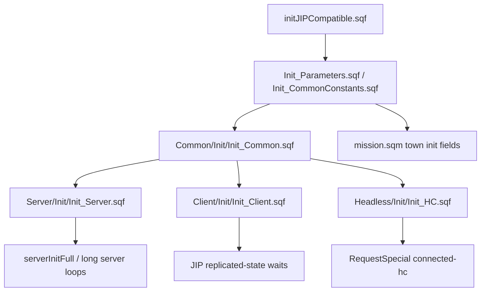

# SQF Code Atlas

Historical guardrail: before changing supply mission, JIP, town-AI, marker or performance-sensitive SQF, read [Developer history and upstream lessons](Developer-History-And-Upstream-Lessons). Miksuu history shows repeated follow-up fixes in those areas, so code changes should cite current source and upstream evidence separately.

This page is the first deeper code-level atlas for the Chernarus source mission. It is generated from source inspection, not memory.

Source mission: `Missions/[55-2hc]warfarev2_073v48co.chernarus`

## What this atlas is

- A source-first map of compile registration and execution owners.
- A dependency map for how mission-side systems wire into runtime, plus canonical link targets for deeper subsystem playbooks.
- A duplicate-control surface: it keeps authoritative pointers but avoids re-stating full deep-review evidence in every feature page.

## Where it lives and how it runs

- Path: `docs/wiki/SQF-Code-Atlas.md`.
- Source owner: `Missions/[55-2hc]warfarev2_073v48co.chernarus`.
- Runtime anchors: `initJIPCompatible.sqf`, `Common/Init/Init_Common.sqf`, `Init_Server.sqf`, `Init_Client.sqf`, `Init_HC.sqf`.
- Scope boundary: this atlas maps compile ownership and risk hotspots; implementation order and authority behavior live in subsystem atlases and feature lanes.

## How To Use This Atlas

This page is the source map for compiled SQF entrypoints and runtime handoffs. Use it to find the owning script family, then follow the owner page for branch matrices, patch gates or Arma smoke requirements.

| Need | Start here | Then route to |
| --- | --- | --- |
| Boot order and wait gates | [Init Owners](#init-owners) | [Mission entrypoints and lifecycle](Mission-Entrypoints-And-Lifecycle), [Lifecycle wait-chain](Lifecycle-Wait-Chain) |
| Compile ownership and function maps | [Compile Registry Summary](#compile-registry-summary) | [Function and module index](Function-And-Module-Index), [Architecture overview](Architecture-Overview) |
| PVF and direct public-variable channels | [PVF Contract](#pvf-contract), [Direct Public Variable Channels](#direct-public-variable-channels) | [Public variable channel index](Public-Variable-Channel-Index), [Networking and public variables](Networking-And-Public-Variables), [PVF dispatch implementation](PVF-Dispatch-Implementation-Playbook) |
| Server runtime loops and authority | [Init Owners](#init-owners) | [Server gameplay runtime atlas](Server-Gameplay-Runtime-Atlas), [Server runtime and operations](Server-Runtime-And-Operations), [Server authority migration map](Server-Authority-Migration-Map) |
| Client UI, HUD and menu entrypoints | [Init Owners](#init-owners) | [Client UI systems atlas](Client-UI-Systems-Atlas), [Player UI workflow map](Player-UI-Workflow-Map) |
| Branch health and patch routing | This page for source ownership only | [Feature status register](Feature-Status-Register), [Source fix propagation queue](Source-Fix-Propagation-Queue), [Hardening roadmap](Hardening-Implementation-Roadmap) |
| Generated/source propagation | [Compile Registry Summary](#compile-registry-summary) | [Tools and build workflow](Tools-And-Build-Workflow), [Agent release readiness ledger](Agent-Release-Readiness-Ledger), [Current source status snapshot](Current-Source-Status-Snapshot) |

## Compile Registry Summary

Snapshot refreshed 2026-06-13 from the source mission in this docs checkout, `docs/developer-wiki-index` at `04a60e43`: `Missions/[55-2hc]warfarev2_073v48co.chernarus`, all `.sqf` files, `Select-String -SimpleMatch 'preprocessFile'`. Rechecked 2026-06-14 on docs checkout `b13308ff`: `git diff --quiet 04a60e43..HEAD -- ":(literal)Missions/[55-2hc]warfarev2_073v48co.chernarus"` shows the Chernarus mission source tree is unchanged, and rerunning the count command returns the same numbers below. This deliberately counts `preprocessFile` as a substring of `preprocessFileLineNumbers`, so plain `preprocessFile` is `total - preprocessFileLineNumbers`. See [Deep-review findings](Deep-Review-Findings) DR-5 for why these counts must be regenerated before relying on them.

This snapshot is branch-local. Stable `origin/master` `cf2a6d6a`, Miksuu `b8389e74`, perf `0076040f` and release `a96fdda2` have branch/root-specific server-init differences, so rerun the command on each target branch before using these counts as branch evidence.

The source mission in this checkout contains 738 `preprocessFile` references:

| Kind | Count | Notes |
| --- | ---: | --- |
| `preprocessFileLineNumbers` | 460 | Preferred for source-backed runtime errors and debugging. |
| plain `preprocessFile` | 278 | Older or performance/legacy style compiles; still common in init files. |
| commented compile references | 22 | Includes disabled systems, duplicate old lines and experiments. |

Regenerate from the repo root with:

```powershell
$root = 'Missions/[55-2hc]warfarev2_073v48co.chernarus'
$rootFull = (Resolve-Path -LiteralPath $root).Path
$records = Get-ChildItem -LiteralPath $root -Recurse -Filter *.sqf | ForEach-Object {
  Select-String -LiteralPath $_.FullName -SimpleMatch 'preprocessFile' | ForEach-Object {
    $rel = $_.Path.Substring($rootFull.Length) -replace '^[\\/]+',''
    [pscustomobject]@{ Path = $rel; Text = $_.Line.Trim() }
  }
}
$total = @($records).Count
$lineNumbers = @($records | Where-Object Text -Match '(?i)preprocessFileLineNumbers').Count
$commented = @($records | Where-Object Text -Match '^\s*(//|/\*|\*)').Count
[pscustomobject]@{ Total = $total; PreprocessFileLineNumbers = $lineNumbers; PlainPreprocessFile = $total - $lineNumbers; Commented = $commented }
```

Target area counts:

| Target area | Count |
| --- | ---: |
| root/bootstrap `.sqf` files | 7 |
| `Common` | 492 |
| `Client` | 142 |
| `Server` | 92 |
| `Headless` | 4 |
| `WASP` | 1 |

Top source registrars, with ties not meaningful:

| Registrar | Count |
| --- | ---: |
| `Common/Init/Init_Common.sqf` | 196 |
| `Client/Init/Init_Client.sqf` | 111 |
| `Server/Init/Init_Server.sqf` | 90 |
| `Common/Config/Core_Root/Root_TKA.sqf` | 12 |
| `Common/Config/Core_Root/Root_GUE.sqf` | 12 |
| `Common/Config/Core_Root/Root_USMC.sqf` | 12 |
| `Common/Config/Core_Root/Root_US_Camo.sqf` | 11 |
| `Common/Config/Core_Root/Root_TKGUE.sqf` | 11 |
| `Common/Config/Core_Root/Root_RU.sqf` | 11 |
| `Common/Config/Core_Root/Root_PMC.sqf` | 11 |

## Init Owners

### Init Graph By Owner

This is the compact owner-order map. Use it for orientation, then use [Lifecycle wait-chain](Lifecycle-Wait-Chain) for the exact `waitUntil` dependencies.



Owner caveats:

- `initJIPCompatible.sqf:52-56` detects roles and `:214-238` dispatches Common, Server, Client and HC owners.
- `Common/Init/Init_Common.sqf` is shared but not owner-pure; the `isServer` branch around `:301-307` means some server-only setup lives in the common init file.
- `Common/Init/Init_Common.sqf:370-371` sets common completion flags that later server/client waits assume.
- `Headless/Init/Init_HC.sqf:12-15` announces HC after a fixed sleep, not an explicit `serverInitFull` wait.
- `Server/Init/Init_Server.sqf:64,69,83,89,91,93` in this docs checkout show duplicate live binds for `WFBE_CO_FNC_LogGameEnd`, `WFBE_SE_FNC_PlayerObjectsList` and `WFBE_SE_FNC_AwardScorePlayer`. Stable `origin/master` `cf2a6d6a` and release `a96fdda2` keep one live bind per function in both maintained roots; Miksuu `b8389e74` keeps the old duplicate shape and perf `0076040f` fixes Chernarus only. Use [Server init bind cleanup](Server-Init-Bind-Cleanup) and keep compile cleanup separate from behavior patches unless smoke covers the touched function.

### `initJIPCompatible.sqf`

Early bootstrap compiles the log function first, checks headless-client identity, prepares server connect/disconnect callbacks, then compiles MP parameters and common constants. This file is the role router; use [Lifecycle wait-chain reference](Lifecycle-Wait-Chain#machine-role-truth-table) for the canonical role truth table and [Lifecycle wait-chain reference](Lifecycle-Wait-Chain#branch-dispatch-in-initjipcompatiblesqf) for branch ordering.

Key compile targets:

- `Common/Functions/Common_LogContent.sqf`
- `Headless/Functions/HC_IsHeadlessClient.sqf`
- `Server/Functions/Server_OnPlayerConnected.sqf`
- `Server/Functions/Server_OnPlayerDisconnected.sqf`
- `Common/Init/Init_Parameters.sqf`
- `Common/Init/Init_CommonConstants.sqf`

### `Common/Init/Init_Common.sqf`

Common init owns shared helpers, old global helper names, newer `WFBE_CO_FNC_*` helpers, profile helpers, core config loading, root faction imports, public variable function setup, boundaries, ICBM, IRS smoke and CIPHER module loading.

Important categories:

- Combat/event helpers: `HandleAT`, `HandleRocketTraccer`, reload handlers, missile/bomb handlers.
- Economy/state helpers: side supply, team funds, team move mode, team respawn, upgrades, towns held/income.
- Object creation helpers: teams, town units, vehicles, static defense crew, backpacks, vehicle cargo and turrets.
- Network helpers: `WFBE_CO_FNC_SendToClient`, `WFBE_CO_FNC_SendToClients`, `WFBE_CO_FNC_SendToServer`.
- Config loaders: model core, gear core, faction roots, defenses, town groups.
- Module entrypoints: ICBM, IRS, CIPHER.

Risk notes:

- `WFBE_CO_FNC_SendToServer` switches between old broadcast behavior and `publicVariableServer`-optimized behavior depending on `WF_A2_Vanilla`.
- Gear config loads only on `local player`, while class/core config loads more broadly.
- Root faction files compile side-specific units, structures, artillery, squads and upgrades; changes here affect buy menus, AI and production.

### `Server/Init/Init_Server.sqf`

Server init owns AI, town, building, construction, special support, supply mission, AntiStack, attack wave, headless delegation and long server loops.

Important categories:

- Legacy server functions: AI buy, AI respawn, AI orders, building damage/killed, defense construction, special supports and team updates.
- AI order helpers are compiled as plain `preprocessFile` binds at `Server/Init/Init_Server.sqf:13-18`; their source-backed caller/status table lives in [Function and module index](Function-And-Module-Index#server-ai-order-helpers).
- New `WFBE_SE_FNC_*` functions: town attack pathing, town groups, empty vehicle handling, PVF dispatch, town defenses, commander voting, upgrades and HQ death/repair flows.
- Supply mission handlers: `supplyMissionStarted`, `supplyMissionCompleted`, `supplyMissionActive`, `isSupplyMissionActiveInTown`, `playerObjectsList`, `supplyMissionTimerForTown`.
- AntiStack handlers: database retrieve/store/flush/set-map, player score sampling, team score compare, launch-side ACK.
- Direct event-channel systems: attack waves, MASH marker, server FPS, day/night, global game stats.

Risk notes:

- In this docs checkout, `Server/Init/Init_Server.sqf:36` comments the `UpdateSupplyTruck` compile but `:383` still raw-spawns `UpdateSupplyTruck`; `Server/AI/AI_UpdateSupplyTruck.sqf` also references missing `Server/FSM/supplytruck.fsm`. Stable/release log-disable the path instead, so route branch claims through [AI commander autonomy](AI-Commander-Autonomy-Audit#ai-supply-truck-branch-matrix).
- In this docs checkout, `WFBE_CO_FNC_monitorServerFPS` compile lines are commented (`Init_Server.sqf:65,90`) but `serverFpsGUI.sqf` and `monitorServerFPS.sqf` still exec at `Init_Server.sqf:578,595`. Stable/release keep `serverFpsGUI.sqf` only and annotate/remove the redundant monitor; route runtime claims through [Server gameplay runtime atlas](Server-Gameplay-Runtime-Atlas#branch-scope-for-source-anchors).
- `WFBE_SE_FNC_MASH_MARKER` appears once active and once commented in server init, but DR-34 resolves the status: the MASH map-marker feature is dead/abandoned. `Client/Init/Init_Client.sqf:132` comments out the receiver compile, `WFBE_CL_MASH_MARKER_CREATED` has no emitter, and the live server PVEH in `Server/Module/MASH/MASHMarker.sqf` is orphaned. MASH tents remain a separate deployable officer feature.

### `Client/Init/Init_Client.sqf`

Client init owns player object setup, player event handlers, UI helpers, PVF reception, supply mission client entrypoints, gear template helpers, action menus, profile variables, CoIn construction, skill modules, keybinds, markers, RHUD and Valhalla low-gear support.

Important categories:

- Player setup: `sideJoined`, temp respawn position, fired handlers, damage handler, RPG drop support and map icon combat state.
- Legacy client functions: build unit, player funds, respawn handlers, support repair/refuel/rearm/heal, UI list helpers.
- New `WFBE_CL_FNC_*` functions: action menu helper, delegation, gear UI, map click, PVF dispatch, kill handler, respawn selector, supply mission UI.
- Long loops and modules: watchdog player AI, Zeta cargo, skill system, EASA, countermeasures, keybinds, markers, CoIn, Valhalla.

Risk notes:

- `TaskSystem` is commented in the legacy client function block.
- MASH receiver, old full-map icon blinking and old AddUnitToTrack compile lines are commented.
- Combat icon blinking is guarded by `WFBE_C_MAP_ICON_BLINKING_ENABLED`; avoid reintroducing unconditional fired-handler or marker scan loops.

### `Headless/Init/Init_HC.sqf`

Headless init compiles the same delegation helpers used by clients plus `WFBE_CL_FNC_HandlePVF`. Headless support is version-gated earlier in `initJIPCompatible.sqf`; see [Lifecycle wait-chain reference](Lifecycle-Wait-Chain#headless-client) for the boot wait and [AI, headless and performance](AI-Headless-And-Performance#hc-delegation-routing) for delegation mechanics.

## PVF Contract

`Common/Init/Init_PublicVariables.sqf` builds two command lists and registers `WFBE_PVF_<Command>` event handlers.

Server-bound PVF commands:

| Command | Target file |
| --- | --- |
| `RequestVehicleLock` | `Server/PVFunctions/RequestVehicleLock.sqf` |
| `RequestOnUnitKilled` | `Server/PVFunctions/RequestOnUnitKilled.sqf` |
| `RequestChangeScore` | `Server/PVFunctions/RequestChangeScore.sqf` |
| `RequestCommanderVote` | `Server/PVFunctions/RequestCommanderVote.sqf` |
| `RequestNewCommander` | `Server/PVFunctions/RequestNewCommander.sqf` |
| `RequestStructure` | `Server/PVFunctions/RequestStructure.sqf` |
| `RequestDefense` | `Server/PVFunctions/RequestDefense.sqf` |
| `RequestJoin` | `Server/PVFunctions/RequestJoin.sqf` |
| `RequestMHQRepair` | `Server/PVFunctions/RequestMHQRepair.sqf` |
| `RequestSpecial` | `Server/PVFunctions/RequestSpecial.sqf` |
| `RequestTeamUpdate` | `Server/PVFunctions/RequestTeamUpdate.sqf` |
| `RequestUpgrade` | `Server/PVFunctions/RequestUpgrade.sqf` |
| `RequestAutoWallConstructinChange` | `Server/PVFunctions/RequestAutoWallConstructinChange.sqf` |

Client-bound PVF commands:

| Command | Target file |
| --- | --- |
| `AllCampsCaptured` | `Client/PVFunctions/AllCampsCaptured.sqf` |
| `AwardBounty` | `Client/PVFunctions/AwardBounty.sqf` |
| `AwardBountyPlayer` | `Client/PVFunctions/AwardBountyPlayer.sqf` |
| `CampCaptured` | `Client/PVFunctions/CampCaptured.sqf` |
| `ChangeScore` | `Client/PVFunctions/ChangeScore.sqf` |
| `HandleSpecial` | `Client/PVFunctions/HandleSpecial.sqf` |
| `LocalizeMessage` | `Client/PVFunctions/LocalizeMessage.sqf` |
| `SetTask` | `Client/PVFunctions/SetTask.sqf` |
| `SetVehicleLock` | `Client/PVFunctions/SetVehicleLock.sqf` |
| `TownCaptured` | `Client/PVFunctions/TownCaptured.sqf` |
| `SetMHQLock` | `Client/PVFunctions/SetMHQLock.sqf` |
| `Available` | `Client/PVFunctions/Available.sqf` |
| `RequestBaseArea` | `Client/PVFunctions/RequestBaseArea.sqf` |
| `NukeIncoming` | `Client/PVFunctions/NukeIncoming.sqf` |

PVF dispatch mechanics:

- Server-bound packets start as `[Command, payload...]`; `Common_SendToServer`/`Common_SendToServerOptimized` rewrites index 0 to `SRVFNC<Command>`.
- Client-bound packets use the command at index 1; `Common_SendToClient` and `Common_SendToClients` rewrite it to `CLTFNC<Command>`.
- Hosted server paths call the handler locally and may also broadcast in multiplayer.
- Client filtering in `Client_HandlePVF.sqf` supports side destinations and player UID destinations.
- Both client and server dispatch call `Call Compile _script`, so malformed function names or unsanitized command names would be high-risk.

PV function files outside the standard PVF command lists:

- `Client/PVFunctions/HandleParatrooperMarkerCreation.sqf` exists in current source/Vanilla and `HandleParatrooperMarkerCreation` is now registered in `_clientCommandPV` before `NukeIncoming`. The remaining work is Arma smoke and modded-mission drift; see [Paratrooper marker revival](Paratrooper-Marker-Revival).
- `Server/PVFunctions/AttackWave.sqf` and `Server/Functions/Server_AttackWave.sqf` are compiled directly in server init rather than through the standard PVF command list (`Init_Server.sqf:94-95`). `WFBE_CO_FNC_LogGameEnd` is wired live to `Server/Functions/Server_LogGameEnd.sqf`; docs checkout/Miksuu duplicate that bind in both maintained roots, stable/release de-duplicate it in both maintained roots, and perf de-duplicates Chernarus while leaving maintained Vanilla old-shape. Use [Server init bind cleanup](Server-Init-Bind-Cleanup) for branch status. The `Server/PVFunctions/LogGameEnd.sqf` twin exists as the DR-13 cleanup target only on docs/Miksuu/perf roots and is absent from stable/release maintained roots; it is not the live compile target.

## Direct Public Variable Channels

Not all networking uses the PVF wrapper. The canonical inventory is [Public variable channel index](Public-Variable-Channel-Index#2-direct-publicvariable-channels-own-event-handlers); keep direct channel additions there first so BattlEye filter work and direct-PV authority reviews use one source of truth.

For code-reading orientation, the important shape is: direct channels have their own `addPublicVariableEventHandler`s, so a PVF dispatch fix does not validate their payloads. The highest-risk examples are `ATTACK_WAVE_INIT` (DR-41 direct authority), `wfbe_supply_temp_east` / `wfbe_supply_temp_west` (side-supply mutation class), the dead MASH marker relay (DR-34), and `kickAFK` as the only current BattlEye-filtered PV feature channel.

## Disabled Or Deferred Compile Signals

High-signal disabled/deferred compile lines:

| Source | Target | Evidence |
| --- | --- | --- |
| `Server/Init/Init_Server.sqf` | `Server/AI/AI_UpdateSupplyTruck.sqf` | `UpdateSupplyTruck` compile line is block-commented; docs/Miksuu/perf still need the branch matrix before claiming the runtime path is safe. |
| `Server/AI/AI_UpdateSupplyTruck.sqf` | `Server/FSM/supplytruck.fsm` | The target FSM is missing; only client FSM files exist. |
| `Client/Init/Init_Client.sqf` | `Client/Functions/Client_TaskSystem.sqf` | `TaskSystem` compile line is commented. |
| `Client/Init/Init_Client.sqf` | `Client/Module/MASH/receiverMASHmarker.sqf` | Receiver compile line is commented. |
| `Client/Init/Init_Client.sqf` | `Client/Functions/Client_BlinkMapIcons.sqf` | Old full-map icon blinking compile and exec lines are commented; target file is absent; guarded per-unit blinking remains. |
| `Client/Init/Init_Client.sqf` | `Client/Functions/Client_AddUnitToTrack.sqf` | Old unit-tracking compile line is commented; target file is absent. |
| `Common/Init/Init_Common.sqf` | `Common/Functions/Common_HandleATReloadVehicle.sqf` | Compile line is commented; target file still exists, so this is dormant revive/archive work rather than a missing-file error. |
| `Common/Init/Init_Common.sqf` | `Common/Functions/Common_HandleBombs.sqf` | Compile line is commented; target file is absent while newer bomb/missile handlers remain. |
| `Server/Init/Init_Server.sqf` | `Server/Module/serverFPS/monitorServerFPS.sqf` | Compile line is commented twice; docs/Miksuu/perf still exec the monitor later, while stable/release keep `serverFpsGUI.sqf` only. |

## FSM Inventory

Only three `.fsm` files exist in the source mission:

- `Client/FSM/updateactions.fsm`
- `Client/FSM/updateavailableactions.fsm`
- `Client/kb/hq.fsm`

Server-side long-running systems are mostly `.sqf` loop scripts under `Server/FSM`. The missing `Server/FSM/supplytruck.fsm` is therefore concrete evidence of an incomplete old AI logistics path rather than just a naming convention mismatch.

## Development Guidance

- Use `-LiteralPath` in PowerShell for mission paths containing `[55-2hc]`; plain `-Path` treats brackets as wildcards.
- Prefer adding new registered function names in the existing init owner for that side: common in `Init_Common`, server in `Init_Server`, client in `Init_Client`.
- If adding a PVF command, update both the command list and the corresponding `Client/PVFunctions` or `Server/PVFunctions` file, then document payload shape.
- Avoid `Call Compile` on data strings unless following an established PVF/localization pattern and the source is controlled.
- For performance-sensitive loops, preserve existing parameter guards and `WF_Debug` logging style.

## Continue Reading

Previous: [Gameplay systems atlas](Gameplay-Systems-Atlas) | Next: [Public variable channel index](Public-Variable-Channel-Index)

Main map: [Home](Home) | Fast path: [Feature status register](Feature-Status-Register) | Agent file: [`agent-context.json`](agent-context.json)
