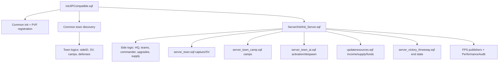
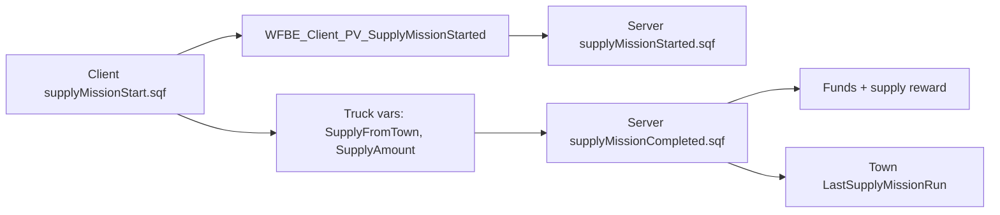

# Server Gameplay Runtime Atlas

This page maps the long-running server gameplay systems from source: town capture, town AI, camps, economy/resources, commander/team state, victory checks, supply mission trust boundaries and server performance loops.

All paths are relative to `Missions/[55-2hc]warfarev2_073v48co.chernarus/`.

## Runtime Graph

## Server Lifecycle Entrypoints

Lifecycle ownership note: [Lifecycle wait-chain](Lifecycle-Wait-Chain) owns the flag table, boot ordering, JIP waits and client/HC wait hazards. This atlas only lists the server runtime owners that start after `Init_Server.sqf` reaches its long-running loop phase.

`Server/Init/Init_Server.sqf` is the central server owner. It guards repeated execution at `:1`, compiles server functions at `:10-103`, initializes side/HQ/team state at `:302-503`, then starts long-running systems.

| System | Server entrypoint |
| --- | --- |
| Town capture and supply value loop | `Init_Server.sqf:509-510` starts `Server/FSM/server_town.sqf`. |
| Town AI activation/despawn | `Init_Server.sqf:512-516` starts `Server/FSM/server_town_ai.sqf`. |
| Camp capture manager | `Common/Init/Init_Town.sqf:129-130` registers camp workers; `Server/FSM/server_town_camp.sqf:8-25` runs one singleton manager. |
| Resources and economy | `Init_Server.sqf:526-532` starts `Server/FSM/updateresources.sqf`. |
| Victory/end state | `Init_Server.sqf:526-529` starts `Server/FSM/server_victory_threeway.sqf`. |
| Garbage, empty vehicles and cleaners | `Init_Server.sqf:535-559`. |
| Server FPS monitors | `Init_Server.sqf:577-595`. |
| AntiStack loops | `Init_Server.sqf:597-614`. |
| Commander vote bootstrap | `Init_Server.sqf:622`. |

## Data Ownership

| Data | Owner | Evidence |
| --- | --- | --- |
| Town list | Global `towns` array populated by `Common/Init/Init_Town.sqf`. | `Init_Town.sqf:165` |
| Town static vars | Town logic objects: `name`, `range`, `startingSupplyValue`, `maxSupplyValue`, `lastSupplyMissionRun`, `supplyMissionCoolDownEnabled`, `wfbe_town_type`. | `Init_Town.sqf:31-40` |
| Town server vars | Town logic objects: `camps`, `wfbe_town_defenses`, `sideID`, `supplyValue`. | `Init_Town.sqf:63-64`, `:87-89` |
| Town AI state | Town logic objects: `wfbe_active`, `wfbe_active_air`, `wfbe_active_sideIDs`, `wfbe_inactivity`, `wfbe_active_override`, `wfbe_active_vehicles`, `wfbe_town_teams`. | `server_town_ai.sqf:21-32` |
| Side/commander state | Side logic objects: `wfbe_commander`, `wfbe_hq`, `wfbe_structures`, `wfbe_aicom_running`, `wfbe_aicom_funds`, `wfbe_upgrades`, `wfbe_upgrading`, `wfbe_votetime`, `wfbe_ai_supplytrucks`, `wfbe_commander_percent`. | `Init_Server.sqf:356-389` |
| Team list | Side logic `wfbe_teams`. | `Init_Server.sqf:500-501` |
| Team/group vars | Group variables: `wfbe_funds`, `wfbe_side`, `wfbe_queue`, `wfbe_vote`, `wfbe_autonomous`, `wfbe_respawn`, `wfbe_teamtype`, `wfbe_teammode`, `wfbe_teamgoto`. | `Init_Server.sqf:474-483` |
| Side supply | Mission namespace `wfbe_supply_<side>` plus temporary public variables `wfbe_supply_temp_<side>`. | `Init_Server.sqf:386`, `Common_ChangeSideSupply.sqf:28-30`, `Server_ChangeSideSupply.sqf:1-47` |

## Long-Running Loop Notes

`Server/FSM/server_town.sqf` scans town ranges with `nearEntities` (`:57`), sleeps per town (`:259`) and per cycle (`:270`), then records performance audit data (`:262-266`).

`Server/FSM/server_town_ai.sqf` avoids aircraft in activation scans (`:84-93`), despawns inactive town AI (`:191-222`) and records audit data (`:244-248`). This is spawn/delete distance activation, not simulation caching.

`Server/FSM/server_town_camp.sqf` centralizes camp capture into a singleton manager. It registers workers and prevents duplicate managers at `:8-13`, then scans on a one-second cadence at `:22-25` and `:157`.

`Common/Functions/Common_PerformanceAudit.sqf` is local RPT logging, not network sync. It snapshots FPS/player/AI/unit/vehicle/town-active counts (`:28-105`), records aggregate call stats (`:159-193`) and flushes every 60 seconds by default (`:221-239`).

Ampere's runtime pass confirmed that the major loops are cooperative rather than tight in the normal dedicated-server path: town capture, town AI, camps, resources, victory, garbage and empty-vehicle collection all have sleeps or per-cycle yields. The high-risk exceptions remain the FPS publisher scripts in hosted/listen mode and any restored AI supply-truck path.

## Server Load Risks

| Risk | Evidence | Development note |
| --- | --- | --- |
| Low-FPS sleep inversion | `Common_GetSleepFPS.sqf:5-9` shortens sleeps under lower FPS. | Overloaded servers may run some loops more often, not less. Verify before reusing this helper. |
| Hosted-server FPS busy loop | `Init_Server.sqf:578` starts `Server/GUI/serverFpsGUI.sqf` and `:595` starts `Server/Module/serverFPS/monitorServerFPS.sqf`; both loop forever and sleep only inside their dedicated-server branches. | Hosted/non-dedicated server mode can spin these loops without sleep. Consolidate publishers or hoist sleeps outside locality guards. |
| Town scans | `server_town.sqf:57` uses `nearEntities` per town. | Preserve per-town/per-cycle sleeps and audit records. |
| Garbage scan | `server_collector_garbage.sqf:4-32` scans `allDead` every 0.5s. | Avoid adding more all-world scans nearby. |
| Empty vehicle scan | `emptyvehiclescollector.sqf:4-30` polls every 0.5s. | Keep cleanup conditions cheap. |
| AntiStack DB loop | `Server/Module/AntiStack/mainLoop.sqf:15-43` iterates `allUnits` and performs DB retrieve/store per player. | Extension/database latency is live-server sensitive. |

## Supply Mission Data Flow

Supply mission start is not fully server-authoritative. Client code sets `SupplyFromTown` and `SupplyAmount` on the truck at `Client/Module/supplyMission/supplyMissionStart.sqf:20-34`, then sends `WFBE_Client_PV_SupplyMissionStarted` at `:38-39`. Completion later trusts truck variables in `Server/Module/supplyMission/supplyMissionCompleted.sqf:9-27`.

There is also a casing mismatch to resolve before relying on cooldown behavior: town init seeds `lastSupplyMissionRun` at `Common/Init/Init_Town.sqf:35`, while server supply mission code reads/writes `LastSupplyMissionRun` at `Server/Module/supplyMission/isSupplyMissionActiveInTown.sqf:8` and `supplyMissionStarted.sqf:8`.

## AI Commander Status

AI commander support is partially present. Boyle's second-pass review corrected the earlier shorthand: the upgrade worker and AI commander funds are real, but no obvious live scheduler was found that drives the full autonomous commander loop or sets `wfbe_aicom_running = true`.

Evidence:

- Constants expose AI commander settings at `Common/Init/Init_CommonConstants.sqf:91-100`.
- Side logic state and funds exist at `Server/Init/Init_Server.sqf:364-365`.
- `WFBE_SE_FNC_AI_Com_Upgrade` is compiled at `Server/Init/Init_Server.sqf:48`; `Server/Functions/Server_AI_Com_Upgrade.sqf:12-50` reads upgrade order, checks funds/supply and debits through `ChangeAICommanderFunds` / `ChangeSideSupply`.
- Commander vote/assign code stops AI commander when a player commander exists at `Server/Functions/Server_VoteForCommander.sqf:54-57`.
- No active loop/FSM was found that starts and drives AI commander automation.

Treat AI commander production and autonomous logistics as partial until a dedicated implementation pass proves or restores the runtime owner. In particular, `AIBuyUnit` appears latent and `UpdateSupplyTruck` is broken under the supply-system-0 + AI commander branch.

## Server End Conditions

`Server/FSM/server_victory_threeway.sqf:23-57` ends the mission when victory conditions are met. The broad end-state pattern is:

- HQ is dead and no factories remain, or a side holds all towns.
- Server publishes endgame state, sets winner data such as `WF_Winner`, and flips `gameOver` / `WFBE_GameOver`.
- Optional AntiStack persistence may run.
- Mission ends through `failMission "END1"`.

Canonical correctness findings: [Deep-review findings](Deep-Review-Findings) DR-11 owns the winner-inversion impact, and DR-36 owns the `server_victory_threeway.sqf:23` guard/precedence mechanism. Runtime summary: the loop is server-authoritative and DR-36 found its Perf/JIP/HC posture clean, but the end-condition guard and no-break side loop still need the DR-36 fix before match results are trusted.

## Confirmed Defects And Partial Features

| Area | Evidence | Status |
| --- | --- | --- |
| AI supply truck system | `UpdateSupplyTruck` compile is commented at `Init_Server.sqf:36`, but spawn remains under supply system 0 + AI commander at `:381-383`; script calls missing `Server/FSM/supplytruck.fsm` at `Server/AI/AI_UpdateSupplyTruck.sqf:17`. | Config-gated broken path. |
| AI commander automation | State/funds/constants exist, but no active AI commander loop/FSM was found. | Partial/latent. |
| `Server_AssignNewCommander` call shape | `_side = _this` then `_commander = _this select 1` in `Server_AssignNewCommander.sqf:3-5`; caller passes `[_side, _assigned_commander]` from `RequestNewCommander.sqf:12-14`. | Likely bug; should assign `_side = _this select 0`. |
| Supply mission cooldown casing | `lastSupplyMissionRun` seeded in town init, `LastSupplyMissionRun` used by server supply code. | Likely cooldown bug or stale variable. |
| Supply mission reward authority | Client sets truck `SupplyFromTown` and `SupplyAmount`; server completion trusts truck vars. | Hardening gap. |
| Resistance supply handler gap | Common sender can format `wfbe_supply_temp_<side>` generically, but server handlers only exist for west/east. | Resistance side supply not fully wired. |
| Paratrooper markers | Server sends `HandleParatrooperMarkerCreation`, client receiver file exists, command is missing from client PVF list. | Broken/dead receiver path. |
| MASH markers | Server rebroadcast exists, client receiver compile is commented, and DR-34 found no client broadcast of `WFBE_CL_MASH_MARKER_CREATED`. | Broken/dead on both ends; revive with a server-held marker list and JIP replay, or remove. |
| Victory/endgame guard | `server_victory_threeway.sqf:23` plus the per-side loop are the DR-36 root-cause surface for DR-11/DR-13. | Correctness bug; use [Deep-review findings](Deep-Review-Findings) DR-11/DR-36 for the canonical mechanism and fix direction. |

## Safe Extension Points

- New server loops should start from `Init_Server.sqf` only after common/town initialization is complete and should set a visible lifecycle flag if clients or headless code wait on it.
- Add performance audit records around any loop that scans towns, all units, all dead objects, vehicles or players.
- Keep side-owned state on side logic objects and team-owned state on group variables; do not introduce parallel globals unless a public-variable sync path needs them.
- For supply/economy changes, make the server recompute authoritative reward/cooldown data from trusted town/truck state rather than client-provided amounts.

## Continue Reading

Previous: [Factory and purchase systems atlas](Factory-And-Purchase-Systems-Atlas) | Next: [Core systems index](Core-Systems-Index)

Main map: [Home](Home) | Fast path: [Quickstart](Quickstart-For-Humans-And-Agents) | Agent file: [`agent-context.json`](agent-context.json)
