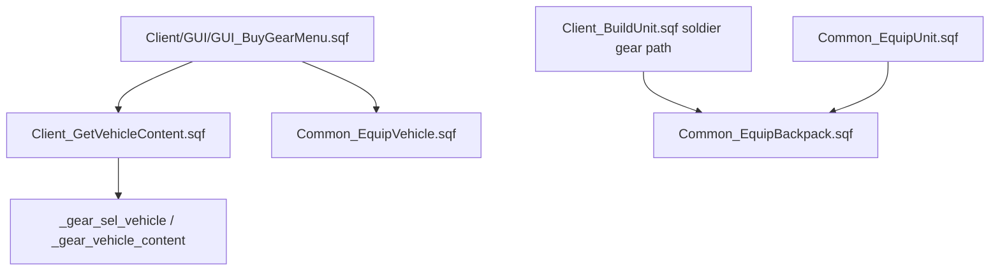

# Vehicle Cargo Equip Loop Bounds

This page documents a confirmed cargo-application loop-bound bug in vehicle and backpack gear helpers. It replaces the older vague scout note in [Gear/loadout/EASA atlas](Gear-Loadout-And-EASA-Atlas).

All mission paths are relative to `Missions/[55-2hc]warfarev2_073v48co.chernarus/`.

## Current Flow



## Source Evidence

| Source | Evidence |
| --- | --- |
| `Common/Init/Init_Common.sqf:108,110` | Compiles `WFBE_CO_FNC_EquipBackpack` and `WFBE_CO_FNC_EquipVehicle` when not running the A2 vanilla fallback. |
| `Client/GUI/GUI_BuyGearMenu.sqf:94,102,108` | Reads current vehicle cargo through `Client_GetVehicleContent.sqf` and stores selected cargo arrays. |
| `Client/GUI/GUI_BuyGearMenu.sqf:439` | Applies selected vehicle cargo with `[vehicle _target, _gear_sel_vehicle] Call WFBE_CO_FNC_EquipVehicle`. |
| `Client/Functions/Client_GetVehicleContent.sqf:20-22` | Reads cargo with safe `for '_i' from 0 to count(_items)-1` loops. The collector is not the bug. |
| `Common/Functions/Common_EquipVehicle.sqf:27,33,39` | Applies weapon, magazine and backpack cargo with inclusive `for '_i' from 0 to count(_items)` loops. |
| `Common/Functions/Common_EquipBackpack.sqf:35,41` | Applies backpack weapon and magazine contents with the same inclusive `for '_i' from 0 to count(_items)` loops. |
| `Client/Functions/Client_BuildUnit.sqf:229` | Calls `WFBE_CO_FNC_EquipBackpack` for soldier purchases when a backpack is present. |
| `Common/Functions/Common_EquipUnit.sqf:38` | Calls `WFBE_CO_FNC_EquipBackpack` for unit loadout application. |

## Bug Shape

SQF arrays are zero-indexed. These equip helpers iterate one slot past the last valid item:

```sqf
for '_i' from 0 to count(_items) do {_vehicle addWeaponCargoGlobal [_items select _i, _counts select _i]};
```

For an array with `N` entries, valid indexes are `0` through `N - 1`. Index `N` is out of range.

Confirmed current-source locations:

| Helper | Loops |
| --- | --- |
| `Common_EquipVehicle.sqf` | weapon cargo `:27`, magazine cargo `:33`, backpack cargo `:39` |
| `Common_EquipBackpack.sqf` | backpack weapon cargo `:35`, backpack magazine cargo `:41` |

Likely impact:

- Each non-empty cargo application can attempt one out-of-range `_items select _i` / `_counts select _i` at the end of the loop.
- Depending on Arma 2 OA runtime behavior and logging settings, this may create RPT noise, abort the loop tail or fail silently after applying valid entries.
- Empty arrays may also enter the loop at index `0` unless the surrounding content guard exits first; `Common_EquipVehicle.sqf` checks only the top-level vehicle-content array, not each sub-array.
- This is a correctness and reliability bug in local gear/cargo application, not a public-server authority fix.

## Patch Shape

Recommended first patch:

```sqf
for '_i' from 0 to count(_items)-1 do {
    _vehicle addWeaponCargoGlobal [_items select _i, _counts select _i];
};
```

Apply the `count(_items)-1` bound to all five confirmed loops.

Optional guard if the code owner wants clearer empty-array behavior:

```sqf
if (count _items > 0) then {
    for '_i' from 0 to count(_items)-1 do {
        _vehicle addWeaponCargoGlobal [_items select _i, _counts select _i];
    };
};
```

Keep the patch scoped:

- Do not redesign the buy-gear UI.
- Do not treat this as gear-purchase authority hardening.
- Do not combine with [Gear template profile filter](Gear-Template-Profile-Filter), even though both live in the gear UI area.

## Validation Plan

Source checks:

1. `Common_EquipVehicle.sqf` has no `for '_i' from 0 to count(_items) do` loops.
2. `Common_EquipBackpack.sqf` has no `for '_i' from 0 to count(_items) do` loops.
3. `Client_GetVehicleContent.sqf` still uses `count(_items)-1` and does not regress.
4. Source Chernarus is patched first; Vanilla Takistan is propagated by LoadoutManager from a correctly named `a2waspwarfare` checkout.

Arma smoke:

1. Add one weapon cargo item to a vehicle through Buy Gear and confirm exactly one appears.
2. Add one magazine cargo item to a vehicle and confirm exactly one appears.
3. Add one backpack cargo item to a vehicle and confirm exactly one appears.
4. Add backpack weapon/magazine contents to a unit backpack and confirm contents apply without RPT out-of-range errors.
5. Try empty cargo groups and confirm no RPT out-of-range errors.

## Generated And Modded Missions

`Missions_Vanilla/[61-2hc]warfarev2_073v48co.takistan` currently carries the same inclusive loops in `Common_EquipVehicle.sqf` and `Common_EquipBackpack.sqf`.

Per project rules:

- Patch source Chernarus first.
- Use `Tools/LoadoutManager` for Vanilla propagation.
- Treat Napf/Eden/Lingor as divergent forks and other modded folders as stubs unless the owner chooses a maintenance model.

## Agent Notes

- This is a small, patch-ready reliability bug.
- It should be safe to patch independently from the server-authority/economy redesign because it only fixes loop bounds in cargo-application helpers.
- Keep this page paired with [Gear/loadout/EASA atlas](Gear-Loadout-And-EASA-Atlas), [Client UI systems atlas](Client-UI-Systems-Atlas) and [Feature status](Feature-Status-Register).

## Continue Reading

Previous: [Gear template profile filter](Gear-Template-Profile-Filter) | Next: [UI IDD collision repair](UI-IDD-Collision-Repair)

Main map: [Home](Home) | Agent file: [`agent-feature-status.jsonl`](agent-feature-status.jsonl) | Backlog: [`agent-hardening-backlog.jsonl`](agent-hardening-backlog.jsonl)
