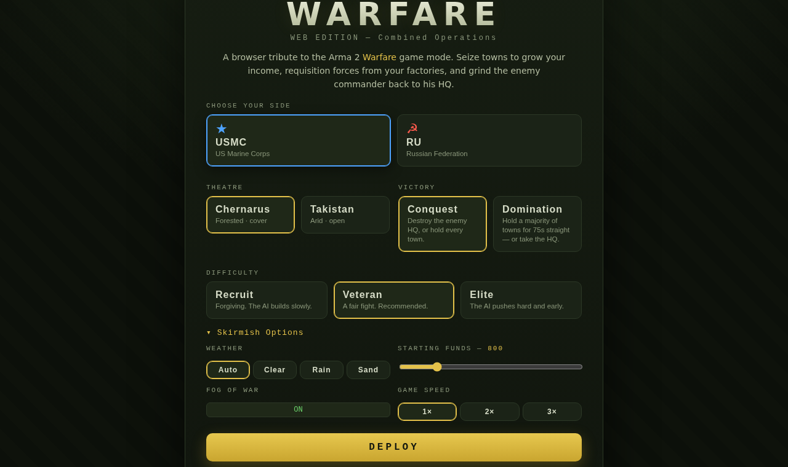
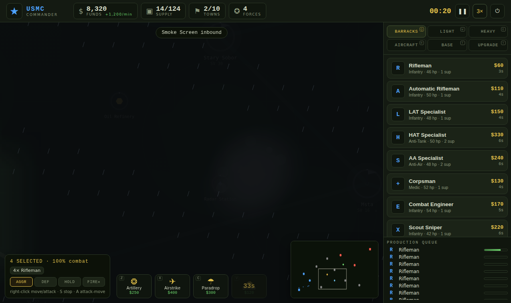

# WASP Warfare — Web Edition

A browser **real-time strategy** game distilled from the Arma 2 *Warfare Benny
Edition* (WFBE / "WASP") mission that lives in this repository. It takes the
mission's core loop — **capture towns → earn funds → requisition forces from
your factories → push the enemy HQ** — and turns it into a self-contained,
no-install web game you can play against an AI commander.

> Zero dependencies, zero build step. Open `index.html` and fight.




## Play

```bash
# any static server works; e.g.
cd web   # this folder
python3 -m http.server 8099
# then open http://localhost:8099
```
Or just double-click `index.html`.

**Single-file build:** `dist/waspwarfare.html` is the whole game (HTML + CSS + JS)
inlined into one file — download it and double-click to play offline, no server
needed. Rebuild it after edits with `node build.js`.

## Features

- **Two theatres** — Chernarus (forested, cover-heavy) and Takistan (arid, open) — pick on the menu.
- **Two victory modes** — Conquest (raze the HQ / hold every town) or Domination (hold the town majority for 75s).
- **Dynamic weather** — rain, sandstorms and overcast cut sight and accuracy and pour across the field.
- **Strategic points** — capture a **Radar Station** (reveals the fog), **Oil Refinery** (bonus income) and
  **Repair Depot** (heal aura) scattered between the towns.
- **Smoke screens** — a support power that lays a concealing, fire-dampening cloud.
- **Skirmish options** — choose weather, starting funds, default speed, and toggle fog of war on the menu.
- **End-of-match medals** — a star grade (up to ★★★ Field Marshal) scored from your kills, tempo and K/D.
- **Fog of war** — vision from your units, towns and HQ; the enemy is hidden until you scout. Forests
  conceal infantry and give them cover; snipers see farther.
- **Day / night cycle with lighting** — the field darkens at night and muzzle flashes, tracers, explosions
  and bases glow through the dark.
- **Commander upgrades** — a 5-branch tech tree (economy, weapons, armor, logistics, production) you
  invest funds into; the AI tech's up too.
- **Commander support powers** — Artillery Barrage, Airstrike, and Paradrop, on funds + cooldown.
- **Defensive emplacements** — MG nests, AT guns, AA batteries and bunkers placed on your lines.
- **Forward outposts** — deploy a supply truck into a forward base (vision + heal aura + supply cap).
- **Unit stances** — Aggressive / Defensive / Hold / Hold-fire, plus a Combat Engineer that repairs armour.
- **Dual economy** — Funds (units) + Supply (logistics cap), driven by town Supply Value.
- **Four factories** — Barracks, Light, Heavy, Aircraft — gated by structures you build.
- **Unit veterancy** — units earn chevrons from kills and grow deadlier and tougher.
- **Control groups** (Ctrl+1–9 / 1–9), rally points, attack-move, and a full RTS order set.
- **Big battles, smoothly** — a spatial hash keeps 100+ units in the field running fast.
- **Particles & weather of war** — smoke from wrecks, craters, sparks, tracers, blast waves.
- **Threat alerts** with minimap pings when your towns or HQ come under fire.
- **Procedural audio + ambient score** — gunfire, explosions, capture stings and a low military drone,
  all synthesised in-browser (no audio files).
- **A real AI opponent** that runs a build order, techs up, masses forces, contests towns, and calls in artillery.
- **Pause / settings / restart** overlay with a volume mixer and full controls reference.

## How it plays

You command **USMC** or **RU** on a Chernarus theatre. Each side opens holding
the two towns nearest its HQ; the towns in the middle are neutral and defended
by garrisons. Take them.

- **Select** — left-click a unit, or drag a box to select many. Double-click a
  unit to grab every unit of that type.
- **Move / Attack** — right-click the ground to move, an enemy to attack.
  Hold **Shift** while right-clicking for *attack-move* (engage on the way).
- **Capture** — park units inside a town's ring. Garrisons must be cleared
  first; then the control ring fills and the flag flips to your colour.
- **Buy** — pick a factory tab on the right (Barracks / Light / Heavy /
  Aircraft) and click a unit to queue it. It rolls out of your HQ — set a
  rally point by **double-clicking** the map so reinforcements deploy forward.
- **Build** — the **BASE** tab spends funds on structures: each factory
  unlocks its unit tier, and **Supply Depots** raise your logistics cap.
- **Economy** — two currencies, exactly like the original: **Funds** buy
  units, **Supply** is your logistics ceiling (each living unit costs supply;
  depots and held towns raise the cap). Every town pays funds each tick based
  on its **Supply Value (SV)**.
- **Support powers** — the bar at the bottom: **Artillery** (`Z`), **Airstrike**
  (`X`), **Paradrop** (`C`). Click the power, then click a target. Each costs
  funds and goes on cooldown. The AI uses artillery on your clustered troops too.
- **Defenses** — in the **BASE** tab, pick an emplacement (MG nest, AT gun, AA
  battery, bunker), then click to place it near your HQ or a held town.
- **Veterancy** — units gain chevrons as they rack up kills, raising damage and HP.
- **Win** — destroy the enemy HQ, or hold every town. Lose your HQ and it's over.

### Hotkeys
`Space` pause · `Q W E R T Y` factory / base / upgrade tabs · `Ctrl+1-9` set
control group · `1-9` select group (double-tap to centre) · `Z X C` support
powers · `O` deploy outpost · `S` stop · `Tab` cycle idle · `H` centre on HQ ·
arrow keys pan · mouse-wheel zoom · middle-drag or minimap to pan. Unit stances
(Aggressive / Defensive / Hold / Hold-fire) are on the selection card.

## What's faithful to the source mission

The names and numbers are lifted from the WFBE mission config and then
compressed onto a ~10–15 minute scale:

- **Sides & units** — USMC vs RU, with the stock roster: Riflemen, AT/AA
  specialists, HMMWV/UAZ, LAV-25/BTR-90, M1A1 Abrams/T-72, AH-1Z/Mi-24,
  AV-8B/Su-25, MLRS/Grad, supply trucks, and so on.
- **Dual economy** — Funds + Supply, with town income driven by Supply Value.
- **Structures** — Barracks, Light/Heavy/Aircraft Factories, Supply Depots,
  built with funds and gating each unit tier.
- **Towns** — Chernarus place-names (Chernogorsk, Elektrozavodsk, Stary Sobor,
  Vybor, Berezino…), each with an SV and a defending garrison you must clear.

## Tech

Plain HTML5 Canvas + vanilla JS, split into small modules loaded as classic
scripts so it runs straight off the filesystem:

| file | role |
|------|------|
| `js/data.js`   | factions, unit roster, structures, powers, defenses, map, tuning |
| `js/util.js`   | math, camera, RNG helpers |
| `js/audio.js`  | procedural WebAudio sound engine (no asset files) |
| `js/engine.js` | the simulation: combat, capture, economy, production, powers, veterancy |
| `js/ai.js`     | the enemy commander (macro build-order + tactics + artillery) |
| `js/render.js` | all canvas drawing + minimap |
| `js/ui.js`     | HUD, build panel, power bar, selection & order input, camera |
| `js/main.js`   | menu, game loop, pause/settings, end screen |

## Credit

Inspired by **Warfare Benny Edition** by *Benny*, with scripting by *Awesome &
WASP* and *Miksuu* — the mission this repo is a modernized fork of. This web
edition is a tribute, not a port; all gameplay here is re-implemented from
scratch for the browser.
